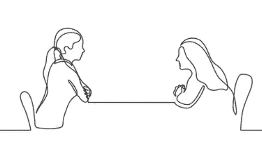

# 我如何将文本文件读入程序以参加 NLP 竞赛

> 原文：<https://medium.com/mlearning-ai/how-i-read-text-files-into-a-program-in-order-to-enter-a-nlp-competition-e0cf289edfd8?source=collection_archive---------4----------------------->

Kaggle 数据科学网站上有不少涉及自然语言处理(NLP)的竞赛。因为我碰巧对 NLP 有所了解，所以我决定参加一个给学生作文打分的竞赛。

我通常会使用 NLP 库，spacy，但无法使用它，因为 Kaggle 的…