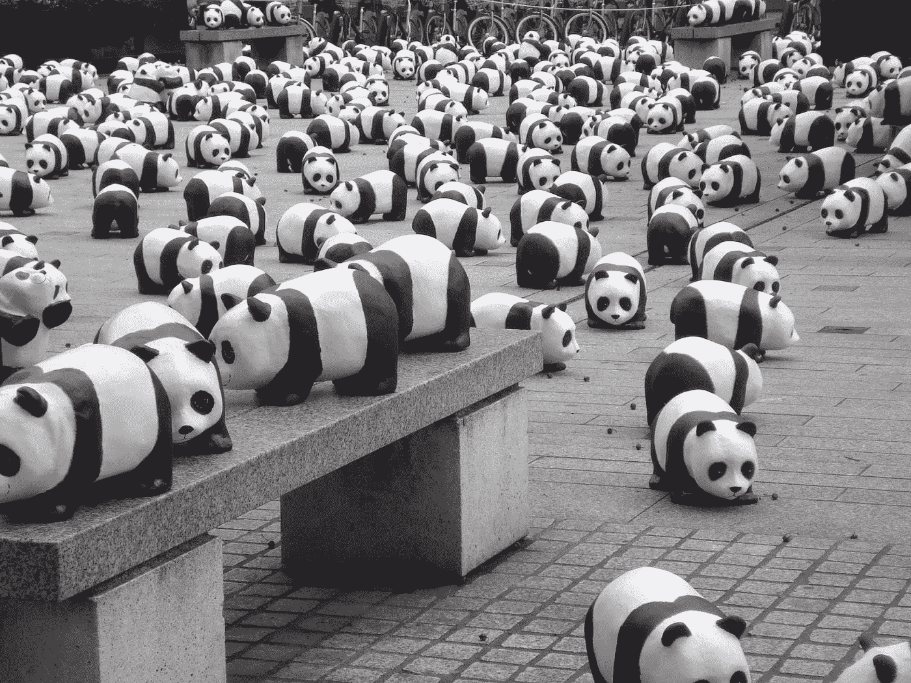

# 我如何只用熊猫和 numpy 解决 Kaggle 的 2022 年 6 月表格竞赛

> 原文：<https://medium.com/mlearning-ai/how-i-solved-kaggles-june-2022-tabular-competition-using-only-pandas-and-numpy-91595b58d08?source=collection_archive---------7----------------------->

每个月，我都会参加 Kaggle 的表格竞赛，努力提高我在数据科学领域的技能。2022 年 6 月的表格竞赛略有不同，因为它不是在测试集上进行预测，而是在有一百万个缺失值的数据集中估算缺失值。