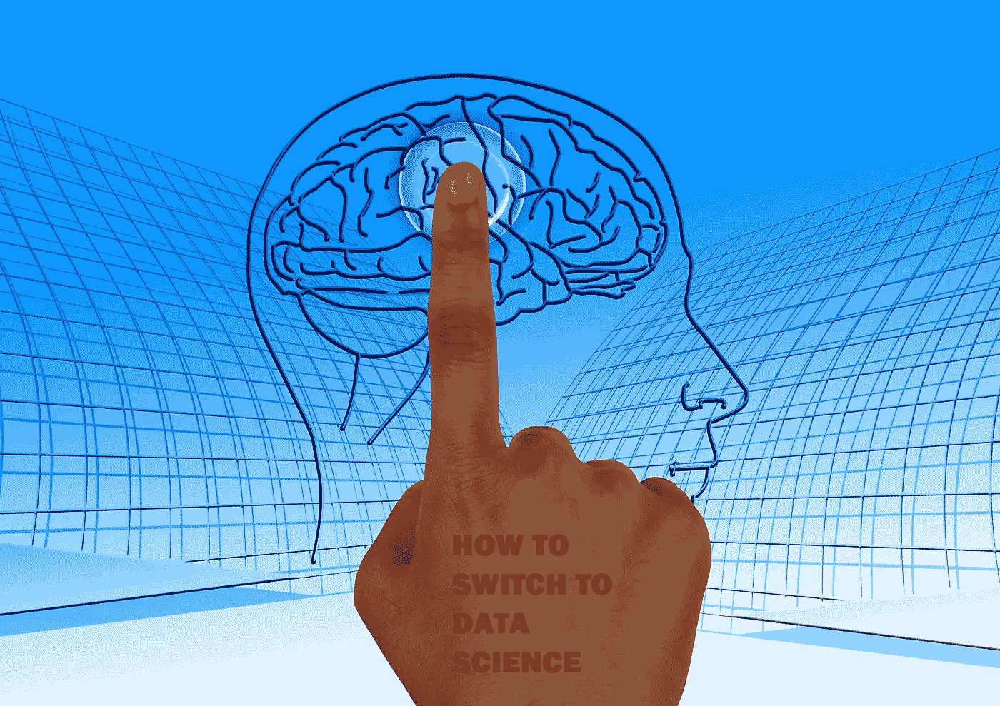
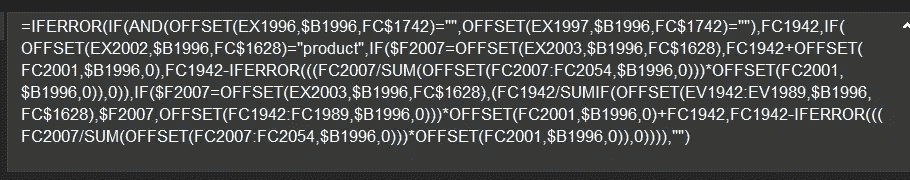

# 我如何从 8 年成功的分析职业生涯过渡到数据科学

> 原文：<https://medium.com/mlearning-ai/how-i-transitioned-from-my-8-year-successful-career-in-analytics-to-data-science-ee52a6832800?source=collection_archive---------0----------------------->

## 我从不懂编程的“p”到用 python 写代码&构建 ML 模型的职业转型故事

首先，我相信当我们试图进入一个新的角色时，我们都有优点和缺点。在告诉你我是如何成功学会编程，自学数学，然后从一所顶尖学校毕业并获得数据科学硕士学位之前，我认为有必要告诉你我的职业生涯，并强调我在做出选择时的优势和劣势。

Edited: Image by [Gerd Altmann](https://pixabay.com/users/geralt-9301/?utm_source=link-attribution&utm_medium=referral&utm_campaign=image&utm_content=770044) from [Pixabay](https://pixabay.com//?utm_source=link-attribution&utm_medium=referral&utm_campaign=image&utm_content=770044)

# 优势:

## 心态:这都是你想象出来的！

如果我只能选择一个优势，这将是它——我最大的优势是我的“心态”,这不是夸张或吹嘘自己，但我在生活中总是做出冒险的决定，我认为它在做出这个决定时也发挥了巨大的作用。然而，我的一部分真的害怕不成功或离开我在这次旅程中拥有的一切，因为在我转行之前，我的职业生涯相当成功。我的工作得到了赞赏和认可，我也得到了及时的晋升(还有几次提前晋升)。在决定我是否会成功转型时，我告诉自己，通过努力实现公司对我的期望，我已经为公司的发展做出了贡献，现在是时候给自己一个发展的机会了，即使这意味着短期内会放缓。同样有帮助的是为**的短期损失**(放弃可能的晋升)**的长期收益**(更丰富和多样化的职业生涯)做准备。这一准备使我免于自我怀疑，也免于对“何时”会有突破感到不耐烦！这让我很放松，每当我在最后一轮面试中失败或破解代码时，我都会提醒自己我从哪里开始，为什么开始，以及我已经走了多远！我可以继续说下去，但总而言之，我已经为短期失败做好了准备！不仅如此，我面对失败不放弃**的态度，接受挑战，有时直面挑战，当我无法破解代码时坚持不懈，在需要时寻求帮助，庆祝小的胜利，适应模糊——所有这些因素都发挥了重要作用。**

毅力:它也在你的心里！

仅仅在头脑中知道要做什么，知道自己注定要面对挑战是不够的。重要的是**当事情不顺心并且需要时间来实现时，不要失去信心。克服前进道路上的挑战需要勇气和坚持不懈的坚持自己和你的愿景。**

**分析背景**

在转行之前，我是 Bpharm 制药营销专业的 MBA 毕业生。我在医药咨询行业开始职业生涯时是一名预测分析师，并在 4 年内晋升为高级分析师和经理。虽然我在高中没有学过数学，但在学生时代我擅长数学。我总能理解数字的含义，这帮助我很好地建立了关系。结合我的制药知识和从数字中学习的好奇心，我使用 MS-Excel 建立了预测药物销售的预测模型。我花时间学习 excel，并通过学习、实践和在工作中应用来掌握公式。我很快就从简单的函数发展到复杂的嵌套公式函数。我选择技术技能纯粹是出于 T2 的兴趣、好奇和热情。我不断完善我的艺术，并总是试图自动化的东西，我曾经为一个国家建立预测，这将很容易复制到 10-20-n 个国家，只需**改变一个单元格的名称**。我的公式看起来很复杂，但是可以在工作表之间无缝地执行操作。

A snapshot of my work (complex formula) from 2016

**商业知识**

MAANG 公司的工作需要专业知识和技术技能的专业化，但如果你想在其他行业取得成功，你需要良好的领域和业务知识。幸运的是，对于我建立的预测，我必须有非常好的市场知识，趋势，影响销售的事件，以及市场预期如何变化——我读了很多关于疾病、市场和竞争的书。

我的其他优势是:

*   一个非常支持我的家庭，他们照顾我的女儿(如果没有我婆婆的支持，我不可能做到)
*   相信我的了不起的导师和朋友
*   从我的公司获得**大量学习资源**
*   我公司全额赞助的学位

# **缺点:**

*   在我的一生中，除了从网上复制一些 VBA 代码并根据需要修改之外，我从未编程过
*   我全职工作，一边学习一边转行
*   我有一个 4 岁的女儿，她需要我的照顾，不得不几个晚上不睡觉
*   没有高中数学让我**投入额外的时间**来温习概率、代数和微积分知识，这些知识是理解像主成分分析这样的主题所需要的
*   在我的小圈子或附近，地位较低:在我的行业中，很少有做出改变的例子，我的经理最初不鼓励我/不支持我
*   由于时区问题，大部分时间都无法上班(在印度攻读严格的硕士学位可不是闹着玩的)

最后，**我善于利用我的优势来掩盖我的劣势，磨砺我的优势，改善**(只是改善——不追求完美)我的劣势来实现转变！

# 是什么促使我转投数据科学这个技术性很强的领域？

**在这里我会尽可能的开放和无耻:**

*   虽然我是一个高水平的表演者，在转换之前在分析方面相当不错，但我们在制药行业做的分析和预测与世界(至少是科技界)对分析的看法非常**不同**。它更接近商业，涉及使用高级 excel 建立模型，将定性信息转化为定量信息(这同样需要扎实的商业知识)，以及建立假设(在我们的世界中，预测者的好坏可以通过查看他们的假设来衡量)。但是当我与人们交谈或考虑探索外部机会时，**我意识到其他地方的分析工作需要强大的技术技能** (SQL、Python、Hadoop 等)。)是我没有的。这是我动力的一个重要原因
*   我总是对技术有一个**的定位**，这鼓励我探索数据科学和编程。我是我们公司第一个在 excel 中使用切片器创建切片器仪表板的人。
*   在某种程度上，每个人都面临着工作停滞不前的问题，尽管我没有完全面对压力，但我正处在压力的边缘！我的长期增长机会有限(尽管短期增长很明显)。这促使我选择了数据、数据科学、见解和分析方面的通才之路
*   我总是喜欢挑战自己，学习新事物。我还自学了其他一些东西:视频编辑、修复被病毒感染的系统、摄影、烹饪、微软 Excel、VBA 编程，以及其他许多生活技能
*   作为神的干预，或者正如他们所说的，幸运总是眷顾勇敢的人，由于我所支持的一个部门的分离，我在办公室的工作量有所下降，这帮助我**在开始的时候投入了一些额外的时间**
*   我没有那么支持我的经理，他们不承认我的才能或者给我有挑战性的任务，这让我**考虑我部门的外部机会**
*   通过我的公司获得大量免费的付费资源，如 Coursera 和 LinkedIn Learning

# 我是如何进行切换的？

大约在 2019 年年中，我开始探索和阅读许多博客和文章，内容涉及数据科学是什么，不是什么，人们如何转换职业，他们的旅程是什么，以及一个人应该采取的资源和步骤是什么。在收集了关于这些的信息并形成了基本的理解后，**我开始学习 Kaggle 课程和 Coursera 上的课程—‘python for everybody’**，并开始在通勤时通过他们的移动平台在 datacamp 上练习我的技能。我积极追求的另一件事是在 **Analytics Vidhya** 和**Analytics diaag**等博客上关注最新趋势。

完整的资源列表和汇编可以在[这里](/mlearning-ai/best-resources-to-learn-programming-data-science-and-machine-learning-4ed760eb825d)找到

就在我做这些事情的时候，我的公司宣布了一个由密歇根大学全额赞助的硕士学位。我们不得不像其他人一样经历同样的申请过程，包括编程和统计测试。我为此做了充分的准备，整个周末都在写论文。我写了又写，并在朋友的帮助下修改了几次，写了三篇 250 字的文章，简洁明了。我在 **Coursera** 上上 UMICH online 的 python specialization 和 stats specialization 作为准备，并跟随 **khan academy** 加强我的数学知识和代数基础——向量和矩阵乘法、概率、假设检验等。

经过学校和公司的双重筛选，我最终被选中了。对我来说，这是一个转折点，我冒险进入了这个梦寐以求的领域，这个领域曾经只有拥有数学/工程背景的人才能进入。我真的很喜欢 MADS(应用数据科学硕士)项目的课程，因为它既全面又实用。我也可以轻松地通过一些科目，如**可视化和讲故事**，因为我在这方面已经有优势。

这门课程是一门 34 学分的课程，包括了在这个领域起步所需的所有核心技能(不是 excel)。我们有关于数据处理、可视化、机器学习、深度学习、推荐系统、NLP、数据伦理、实验设计、因果推理等课程。更多关于[课程](https://www.si.umich.edu/programs/master-applied-data-science-online)和[课程](https://www.si.umich.edu/programs/master-applied-data-science-online/curriculum)可以在这里找到

学完这门课程后，我觉得自己对多个数据科学主题非常自信和熟悉，而且这门课程也有实际应用，帮助我掌握了一些容易应用的技能。这是一个艰难的阶段，因为如前所述，我一直在学习和工作。

如果你们中的一些人对硕士学位是否是在这个领域获得体面工作的必要条件有疑问，我觉得这对**迈出第一步很有帮助，尤其是在像我这样的情况下，你的电子**教育背景不是来自工程**等数学领域。但如果你是软件开发人员或工程师，或者在科技公司工作过，这可能会让项目和实践经验的转换变得容易。我公司的顶尖数据科学家都是博士，很少有核心数据科学家是非博士。话虽如此，如果你的目标是**成为一名公民数据科学家，我觉得硕士学位或经验会对你有利。**我在这里写了一篇关于不同类型数据科学家的完整文章**

# 从研究转向应用

如果你一直在关注我的旅程，感谢你的耐心和时间。我最不想谈的是我是如何在数据科学领域找到工作的。

在攻读硕士学位期间，我非常热衷于从事一些与我正在做的事情有一些应用的项目。凭借我的经验和对业务的深刻理解，在与几位导师进行了多次交谈后，我觉得数据科学翻译角色最适合我，因为我可以从两个世界中获得最大的好处——技术和业务。此外，我过去认为，现在仍然认为，成为一名核心数据科学家仍然是一个专业领域，你应该能够构建算法并理解幕后的数学，而我目前并不擅长这些。虽然我不是专家，但我的渴望、好奇心和对知识的渴求让我有动力去寻找哪怕是很小的机会来应用我的技能。我会写一篇完整的文章，讲述当我还在硕士项目的最初几个月时，我是如何创造了一些机会并维持了最初的几天。

回到这个故事，当我决定我想做翻译的时候，我和公司的几位领导谈过，表达了我的兴趣，并开始参加**数据科学社区活动**。我接手了一些小项目，并通过我新学到的技能创造价值。了解我的表现和分析能力后，我被以前的经理/同事拉进了几个项目。成功地实现它们帮助我对新学到的技能有了信心。这样过了一段时间后，我得到了一个**的任务，领导我公司一个新成立的项目**，并领导**数据科学解决方案/翻译职能**之一的成立。这不是一次晋升或角色转换，但我仍然抓住了这个机会，因为它帮助我在这个新领域建立了自己的关系网。在几个月到一年的时间里，我建立了这个部门，进行业务开发，与该领域的专家交谈，构建了一些 NLP 原型，并展示了关于我们如何在组织内民主化 AI/ML 的有远见的宣传资料。我也在积极寻找角色，并申请了公司内部的几个角色，在遭到 4-5 次拒绝和错失机会后，我得到了我梦想中的工作**，担任一个由 100 个国家组成的地区的数据科学和人工智能主管**。考虑到我已经准备好再降几级，但我却在全球职位上被提升了两级，这是一个很大的成就(之前我在一家服务机构工作，现在我转到了业务部门)。

在该地区担任领导职务一年后，我最近调到了**人力资源分析和洞察**部门，在那里我学到了在处理和集成来自多个系统的数据时应用数据科学技能。**我的角色中最棒的部分是我可以保留我的优势领域**,例如通过准备高管演示文稿、传达价值、推动企业级计划的实施、与 IT 部门、法律部门、合规部门和其他部门沟通以在组织中推行新的转型计划，来转化从事技术工作的商业价值。

我将在下一篇文章中写更多关于我的专业数据科学工作的内容，敬请关注。也为了我有限的关注者，**感谢**阅读我的文章——你是我**写更多文章的灵感**！请在评论中告诉我你还想让我写些什么！

 [## Mlearning.ai 提交建议

### 如何成为 Mlearning.ai 上的作家

medium.com](/mlearning-ai/mlearning-ai-submission-suggestions-b51e2b130bfb)