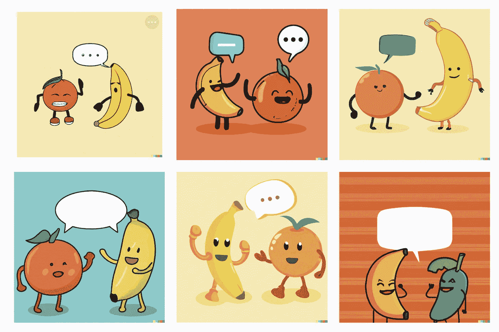

# 我如何使用人工智能在不到 5 分钟的时间里创作漫画——免费

> 原文：<https://medium.com/mlearning-ai/how-i-use-ai-to-create-comic-in-under-5-minutes-for-free-9c863e66e8c9?source=collection_archive---------0----------------------->

Screenshot by [Author](/@jimclydemonge) — Generated images by [Dall-E2](https://labs.openai.com/)

在不太遥远的未来，人工智能将被插画师用来帮助他们创作出令人惊叹的艺术品——既快又免费。

事实上，人工智能工具已经出现了。

我在这篇文章中要分享的是一个由 AI 生成的小漫画，在我的一点帮助下。