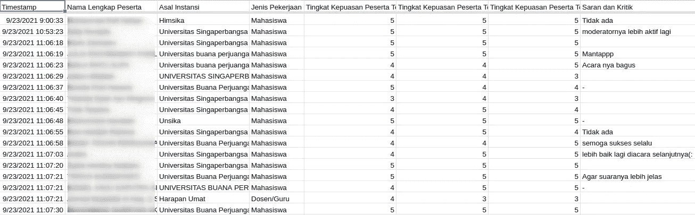

# 我如何使用数据工程在学生组织中建立数据驱动的文化——第 1 部分:捕捉问题

> 原文：<https://medium.com/mlearning-ai/how-i-use-data-engineering-to-start-the-data-driven-culture-in-a-student-organization-part-1-d146221a76a2?source=collection_archive---------10----------------------->

Photo by [Jon Tyson](https://unsplash.com/@jontyson?utm_source=medium&utm_medium=referral) on [Unsplash](https://unsplash.com?utm_source=medium&utm_medium=referral)

我先说一个故事。

2020 年，我成为学院学生组织的一名工作人员。是新生组织，我这一年是第一届内阁。在年初，我们必须为全年计划举办的活动制定一个“宏伟的设计”。宏伟的设计应该包括每个事件的参数，以衡量它是否成功举行，否则，失败。结果还需要写入问责报告，并在管理期结束时发布。

为了确保我们的活动符合这些参数，我们决定以谷歌的形式向参与者传播反馈调查。我们主要根据李克特量表询问参与者对以下内容的满意度:

1.  演讲者
2.  委员会的服务
3.  整个事件

它也要求批评家和推荐，因此委员会成员将在下次组织另一个事件时变得更好。除此之外，我们还询问了一些人口统计资料，比如他们目前的工作和大学/工作情况。此外，我们决定只有填写调查的参与者才能获得出勤/结业证书，因此这吸引了他们对反馈调查做出回应(因此我们收集了他们的全名和电子邮件)。下图是一个事件响应示例。

A sample of an event feedback

这种先举办活动，然后分享反馈调查的模式运行得很顺利。我们还可以为每个事件制定责任报告。

但是，随着时间的推移，有可能改进对收集的反馈的管理和分析。

## 可能的数据分析

对于单个事件反馈分析，包含表单响应的 Google Sheet 足以分析满意率。但是，仅此而已。满意率。在一张纸上。

如果我们想比较两个或更多的事件呢？费率一直在提高怎么样？在电子表格中很难做到。

分析其他数据也变得复杂，尤其是学院/工作实例。谷歌表单调查在一个文本字段中提问，这使得它变化很大，很难分析。我们需要清理它。

万一我们有更干净的数据，我们如何建立一个更好地可视化的仪表板？

## 多维分析

好吧，假设我们已经有了更清晰的数据。另一种可能性是我们可以做多维分析。这也意味着我们将能够回答更多的问题。我们来说一些例子:

1.  在 X 大学工作的学生给出的事件 A 的发言人的满意率是多少？
2.  从六月到八月有多少人参加这些活动？
3.  来自 X 大学的参与者倾向于给出更高的比率吗？他们的批评者怎么样，他们有什么感想？
4.  还有更多…

有了更干净、准备更充分的数据，就有了进行更多分析和获得更多见解的空间。

## 历史数据收集(数据仓库)

我提到过，我这一年是组织中的第一届内阁。在这篇文章发表时，第二届内阁已经开始举行活动。正如第一届内阁所做的那样，他们也以谷歌的形式传播反馈调查。

随着生产的纸张越来越多，我们需要管理如何储存它们。这可能是一个业务规则，例如准备一个 Google Drive 文件夹来存储所有反馈表，并命令委员会将表上传到那里。由于工作表具有结构化的形式，我们有一个将工作表上传到数据仓库平台的替代方法，比如说 Google BigQuery。

存储以前事件的好处是我们可以通过时间维度来分析它们。而且，有些活动是前一年活动的“下一个版本”。在这种情况下，一些分析性的问题可能会再次出现。

满意率和参与人数是否有下降？与去年相比，我们取得了哪些进步？我们把活动办得更好了吗？

现在还在第二个柜子里。设想下一届、下一届、再下一届内阁需要做这种分析。最好从现在开始准备基础设施，不是吗？

## 机器学习应用和基于语言的分析

反馈调查还在一个段落字段中询问了批评者和建议。在这里，通过机器学习实现分析是可能的。

除了流行的“情绪分析”，我们还可以分析参与者经常批评的方面。是联系服务吗？声音不清楚吗——我们在疫情期间举办了许多虚拟活动。又或许，他们不喜欢司仪？

通过回答这些问题，委员会将能够为下一次活动做出准确的改进。

这种分析应该以编程方式完成，比如用 Python。当然，我们不能在电子表格中这样做。

## 下一步是什么？

到目前为止，我们已经抓住了当前反馈分析方法中的问题。绝对有改进的空间。我们还定义了一些可以用来构建我们的解决方案的技术。

1.  仪表板提供更好的可视化效果。
2.  Google Drive 存储所有反馈电子表格。或者用另一种方式，Google BigQuery。
3.  机器学习的 Python 语言。

但是，等等！

*还有一个更基本的要求:准备更干净的数据*。我们需要做一个数据工程过程。

目前，这是主要目标。

在本文的下一部分，我将讨论数据管道的开发，该管道用于为分析提供更多准备好的数据。

下一部分再见！

 [## Mlearning.ai 提交建议

### 如何成为 Mlearning.ai 上的作家

medium.com](/mlearning-ai/mlearning-ai-submission-suggestions-b51e2b130bfb)