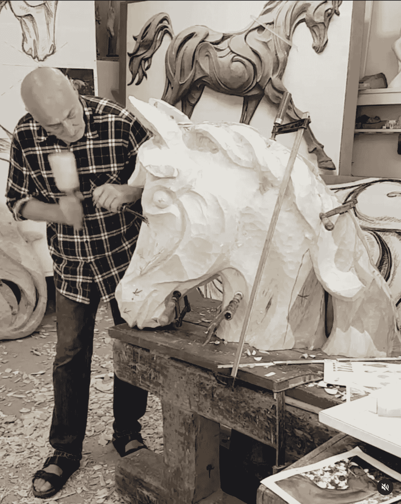

# 我如何在我的艺术中使用 GPT3

> 原文：<https://medium.com/mlearning-ai/how-i-use-gpt3-in-my-art-61e0a2d07f2?source=collection_archive---------0----------------------->

## 机器学习

## myFATHERintheCloud.ai

Siegfried Gross — [https://www.instagram.com/gross_bildhauer/](https://www.instagram.com/gross_bildhauer/)

 [## 新的人工智能文本分类器:OpenAI 发布

### 使用 OpenAI 的工具检测人工智能编写的文本

medium.com](/mlearning-ai/new-ai-text-classifier-openai-launches-1cae4e1398b1)