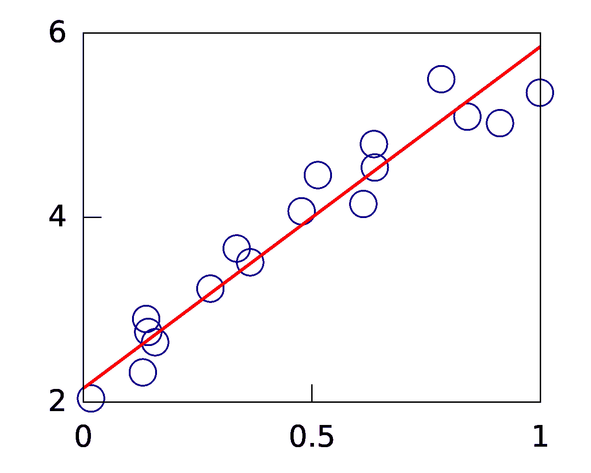

# 我如何使用线性回归在 Kaggle 的 2021 年 5 月表格比赛中获得 1.107 分

> 原文：<https://medium.com/mlearning-ai/how-i-used-linear-regression-to-score-1-107-on-kaggles-may-2021-tabular-competition-3b728d8a0009?source=collection_archive---------4----------------------->

对于那些一直关注我的人来说，他们会知道我一直在致力于解决 Kaggle 的 2021 年 5 月表格竞赛。我尝试了各种方法来解决这个问题，并在我最近的帖子中记录了这些方法，因为准确性在稳步提高。我最近关于这个主题的帖子的链接是…