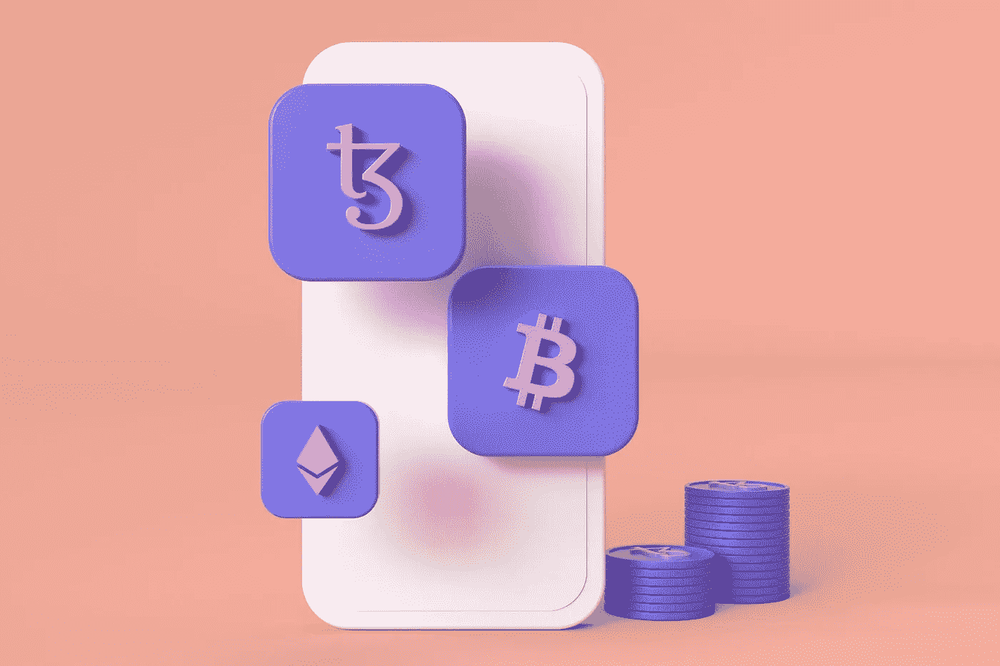
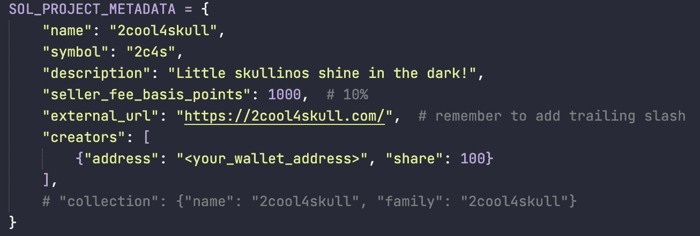
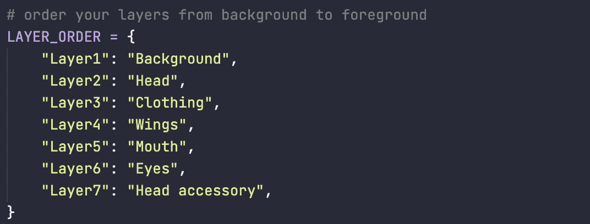
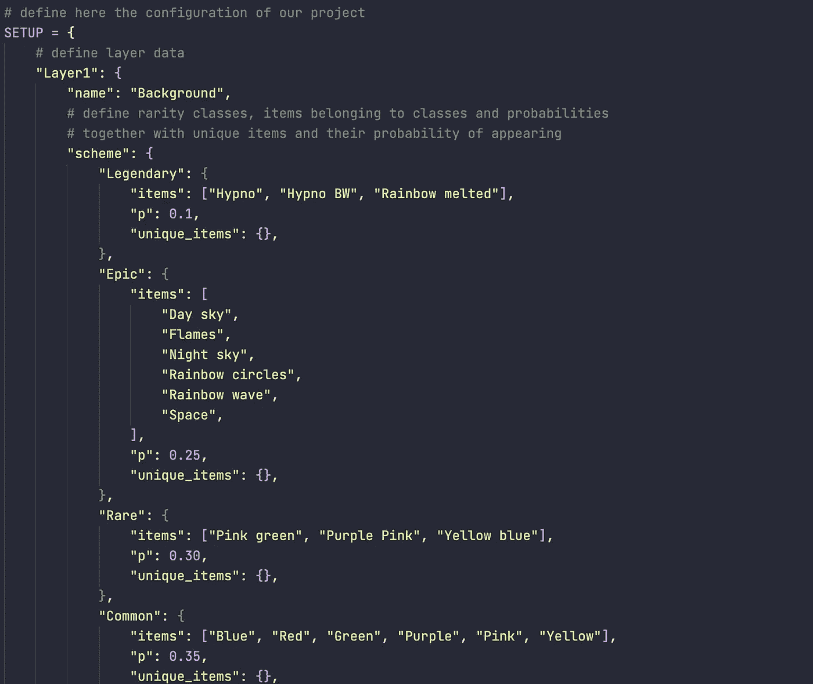
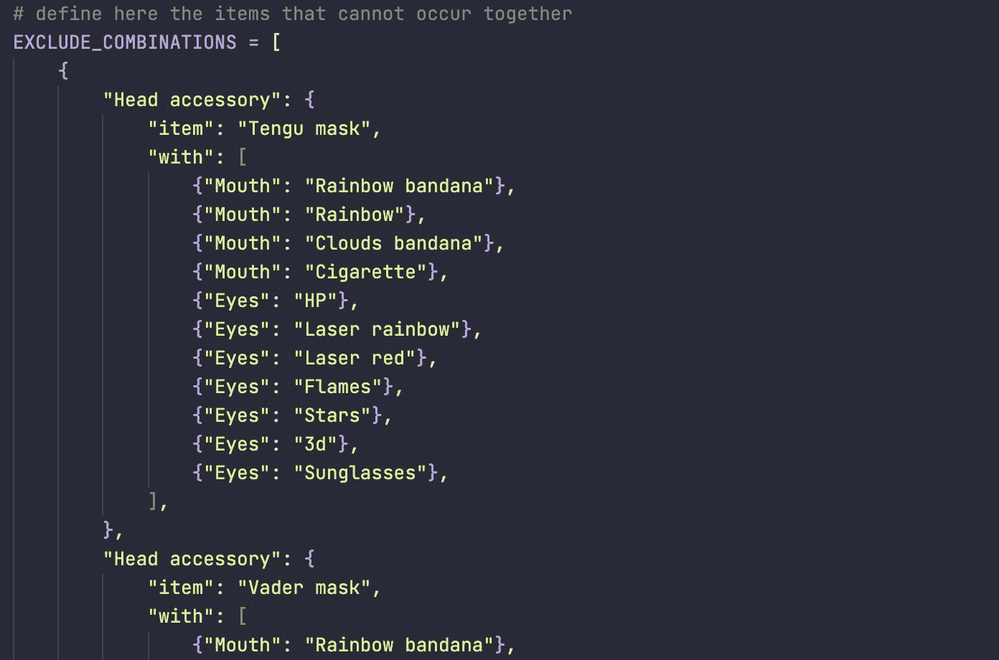
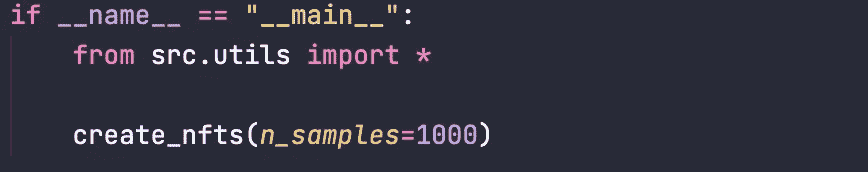
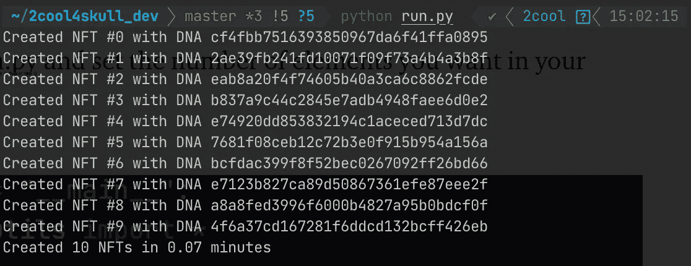
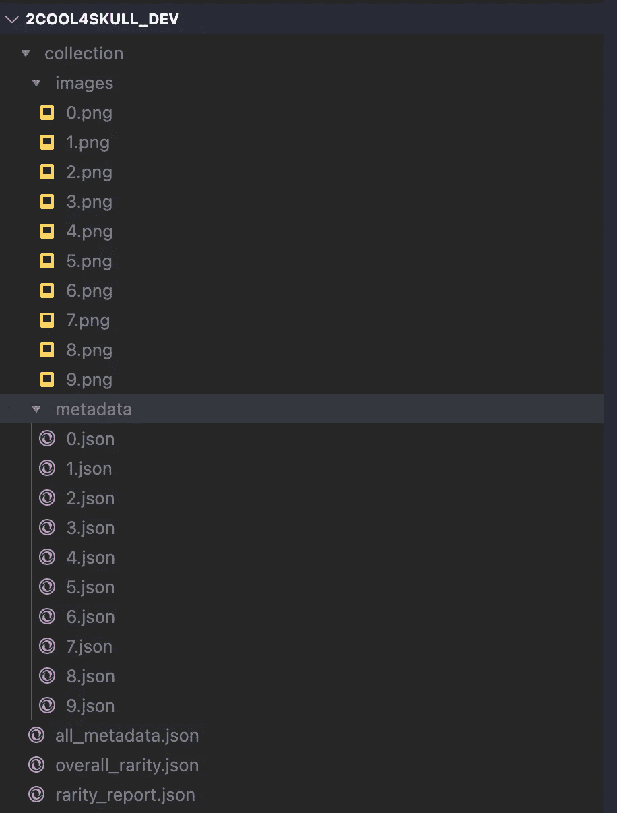

# 我如何利用我的数据科学技能为 NFT 和加密领域做出贡献

> 原文：<https://medium.com/mlearning-ai/how-i-used-my-data-science-skills-to-contribute-to-the-nft-and-crypto-space-cd0e9278a7eb?source=collection_archive---------3----------------------->

> 我如何使用基本的概率知识创建一个开源的 NFT 生成软件

Photo by [Tezos](https://unsplash.com/@tezos?utm_source=unsplash&utm_medium=referral&utm_content=creditCopyText) on [Unsplash](https://unsplash.com/s/photos/nft?utm_source=unsplash&utm_medium=referral&utm_content=creditCopyText)

因果报应并不总是一个婊子。我将以这个盛大的开场开始这篇文章。今天的*一个艺术家不仅可以谋生，而且可以在网上*数百万人*这一事实是一个具体而切实的迹象，表明恶有恶报。*

*我现在 31 岁了，多年来，我只看到少数艺术家(即那些画画、绘画和创造视觉内容的人)在他们的职业生涯中取得了成功。这些人很幸运，也很有才华，可以把他们的作品展示给合适的人，而这些人又会得到丰厚的回报。但并不是所有的艺术家都有这种奢侈。*

*大多数都是磨工和皮条客，他们中的一些人甚至因为经济限制而无法献身于自己的激情。我不是艺术家，但我很高兴看到这份工作的历史将如何改变，而这仅仅是开始。*

*但我在这里不是要单独谈论艺术家——我真正想做的是与你分享我们这些数据爱好者的机会。事实上，我将解释我如何使用我的数据技能为加密社区创建一个有用的 NFT 生成软件。*

# *动机*

*NFT 空间是一个怪异的野兽。这是一个极具风险但有利可图的利基市场，每天都吸引着越来越多的人。它的酷之处在于这个领域(目前)主要利用艺术品来创造价值。事实上，艺术家们看到了通过出售 NFT 的收藏品获取巨大利润的机会。*

*我不会介绍什么是 NFT。Medium 上有很多资源可以深入探讨这个主题。不过，我会简单介绍一下我是如何涉足这个领域的。*

***我最近与一位艺术家朋友**共同创办了一个自己的 NFT 项目(点击了解更多[)。这个想法是，艺术家将创造艺术品，我会帮助他建立和设置技术结构。对于这个项目，我们选择了索拉纳区块链。](https://www.2cool4skull.xyz/)*

*艺术品进展顺利，我们很快就为 NFT 一代准备好了资产。网上一个简短的研究提供了一个流行的解决方案: [Hashlips Art Engine](https://github.com/HashLips/hashlips_art_engine) 。我很快研究了代码库，并意识到该软件写得很好，并提供了很酷的功能。*

*但是我们的想法无法通过 Hashlips 获得:我们想要编写显式的**稀有类**(比如传奇类、史诗类、稀有类、普通类……)并在生成过程中控制它们的行为。我们想设定世代期间层出现的**概率**，以及**排除一起出现的特定组合**。此外，该软件的目标是艺术家:它的用户界面对于非技术用户来说必须足够简单，这样他们只需完成艺术品就可以生成他们的 NFT 收藏。*

*我最终用纯 Python 编写了这个软件，**，并将其开源，供社区使用和改进**。在本文接下来的部分中，我将对它的内容做一个简单的解释。*

# *它是如何工作的？*

*我从**配置文件**开始编写软件。用户只需操作一系列 Python 字典，就可以在中设置集合的参数。虽然对于完全不熟悉这门语言的人来说，这可能会令人望而生畏，但是对数据结构有非常基本的入门知识的人会感觉很轻松。*

*这个想法是让用户控制稀有类和它们在图像中出现的概率。让我们看一个例子。*

> *假设你是一名艺术家，你想创造一个基于怪物的哥特式主题的 NFT 系列。以一个兽人为例。你想让这个兽人有机会使用武器、盔甲等等。反过来，这些项目中的每一个都应该根据概率变强或变弱。*

*你用这个软件就可以做到，而且很容易做到。*

*你为每一层创建你的物品类别，比如传奇，史诗，稀有等等。然后你给这些类别分配概率。例如，传说中的防具每十件物品可以出现一次，即 10%。*

*您还可以配置**特殊项目**的行为。特殊物品是非常稀有的物品，它们甚至比传说中的物品更有价值。你可以指定一个独特物品和相对概率的列表，然后*瞧*，**你现在有了一组在同一稀有等级**中表现不同的物品。*

*我们在 YouTube 上发布了一段视频，详细介绍了该软件的工作原理。*

*这是我们的第一个视频之一，所以请分享您的反馈，以帮助我们在未来的迭代中改进。*

## *要求*

*这是成功运行软件所需的全部内容:*

*   *您的计算机上安装了 Python 3.7+版本*
*   *图像层*

*就是这样。您确实需要 Python，初始化一个虚拟环境(这是可选的，但强烈建议)并安装 Pillow。关于如何安装软件的详细信息可以在 Github repo 中找到。*

* [## GitHub-Andrea-dagostino/2 cool 4 skull _ NFT _ generator

### 从 Hashlips 的伟大作品中获得灵感，这个软件诞生的目的是为 NFT 一代提供…

github.com](https://github.com/andrea-dagostino/2cool4skull_nft_generator) 

# config.py 文件

让我们简单地浏览一下配置文件，看看为了定制我们的 NFT 集合，我们需要修改什么。在写这篇文章的时候，这个软件只适合索拉纳·区块链。未来它也将允许以太坊收藏。

## 项目元数据

*。/src/config.py* 是您需要编辑以定制项目的文件。这一切都从 Solana 项目元数据字典开始。

How project metadata is defined. Image by author.

这些初始参数是为每个 NFT 创建元数据文件的基础。在 Solana 中，每个 NFT 都与一个 metadata.json 文件相关联，枚举从 0 开始。

## 层顺序

接下来是允许用户指定**名称和层数**来组合创建一个图像。

Layering system. Image by Author.

图像通过[枕](https://pillow.readthedocs.io/en/stable/)库放在一起。事实上，它是这个软件中唯一使用的外部库，其余的都是标准库。

图层顺序应该遵循一个简单的原则:图层应该从背景到前景排序。这是为了确保图像创建过程中项目的正确重叠。

## 稀有等级、概率和特殊项目

要编辑的下一个词典保存在*设置*变量*中。这就是魔法发生的地方(这不是真正的魔法，只是一些简单的数学！).*

**您可以在一个简单的 Python 列表中添加 *scheme* 键下的类和该类的条目。**

How the SETUP variable is set in the config.py file. Image by author.

稀有类名是任意的。我们使用了传奇、史诗等游戏化的惯例，但你真的可以使用任何你想要的。

p 键是你定义该类概率的地方。如果*传奇*的 p = 0.1，则意味着该层的传奇类将每十个 NFT 出现一次。很酷，对吧？:)这对于您决定添加的所有类都有效。

该类中的所有项目出现的概率相同。那么我们如何控制特殊物品的稀有度呢？我指定一个字典，**我们可以用乘数**乘以类中项目的潜在概率。我们实际上是将两个概率相乘。

在下面的例子中，传说中的职业有 10%的几率出现。假设该类中的所有项目都有相同的出现机会(它们遵循均匀分布)，**一个项目出现的机会大约是 16%** (1/6)。我们将*天狗面具、维德面具、防毒面具*设定为特殊物品:我们希望它们的出现率低于 16%。用 0.2，基本就是说 16% * 20% = ~3%。

当然，由于现在三个项目的概率较低，其他项目出现的机会较高。

这就是你不仅可以操纵类的概率，也可以操纵单项的概率。干净利落。

## 排除组合

拼图的最后一块是可选的，但是如果你作为一个艺术家已经在你的层之间创建了复杂的组合，它仍然是强大的。在此字段中，您可以指定要从集合中排除的组合。你为什么想这么做？一种情况是避免不兼容层之间的冲突和故障。我们排除了天狗面具和其他物品，因为它们看起来很像。我们不喜欢他们，所以我们决定让用户也控制这个方面。

How to exclude combinations. Image by author.

同样，如果你觉得你需要更深入的了解，请随意观看 YouTube 视频，了解所有这些功能。

# 结论:创建你的 NFT 收藏

现在我们已经在 config.py 文件中设置好了一切，我们准备创建我们的 NFT 集合。

如果您还没有将 Layers 文件夹放入项目根目录，请确保所使用的命名约定在任何地方都是一致的。

现在伸手。/src/run.py 并设置集合中所需的元素数量。

Launch this script to create your collection from config.py. Image by author.

终端应该填充我们的 NFT 的基因序列。

Genetic sequence of our NFTs. Image by author.

如果基因序列无效(例如，如果在 *EXCLUDE_COMBINATIONS* 中发现该组合)，那么软件将破坏该序列并创建一个新的序列。

完成后，您将找到收藏文件夹，其中包含您的图像和元数据文件夹，以及一些关于项目和类别稀有性的报告。

Your NFT collection! Image by author.

这就是了！你现在可以出版你的 NFT 作品集了！

如果你觉得这个软件有用，请在下面的评论中分享你的想法或给我发消息。如果你是一名开发人员，请随意在 Github 上投稿。这对我来说很有价值，你将帮助改进这个社区的倡议。

希望你喜欢这篇文章。留得安好👋

 [## Mlearning.ai 提交建议

### 如何成为 Mlearning.ai 上的作家

medium.com](/mlearning-ai/mlearning-ai-submission-suggestions-b51e2b130bfb)*