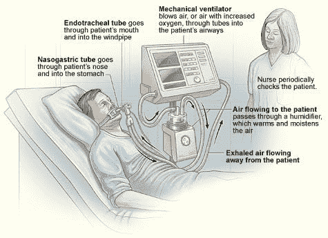

# 我是如何用 PyTorch 登上 Kaggle 呼吸机比赛排行榜的

> 原文：<https://medium.com/mlearning-ai/how-i-used-pytorch-to-get-on-the-leaderboard-of-a-kaggles-ventilator-competition-88eaa90dd0c3?source=collection_archive---------3----------------------->

当 Kaggle 有我能参加的比赛时，我总是很高兴。目前我只能胜任表格比赛，但是在 Kaggle 没有很多这种比赛。想象一下，当 Kaggle 网站上出现一个关于通风机的表格竞赛时，我是多么兴奋。关于呼吸机的竞争可以…