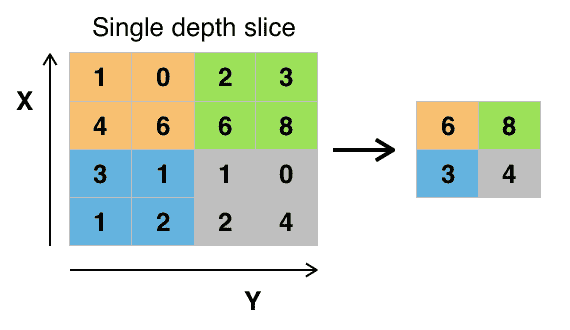

# 我如何使用 PyTorch 在 CIFAR_10 数据集上进行训练和预测

> 原文：<https://medium.com/mlearning-ai/how-i-used-pytorch-to-train-and-predict-on-the-cifar-10-dataset-5574bf151bb1?source=collection_archive---------7----------------------->

在之前的两篇文章中，我讨论了如何使用 PyTorch 在 MNist 数据集上进行预测，并且很高兴使用 PyTorch 和 skorch 库获得了非常高的准确率。关于这个主题的最新帖子的链接可以在这里找到:- [我如何使用 PyTorch 和 skorch 在 Kaggle 的 MNIST 竞赛中提高 2%的准确率|作者 Tracyrenee |](/mlearning-ai/how-i-increased-accuracy-2-on-kaggles-mnist-competition-using-pytorch-and-skorch-6520913fa8b2) …