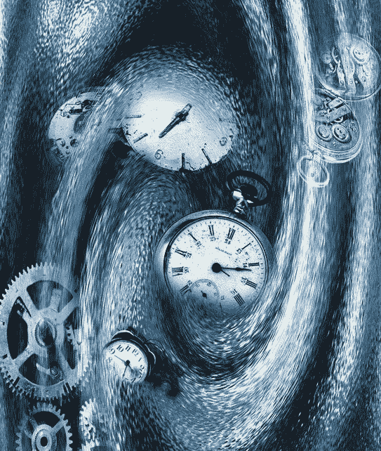

# 我如何使用 statsmodels 向量自回归(VAR)对多元训练数据进行预测

> 原文：<https://medium.com/mlearning-ai/how-i-used-statsmodels-vector-autoregression-var-to-forecast-on-multivariate-training-data-fc867eb6de8b?source=collection_archive---------1----------------------->

过去几天，我收集了一个数据集，涉及一个非营利组织中某个部门的培训状况，个人可以在他们的数据科学项目中使用。。

这个数据集，我称之为 Analyse _ Training _ Deficiencies，是一个多元数据集，可以在这里找到…