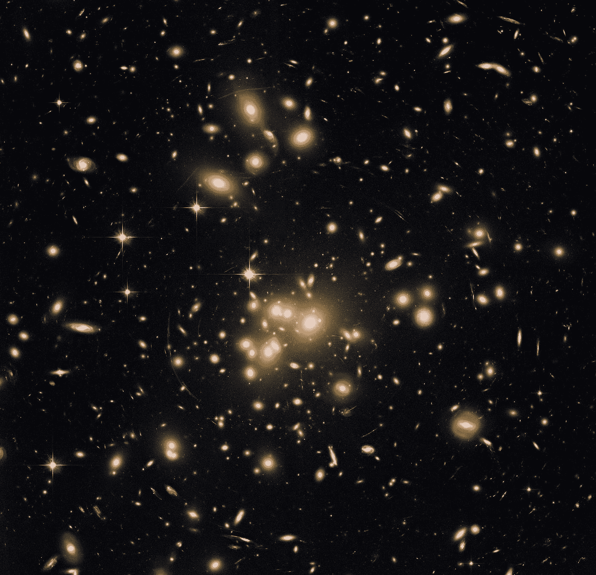

# 我如何使用贝叶斯高斯模型来解决卡格尔 2022 年 7 月的无监督表格竞争

> 原文：<https://medium.com/mlearning-ai/how-i-used-the-bayesiangaussian-model-to-solve-kaggles-july-2022-unsupervised-tabular-competition-a51f05fade07?source=collection_archive---------0----------------------->

在 7 月 22 日的表格竞赛中，卡格尔提出了他们第一个无人监督的竞赛问题。没有告知参赛选手所提供的数据集中有多少聚类，参赛选手必须做出最佳猜测。有一些模型可以在群集数量未知时创建群集，例如 dbscan 或分层…