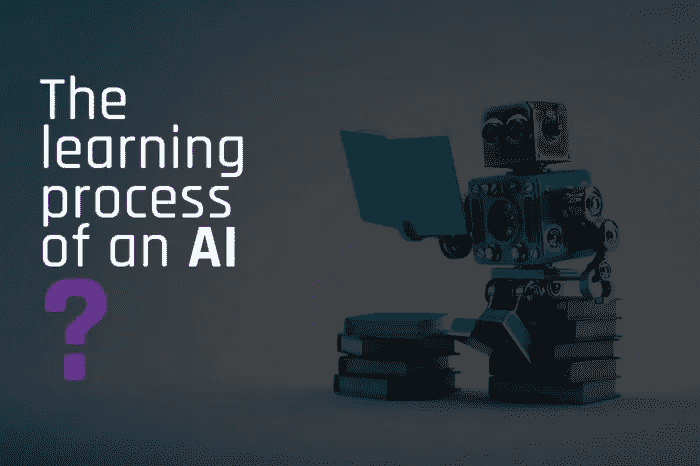

# 人工智能的学习过程如何？

> 原文：<https://medium.com/mlearning-ai/how-is-the-learning-process-of-artificial-intelligence-d80d894f8415?source=collection_archive---------2----------------------->

世界上大多数生物都会经历一个成长和学习的过程，在这个过程中，别人会教他们如何做一些事情。如果你看看人类，当我们是孩子的时候，我们的父母教我们具体的行为和如何完成我们的义务。如果你看到动物，它们的父母会教它们如何捕猎、生存和自卫。我们可以找到与…相同的联系