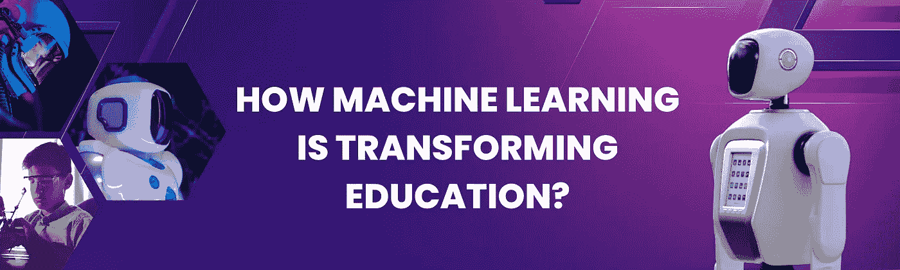
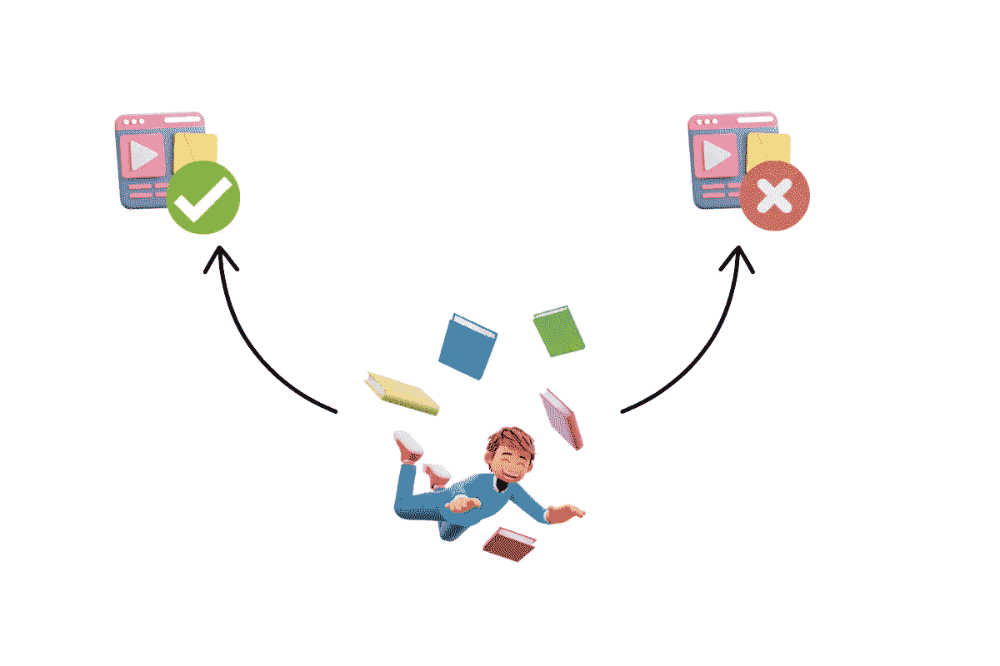

# 机器学习如何改变教育？

> 原文：<https://medium.com/mlearning-ai/how-machine-learning-is-transforming-education-994f5e913728?source=collection_archive---------3----------------------->

众所周知，机器学习正在改变我们所知的世界。这项强大的技术正被广泛应用于各个行业，从医疗保健到金融再到零售。但是教育呢？在这篇博客文章中，我们将讨论机器学习被用来改变教育领域的几种方式。从聊天机器人到个性化学习体验，机器学习正在改变学生学习和教育工作者教学的方式。让我们潜水吧！

机器学习在教育中最受欢迎的应用之一是**聊天机器人**的使用。聊天机器人是能够模拟人类对话的计算机程序。它们通常用于提供自动化的客户支持，为常见问题(也称 FAQ)提供快速有效的答案，或简化复杂的任务。在教育领域，聊天机器人可以用来为学生提供全天候的学术支持。他们可以充当虚拟导师来帮助学习者。

例如，如果一个学生有关于家庭作业的问题，他们可以简单地给聊天机器人发一条信息，并收到即时回复。这使教育者可以腾出时间专注于其他任务，并让学生在需要的时候得到帮助。

Image provided by the blog author

机器学习在教育中的另一个常见应用是使用**推荐系统**。推荐系统是基于用户过去的行为来建议项目的算法，这种人工智能通常被用在像网飞这样的流媒体平台上。它通过分析您的观看习惯并推荐您可能喜欢的类似内容来工作。在教育中，推荐系统可以用来根据学生以前的课程或兴趣推荐课程或书籍。例如，如果学生选修了数据科学的入门课程，则推荐系统可能会推荐数据科学或相关领域的高级课程，例如 Deep Learning 或 MLOps。推荐系统为学生提供量身定制的建议，帮助他们探索新的兴趣领域，发现隐藏的才能。

Image provided by the author

我们需要提到的是，机器学习也可以用来**预测高危学生**。这意味着它可以预测哪些学生有辍学或不及格的风险。拥有此类信息非常有用，因为我们可以通知讲师，以便他们可以为这些学生提供额外的支持(例如，辅导、指导等)。)以达到预期的成功。

最后，机器学习被用来为学生创造个性化的学习体验。人工智能可以分析学生的数据(例如，考试分数、成绩、出勤记录)，并为每个人创建定制的学习计划。例如，如果一名学生正在努力学习一个特定的概念，我们的人工智能系统可以为他们提供额外的资源(例如，练习题、视频等)。)来帮助他们更好地理解材料。这种**以学习者为中心的**方法允许学生接收专门为他们的需求和兴趣定制的内容。因此，学生们更专注于他们的学习，更有可能实现他们的目标。

正如我们所看到的，机器学习正在对教育领域产生重大影响，它似乎很有希望彻底改变学生的学习方式和教育者的教学方式。有这么多令人难以置信的应用，难怪机器学习正迅速成为我们这个时代最重要的技术之一。

 [## Mlearning.ai 提交建议

### 如何成为 Mlearning.ai 上的作家

medium.com](/mlearning-ai/mlearning-ai-submission-suggestions-b51e2b130bfb)