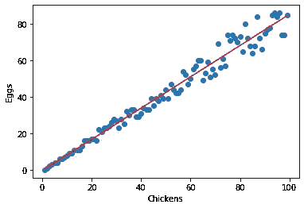
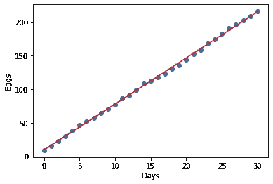
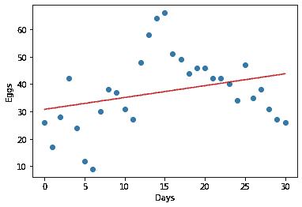

# 我会得到多少鸡蛋？线性回归可以告诉你。

> 原文：<https://medium.com/mlearning-ai/how-many-eggs-will-i-get-linear-regression-can-tell-you-d7d0e5968a4c?source=collection_archive---------2----------------------->

你听说过这样一句话吗？不要在小鸡孵出来之前数你的小鸡。现在你不必用线性回归了。通过这个介绍，你可以了解更多关于线性回归的知识，以及如何简单地向你的孩子解释或者只是为了你自己的学习。


Photo by [Karim MANJRA](https://unsplash.com/@karim_manjra?utm_source=unsplash&utm_medium=referral&utm_content=creditCopyText) on [Unsplash](https://unsplash.com/s/photos/chicks?utm_source=unsplash&utm_medium=referral&utm_content=creditCopyText)

所以你想知道在一个给定的时间里，你会得到多少只鸡，或者更确切地说，多少个蛋？好吧，线性回归是来拯救世界的！

在这个练习中，我们将使用所谓的简单线性回归。不要太担心简单的部分，它只是指只有一个决定性因素，即鸡的数量，而不是一个以上。

## 鸡和线性回归有什么关系？

不太多，他们实际上更喜欢探索性的数据分析(他们四处搜寻，直到找到感兴趣的东西)。

玩笑归玩笑，从鸡身上获得的数据可以帮助你学习线性回归。

关于鸡的要点:

*   它们产卵
*   我们可以数鸡蛋
*   许多品种的鸡每天下一个蛋
*   传统品种可能不会全年产蛋

所以正如你所看到的，关于鸡的一些事情意味着每只鸡每天的蛋的比例并不总是 1 比 1。

一只鸡可能是一只公鸡(不会下蛋)，可能正在换羽(不会总是下蛋)，可能不下蛋(例如在冬天)，或者可能怀了孕(宝宝可能就要出生了！)所有这些因素都会减少一群鸡在某一天、某一月或某一年生产的鸡蛋数量。

## 什么是线性回归？

鸡和蛋只是线性关系的一个例子。其他包括:

*   购买水果——批量购买时，单价可能会下降
*   驾驶时的燃油消耗(燃油随着驾驶而减少)
*   给定广口瓶的重量，广口瓶里有多少颗软糖

让我们回到鸡和蛋的例子。下图展示了一个虚构的鸡和蛋的故事，当我们增加鸡的数量时，我们也会得到更多的蛋。请注意，我们不会从 100 只鸡身上得到 100 个鸡蛋。这又回到了我们在开始提到的因素，我们可能有公鸡，或者一些鸡可能因为各种原因不下蛋。



Image by Author

“我们当然会知道我们有多少只鸡，其中有多少是公鸡？”我听到你问了。没错，但是想象一个有 100、1000 甚至 10000 只鸡的企业。他们可能想知道每只鸡能产多少蛋，上面看到的生产快照会帮助他们做到这一点。

另一个有用的图是显示每天、每周、每月或每年产卵量的时间序列。



Image by Author (egg production for 10 chickens per month)

在上面的图中，你可以看到一个月以来每天产卵量的上下波动。穿过中间的红线称为回归线，是显示数据的平均值。每条回归线用线性方程以数学方式表示，其形式为:

y = mx + c

其中 y 是预测值(eggs)，m 是直线的斜率，x 是行列式(days)，c 是 y 截距(回归线与 y 轴相交的地方)。

出于兴趣，我们现有数据的直线方程是:

```
daily egg  production = 6.87 x day + 9.24
```

因此，在第 5 天，我们可以预计 10 只鸡大约产 43-44 个蛋，这并不算太糟糕，因为如果它们每天都产一个蛋，那么最多产 50 个蛋。

## 所以我们有一个等式！但是方程可靠吗？

并不是所有的数据集都像我生成的一样“整洁”。我故意这样做，以便值每天都在上升，并且数据中没有可能影响我们模型的异常值。

判断直线是否适合数据的一种方法是 R 平方值，或决定系数。简而言之，这将告诉您 x 值对 y 值的预测有多准确，因此是一种相关性的度量。

例如，我们的产蛋模型的 R 平方值是 0.9996，非常接近 1！这意味着正在生产的蛋的数量几乎完全由已经发生的天数决定。

现在想象一下，有一小段时间，没有鸡下蛋，农场里发生了一些奇怪的事情。那会是什么样子呢？



Image by Author

现在花一分钟想想这个农场里的鸡会怎么样。很有可能，在这种情况下，我们可能有一个记录保存问题，有人在编造数据…也许是鸡。我怀疑是家禽游戏！！

我们做了一些检查，看起来作者可能对数据有所创新。没错，是我！我会以教育的名义再做一次！

所以回到正题。道奇地块的 R 平方值为 0.2905，这意味着，虽然天数对产卵量有一些影响，但这远不是唯一的因素。

## 那么这意味着什么呢？

这意味着你应该经常检查你面前的数据是否真实合法，但更重要的是，要明白现实世界中完全没有错误的数据是很少的，如果有的话。

这里的另一个主要收获是，线性回归可以用于各种领域，以提供对事物如何工作的见解，并对未来做出有用的预测。

如果你想要一些令人惊讶的高度相关关系的例子，那就看看[虚假相关性](https://www.tylervigen.com/spurious-correlations)！这是解释为什么相关性不总是=因果关系的一个很好的资源。但这是另一篇文章的主题！

我希望你已经对线性回归以及如何使用它有了一些了解。我写它的时候真的很开心！

写这篇文章是为了给那些寻找简单易懂内容的父母/看护者和老师提供线性回归的介绍。我希望有了我提供的信息，你会有信心把这些知识传递下去。

想了解更多关于教你的孩子计算机编程和数据科学的资源，请看下面列出的我以前的一些帖子:

[](/mlearning-ai/machine-learning-for-kids-decision-trees-db9853dca27d) [## 面向儿童的机器学习—决策树

medium.com](/mlearning-ai/machine-learning-for-kids-decision-trees-db9853dca27d) [](https://allanbond.medium.com/teaching-children-programming-using-minecraft-6a537d38f4dd) [## 使用《我的世界》教儿童编程

### 学习编码几乎是我们的孩子的一个要求，随着劳动力从传统角色转向…

allanbond.medium.com](https://allanbond.medium.com/teaching-children-programming-using-minecraft-6a537d38f4dd) [](https://allanbond.medium.com/machine-learning-for-kids-1f47d656bee0) [## 面向儿童的数据科学——如何让他们入门

### 机器学习领域在最近几年有了爆炸性的发展，所以为什么不教你的孩子使用简单的工具呢…

allanbond.medium.com](https://allanbond.medium.com/machine-learning-for-kids-1f47d656bee0) 

如果你喜欢这篇文章，请通过 [LinkedIn](http://linkedin.com/in/allanbond) 或 [Twitter](https://twitter.com/AllanJBond) 与我联系。