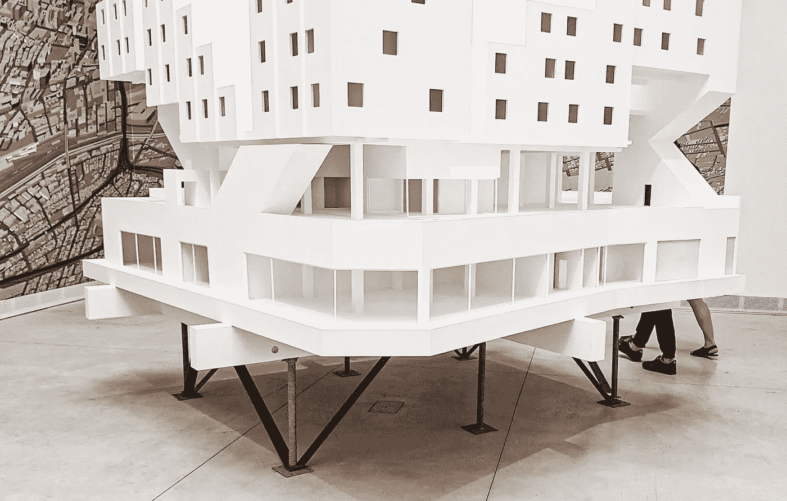

# MLearning.ai 如何增强创造力

> 原文：<https://medium.com/mlearning-ai/how-mlearning-ai-enhance-creativity-c5932589e2a4?source=collection_archive---------6----------------------->

## [艾艺术](https://mlearning.substack.com/p/-how-ml-tools-can-enhance-your-creativity?r=z7zu8&utm_campaign=post&utm_medium=web)

## [提高生产力的机器学习](https://www.getrevue.co/profile/mlearning_ai/members)

machine learning for creativity

一位[人工智能艺术家](/mlearning-ai/datasculptors-top-stories-616f2f098959)经常在他们的创作过程中融入人工智能和机器学习。人工智能的范围可以从将 ML 生物集成到[创作过程中](/mlearning-ai/unlimited-creativity-7aac8457e837)到将实时设备集成到交互式装置中。社交媒体作为空间，数据作为空气，机器学习…