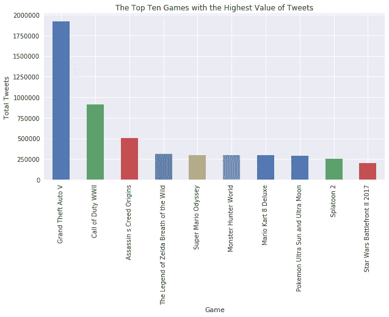
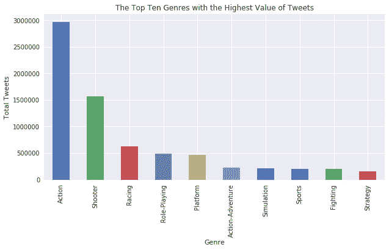
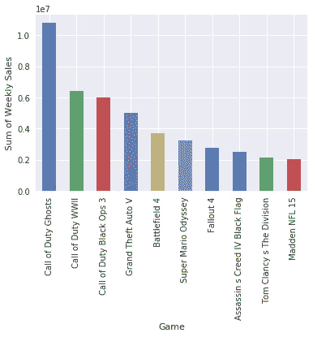
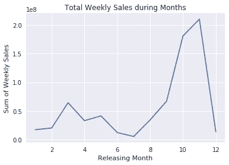
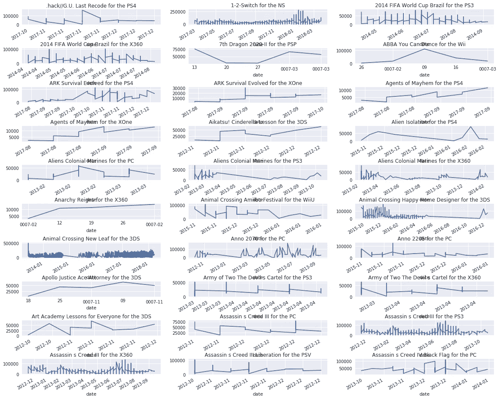

# 你会从你的电子游戏中获得多少？

> 原文：<https://medium.com/mlearning-ai/how-much-will-you-sell-off-of-your-videogame-44994aabb125?source=collection_archive---------3----------------------->

随着我最近努力玩《战地 I》和《战地 V》将于 10 月份发行，我对公司如何确定销售什么以及如何销售变得相当感兴趣。我开始寻找有助于解答我的好奇心的数据来源。我发现 [VGChartz](https://www.vgchartz.com/) 是一个可靠且经常更新的网站。VGChartz 包含几个具有视频游戏特征的数据库，包括类型、发行年份、每周和总销售额等等。有了这些数据，我仍然需要找到一种方法来衡量买家中的受欢迎程度，并发现视频游戏的活跃用户也倾向于在 Twitter 等其他平台上社交。该项目调查了出版商的特征、推文数量和周销售额之间的相关性，以最终预测接下来一周的周销售额。

获取数据的时间最长(这似乎是数据科学家世界的趋势)。我在网上搜索了 VGChartz 和 Twitter(不，我不知道熊猫创造了一个功能，可以让我用 HTML 阅读)。

我在看周销售额和总销售额。

对于总销售额，我用 BeautifulSoup 开始了网页抓取过程。下面是总销售额的部分代码。

```
urlhead = '[http://www.vgchartz.com/gamedb/?page='](http://www.vgchartz.com/gamedb/?page=')
urltail = '&results=1000&name=&keyword=&console=&region=All&developer=&publisher=&goty_year=&genre=&boxart=Both&ownership=Both&results=50&order=Sales&showtotalsales=0&showtotalsales=1&showpublisher=0&showpublisher=1&showvgchartzscore=0&showvgchartzscore=1&shownasales=0&shownasales=1&showdeveloper=0&showdeveloper=1&showcriticscore=0&showcriticscore=1&showpalsales=0&showpalsales=1&showreleasedate=0&showreleasedate=1&showuserscore=0&showuserscore=1&showjapansales=0&showjapansales=1&showothersales=0&showothersales=1'
clean_list = []for page in range(1,pages):
    surl = urlhead + str(page) + urltail
    r = requests.get(surl)
    soup = BeautifulSoup(r.text,'html.parser')

    #even rows
    charts = soup.find_all("tr", attrs={"style": "background-image:url(../imgs/chartBar_alt_large.gif); height:70px"})

    for row in charts:
        values = []
        for value in row.find_all("td"):
            if value.text != ' ':
                values.append(value.text)
        values = list(filter(str.strip, values))
        clean_list.append(values)
```

清理数据帧需要删除大量不存在的值和不必要的列。由于总销售数据包括每周销售的类型和其他特征，我必须检查类型、位置等，并将它们分别添加到数据框中。

为了让 Twitter 正常运行，我做了一个数据框，上面有所有比赛的名称，以及需要运行的日期。我把 2006 年的日期去掉了，因为那是 Twitter 发布推文的最早日期。

使用当前的 Twitter API，我只能从过去 7 天中提取推文。然而，我想获得过去 7 年的推文。我基于 [Henrique 的作品](https://github.com/Jefferson-Henrique/GetOldTweets-python)创建了一个函数 finding_tweets。请注意，我不得不在每周 500 条推特上停止，因为计算是内存密集型的，也是时间敏感的。

```
def finding_tweets(videogame):
    name = []
    start_date = []
    tweet_date = []
    tweet_text = []
    assert isinstance(videogame[0],str)
    assert isinstance(videogame[1],str)
    assert isinstance(videogame[2],str)
    try:
        tweetCriteria = TweetCriteria().setQuerySearch(videogame[0]).setSince(videogame[1]).setUntil(videogame[2]).setMaxTweets(500)
        tweets = TweetManager.getTweets(tweetCriteria)
        for tweet in tweets:
            tweet_date.append(tweet.date)
            tweet_text.append(tweet.text)
    except:
        print(videogame[0],videogame[1],videogame[2], 'empty')
    df = pd.DataFrame(np.column_stack((tweet_date,tweet_text)))
    df['Name']= videogame[0] 
    df['start_date'] = videogame[1]
    df['end_date'] = videogame[2]
    return df
```

在抓取之后但在分析之前，我最终将单位销售额(以百万计)更改为每 1000 人的单位销售额，并将日期从字符串更改为 datetime 对象。

```
#Populations
USA = 326067398
UK = 66454759
Germany = 82239223
France =  65156451
Japan = 127275698#Definitions
Europe = UK + Germany + France
Global_pop = USA + Europe + Japan#conversions
sales['JP_Sales'] = [float(x)*1000000.0*1000.0/float(Japan) for x in sales['JP_Sales']]
sales['EU_Sales'] = [float(x)*1000000.0*1000.0/float(Europe) for x in sales['EU_Sales']]
sales['NA_Sales'] = [float(x)*1000000.0*1000.0/float(USA) for x in sales['NA_Sales']]
sales['Global_Sales'] = [float(x)*1000000.0*1000.0/float(Global_pop) for x in sales['Global_Sales']]
columns = ['Chartz_Score','User_Score','Critic_Score','Other_Sales']
for col in columns:
    sales[col] = pd.to_numeric(sales[col],downcast='integer')
sales['Year'] = pd.to_datetime(sales['Year_of_Release'],dayfirst=True,errors='coerce').dt.year
sales.head()
```

当我不得不决定出版商的总部所在地时，我决定考虑通过谷歌地理编码结果得出的第一个结果是最佳选择。我做这个假设的基础是，最高的结果意味着人们看这个最多。

VGChartz 的大多数游戏都是动作和射击类的，这显然表明人们喜欢这种类型的游戏(否则他们不会继续制作它们)。然而，这意味着数据偏向于这两种类型。

现在我们准备好出发了！

首先，我想看看当时最流行的视频游戏是什么。



The top ten games with highest value of tweets

排名前两位的游戏是侠盗猎车手 V 和使命召唤二战。我对《使命召唤:二战》并不感到惊讶，因为它几周前才刚刚发行。但是侠盗猎车手 V？很久以前就出了！人们仍然在推特上谈论它，所以这可能表明尽管这个游戏已经有 5 年的历史了，但它仍然很受欢迎。然而，这正是对推文进行感性分析有助于澄清的地方。

每个电子游戏都有一个流派。推文数量最多的类型是动作类，然后是射击类。



又一次，不意外。

发行商的位置显示大多数游戏实际上都是在北美和欧洲开发的。然而，有些游戏是在南美西部和非洲南部制作的，这是我没有预料到的。

更注重单位销售，我想看看什么游戏卖得最多，什么时候卖得最多。



《使命召唤幽灵》的销量高居榜首有点出乎意料，但这是有道理的，因为这款游戏是《使命召唤》系列的一部分。出于同样的原因，我对《使命召唤:二战》成为销量第二的游戏并不感到惊讶。

现在是各大洲的销售额..

这些游戏大部分是在 9 月(第 9 个月)到第 11 个月的假期期间售出的。请注意，每周的总销售额是价值乘以 1e8，即以百万为单位。



这让你感到惊讶吗？这是因为大量的销售正在进行，人们正在为自己、家人和朋友购买礼物。也要考虑一下这段时间的天气。这也是为什么大多数游戏都是在这段时间发布的。

```
Month Number of Games
1      519
2     1138
3     2525
4     1491
5     1554
6      730
7      343
8     1134
9     1596
10    4748
11    5223
12     892
```

但是有了这些数据，我能预测未来几周的销售吗？

我用 AdaBoostRegressor 和 RandomForestRegressor 作为基本估计量来预测未来四周的销售额。使用以下参数的测试集准确度得分为 0.375。

```
0.37511167387659317 AdaBoostRegressor(base_estimator=RandomForestRegressor
(bootstrap=True, criterion='mse', max_depth=None,max_features='sqrt', 
max_leaf_nodes=None,
min_impurity_decrease=0.0, 
min_impurity_split=None, 
min_samples_leaf=1, 
min_samples_split=2, 
min_weight_fraction_leaf=0.0, 
n_estimators=9, 
n_jobs=-1,
oob_score=False, 
random_state=None, 
verbose=0, warm_start=False)
,learning_rate=1.0, loss='linear', n_estimators=50,random_state=None)
```

找到了接下来四周所有视频游戏的分数，但决定只显示 30 分。



# 进一步研究

我会考虑添加更多的推文。我目前每款游戏每周最多只发 500 条推文，这造成了对视频游戏受欢迎程度的不准确描述。

因为我目前假设视频游戏的受欢迎程度是由推文的数量决定的，所以在推文的基础上增加一个情感分析会很有帮助。一条负面的推文可能有某个值，比如-1，而一条正面的推文可能大于 1，这决定了一款游戏受欢迎背后的潜在原因。

感谢您的阅读，并期待听到任何评论或反馈！:)

有兴趣阅读更多关于代码和项目的信息吗？下面是[链接](https://github.com/sdf94/videogame_sales/blob/master/videogame_sales.ipynb)！

[](/mlearning-ai/mlearning-ai-submission-suggestions-b51e2b130bfb) [## Mlearning.ai 提交建议

### 如何成为 Mlearning.ai 上的作家

medium.com](/mlearning-ai/mlearning-ai-submission-suggestions-b51e2b130bfb)