# 你的数据集有多嘈杂？样本和重量训练样本，以优化性能！！！

> 原文：<https://medium.com/mlearning-ai/how-noisy-is-your-dataset-sample-and-weight-training-samples-to-optimize-the-performance-aa8e0e3b7c43?source=collection_archive---------2----------------------->

训练数据可能是干净的，也可能是有噪声的，从而影响机器学习模型的性能。本文讨论了处理各种情况的最佳策略。内容基于论文[5]。

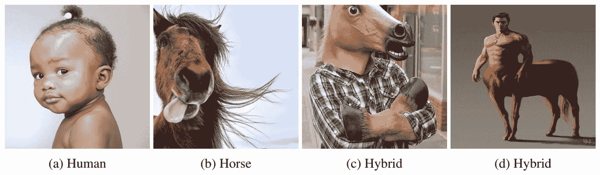

**Figure 1:** Human-Horse image classification: difficult samples for annotation.

# **数据收集和注释中的实际问题**

目前，深度学习是人工智能发展的一项重要技术。这种技术的功效取决于(1)训练样本的数量和(2)数据注释的质量。然而，大容量的训练数据导致注释工作的困难管理。例如，图 1 示出了一个简单图像分类问题的四个训练样本:人对马。为了收集这两个类别的大量图像，可以在互联网上抓取数据。大多数图像都区分出人和马，如图 1 a、1b 所示。然而，通常会看到如图 1 c、1d 所示的嘈杂图像，注释者很难决定哪一类图像更适合他们。显然，即使对于这种简单的两类识别，数据收集和注释也是具有挑战性的。

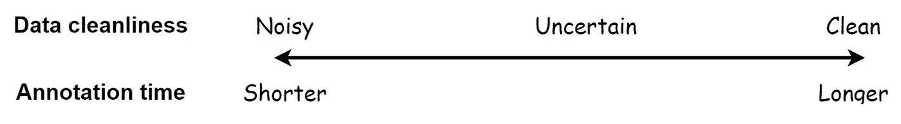

**Figure 2:** Trade-off between data cleanliness and annotation management.

根据清洁度标准，我们可以将训练数据集组织成三类: ***【清洁】*****。如图 2 所示，在数据清洁度和注释管理之间有一个折衷。首先， ***干净*** 如果仔细管理数据收集和标注，这是耗时且需要劳动力的。第二，标签*代表一个数据集被爬取(例如通过 [*icrawler*](https://pypi.org/project/icrawler/) 使用关键词)然后直接馈入深度学习模型进行训练。最后，我们使用术语 ***不确定*** 来表示清洗过程具有粗略监督(例如，一轮)的数据集。然后，尽管进行了一轮评估，我们仍然不确定注释是否完全精确。***

# **采样和加权训练数据**

**不同类型的训练数据集表现出不同的属性。因此，有必要对每个数据集采用不同的采样和加权策略来优化模型性能。在剩下的部分中，我将讨论四种采样策略，分别名为 ***、统一的、自定进度的、硬示例挖掘的*** 和 ***主动偏向的*** 学习。对于每种采样方法，我们还讨论了是否应该加权以进一步强调某些特定的训练样本。**

## **制服**

**在训练机器学习模型时，由于计算机内存容量有限，训练样本集被分成更小的批次。一次迭代将处理单个批次的前馈和反馈。在某个时刻，应该选择哪些样本放入该批次还是一个问号。一个琐碎的解决方案，叫做 ***统一*** ，就是平等对待每一个样本。换句话说，选择每个样本的概率是相同的。我们可以使用这种方法的两种变体之一。首先，一种叫做 **SGD-Uni** 的方法基于概率选择一批训练样本:**

**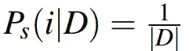**

**输入到模型中。然后，它将样本放回训练集，以参加下一次选择。第二，另一种方法，即 **SGD-Scan** 基于概率:**

**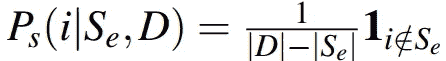**

**选择训练样本。在一轮样本选择之后，该方法跳过选定的样本，只考虑队列中的其余样本。虽然 **SGD-Uni** 可能会跳过一些训练样本，但 **SGD-Scan** 会扫描所有数据。因此， **SGD-Scan** 很可能比 **SGD-Uni** 执行得更好。**

## **自定进度学习**

**对于人类来说，学习过程通常是一种由易到难的策略。这启发了神经网络的一个训练过程，称为 ***课程学习***【1】，从容易到难的样本学习机器学习模型。然而，标注者很难定义每个训练样本的难度。此外，人类和机器对于样本是容易还是难的观点可能不一致。一种所谓的 ***自定步调学习***【2】，简称 **SGD-SE** 的方法，提出采用当前模型的损失来评估训练样本的难度水平。具体来说，预测标签和实际标签之间的损失越低，意味着模型在处理样本时更有信心。相反，较大的损失对应于较低的置信度得分。训练数据优先队列选择样本 *i* 的概率公式为:**

**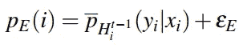**

**其中第一个因子代表模型对样本 *i* 正确预测的置信分数，第二个因子是偏差参数。这种方法在带有噪声标签的训练数据集中表现出更强的鲁棒性[3]。**

**请注意，通过这种采样策略，模型会比较难的样本更频繁地扫描较容易的样本。这并不意味着模型偏向其参数，以满足更容易的样本多于更难的样本。为了产生这种偏差，将采用所谓的 **SGD-WD** 加权策略，样本权重公式如下:**

**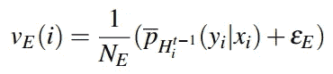**

**其中分母旨在归一化样本权重。**

## ****硬例挖掘****

**课程学习[1]表现出一些缺点。首先，更简单的样本有助于更小的梯度，导致模型收敛缓慢。第二，硬训练样本由处理具有挑战性的测试样本的关键特征组成。例如，只有狗头的图像很难，但它是训练狗识别模型的好样本。通过这个硬样本，该模型可以识别出只露出头部而身体藏在灌木丛或沙发中的狗。因此，在整个训练过程中更优先考虑硬样本可以导致更强的性能。因此，在干净的训练数据的情况下，硬例挖掘[4]，简而言之 **SGD-SD** ，策略更适用。这种方法为模型可信度较低的样本提供了更多的频率:**

**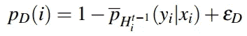**

**然后，我们可以通过增加权重，让模型进一步关注硬样本:**

****

**在损失函数中。这种方法叫做 **SGD-WD** 。**

## **主动偏向学习**

**评估每个单一训练样本的注释是耗时的。况且，多少“干净”才够挑这两种学习策略中的一种。主动学习[5]，简称为 **SGD-STC** ，通过关注停留在预测边界的样本来平衡它们。该方法寻找哪个样本是“几乎正确”或“几乎错误”的，然后将它们推入正确的一侧。选择这种样本的概率公式如下:**

**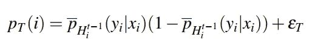**

**我们还可以检验在“边界”样本上加权是否可以提高模型的性能:**

**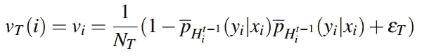**

**该方法被命名为 **SGD-WTC** 。**

# **实验结果**

**为了评估具有不同清洁度级别的数据集上的采样和加权策略，论文[5]对两个机器学习问题进行了实验。第一个问题是在干净的 [*MNIST*](http://yann.lecun.com/exdb/mnist/) 数据集上评估的手写识别。随机选择的 10%训练图像被进一步重新分配标签，即噪声 MNIST，以评估在噪声训练样本上训练的所呈现方法的鲁棒性。第二个问题是在数据集 [*CIFAR*](https://www.cs.toronto.edu/ kriz/cifar.html) 上评估的图像分类。图像被显著地下采样到 32×32×3，使得这个问题更具挑战性，即使对于注释者来说也是如此。**

**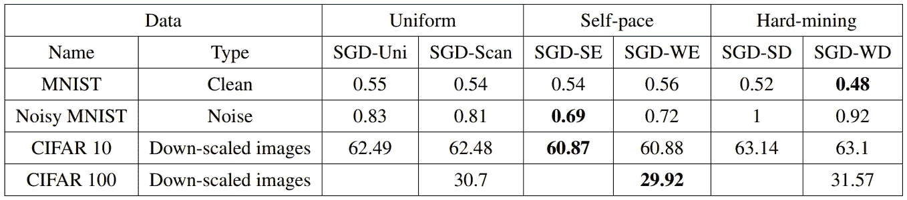**

****Table 1:** The testing error rates of different sampling and weighting strategies. The smaller number indicates better performance.**

**当收集数据的清洁度已知时，哪种取样或称重策略更可取？表 1 给出了答案。以下是结果分析:**

****整齐划一。**表 1 显示 SGD-Scan 的测试误差相对小于 SGD-Uni。这两种方法之间的差距并不明显。以上四个问题， ***统一*** 并不是数据采样的最佳方案。**

**自定进度的学习。如表 1 所示，对于噪声数据，易到难策略(SGD-SE，SGD-WE)是最有效的方法。然而，SGD-WE 比 SGD-SE 更关注简单样本，似乎比 SGD-SE 引起相对更大的误差。这表明应该仔细考虑对简单样品的关注程度。**

****硬例挖掘。**在数据非常干净的情况下，更多地关注硬示例(SGDSD 和 SGD-WD)会得到更好的结果。这表明较难的样本比较容易的样本包含更多的区别特征。**

**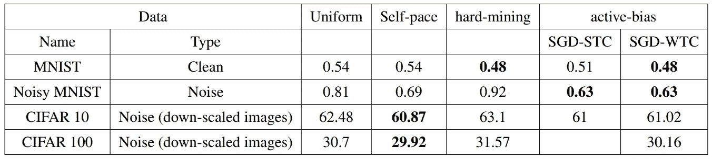**

****Table 2:** The testing error rates of different sampling and weighting strategies. The smaller number indicates better performance.**

****主动偏置学习。**然而，我们通常不确定数据有多杂乱。此外，我们可能没有足够的计算机资源来验证自定进度或硬挖掘是否会产生更好的结果。因此，需要一种方法来处理这两种情况，并具有竞争性的性能。表 2 显示，主动偏置就是这样一种方法。当训练数据是干净的时，硬挖掘和主动偏向一起表现最好。否则，在数据嘈杂的情况下，出色的表现属于自定步调。然而，这种方法与主动偏置之间的差距并不明显。另一方面，抽样和加权没有太大区别。这表明，为了满足紧迫的截止日期，研究人员可能会选择其中之一，而不考虑如何进一步优化性能。**

**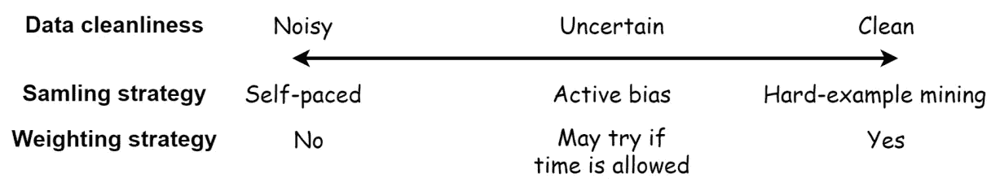**

****Figure 3:** Sampling and weighting strategies based on the cleanliness of training data.**

# **结论**

**图 3 示出了针对每种训练数据情况的适当训练方法。没有样本加权的自定步调学习对于有噪声的标签数据是优选的。对于干净的数据，应选择硬示例挖掘和样本加权。如果训练数据的清洁度不确定，主动偏向学习是更好的选择。**

# **参考**

**[1] Yoshua Bengio、Jerome Louradour、Ronan Collobert 和 Jason Weston。课程学习。ICML 2009。**

**[2]帕万·库马尔、本杰明·帕克和达芙妮·柯勒。潜在变量模型的自定步调学习。NIPS 2010。**

**[3]，，，张，孟德宇，，，庄月婷.用于分类的自定进度推进学习。IJCAI 2016。**

**[4] A. Shrivastava、A. Gupta 和 R. Girshick。利用在线硬示例挖掘训练基于区域的对象检测器。CVPR 2016。**

**[5] Haw-Shiuan Chang、Erik Learned-Miller 和 Andrew McCallum。主动偏向:通过强调高方差样本来训练更精确的神经网络。NIPS 2017。**