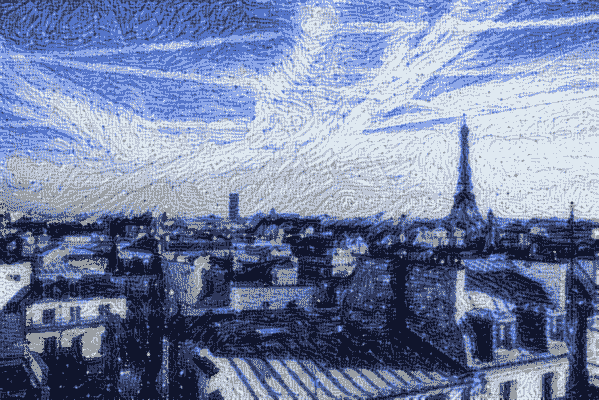

# 规范化层如何影响图像样式？阿丹是什么？

> 原文：<https://medium.com/mlearning-ai/how-normalization-affects-image-styles-edec31841bb4?source=collection_archive---------1----------------------->

source: [https://keras.io/examples/generative/neural_style_transfer/](https://keras.io/examples/generative/neural_style_transfer/)

在风格转换和一些生成网络中，使用特殊的规范化层，如 CIN、阿丹，来控制输出图像的风格。但是标准化层是如何影响图像风格的呢？

为了知道为什么它们被集成到许多现代神经网络模型中，理解其背后的基本原理是至关重要的。