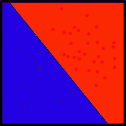
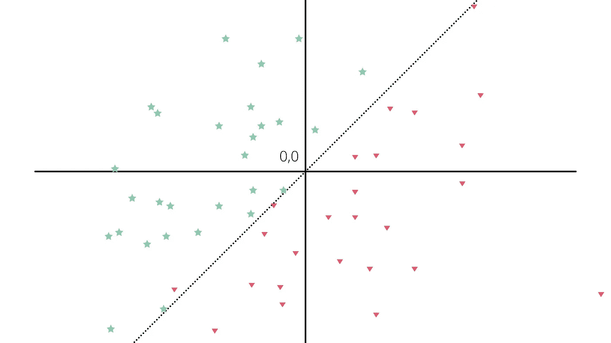

# 感知器如何解决线性可分问题

> 原文：<https://medium.com/mlearning-ai/how-perceptrons-solve-the-linearly-separable-problems-b8a623055550?source=collection_archive---------1----------------------->

感知器是单个神经元模型，它可能是大型网络的前身。

感知器执行计算以输出二进制值 0 或 1(根据使用的激活函数，输出值也可以是-1 和 1)。

## 什么是线性可分问题？

> **线性可分性**是两组[点](https://en.wikipedia.org/wiki/Point_(geometry))的性质。通过将一组点想象成蓝色，而将另一组点想象成红色，这在二维空间(T4 欧几里得平面)中是最容易可视化的。如果在平面中至少存在一条[线](https://en.wikipedia.org/wiki/Line_(geometry))，并且所有的蓝点在线的一侧，所有的红点在线的另一侧，则这两组是*线性可分的*。

Image Courtesy: [https://en.wikipedia.org](https://en.wikipedia.org/)

## 单个感知器如何解决线性可分问题？

正如我们所知，单个感知器由输入、权重、偏差和一个服务于输出的激活函数组成。

让我们假设感知器的输出是 y，x 是感知器的一个输入，只有一个输入。

那么 y = w1*x + b，其中 **w1** 是输入的权重， **b** 是偏差。

让我们进一步简化这个问题，假设 w1 为 1，b 为 0。

这使得我们的方程为 y = x，这是通过原点的直线的方程。

上图显示的是红色和绿色标签，分别表示问题中的两个类别。

正如我们可以看到的，我们上面定义的等式可以很容易地将这两种类型分开。

## 但是如果问题不是线性可分的呢？

单个感知器不能解决线性不可分的问题。

正如我们所见，单个感知器能够以模型的形式输出线性方程。

因此，为了解决非线性问题，我们在网络中添加了多个感知器。

一个这样的问题是 XOR 问题，它导致多层感知器。

你可以在这里阅读多层感知器[。](/@priyansh-kedia/solving-the-xor-problem-using-mlp-83e35a22c96f)

在这篇博客中，我们读到了感知器如何能够解决简单的问题，以及它们如何在解决复杂问题的神经网络的构建中有用。