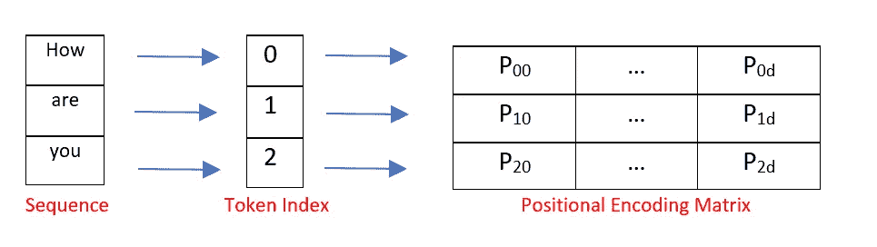
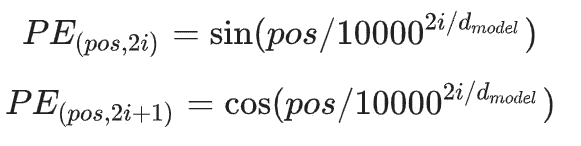
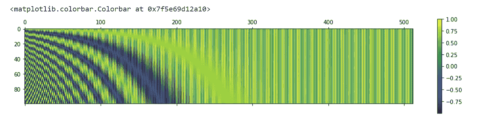

# 位置嵌入如何在自我注意中起作用

> 原文：<https://medium.com/mlearning-ai/how-positional-embeddings-work-in-self-attention-ef74e99b6316?source=collection_archive---------7----------------------->

image src: [https://unsplash.com/photos/qodjMu0byZ8](https://unsplash.com/photos/qodjMu0byZ8)

在语言中，单词的顺序和它们在句子中的位置很重要。如果单词被重新排序，整个句子的意思将会改变，或者在重新排序后句子可能变得没有意义。

递归神经网络具有处理序列排序的内置机制。但是，变形金刚不使用任何递归神经单元，如 LSTM 或 GRU，因此将序列中的每个单词视为彼此独立。因此，增加了位置编码来保留关于句子中单词顺序的信息。

*让我们开始吧！*

# 什么是位置编码？

位置编码告诉转换器模型某个实体/单词在序列中的位置，以便为每个位置分配一个唯一的表示。虽然最简单的方法是使用索引值来表示位置，但这仍然会给长序列带来问题，因为索引的数量会变得很大。

这里，每个位置/索引被映射到一个向量。因此，位置编码层的输出是一个矩阵，其中矩阵中的每一行是序列中的编码字加上它的位置信息。

下图显示了仅编码位置信息的矩阵示例。

Positional encoding of sequence — “How are you”

## 变压器中的位置编码层

假设我们有一个长度为 **L** 的输入序列，我们需要这个序列中物体的位置。位置编码由不同频率的正弦和余弦函数给出:

image src: [https://www.tensorflow.org/text/tutorials/transformer](https://www.tensorflow.org/text/tutorials/transformer)

**d** :输出嵌入空间的尺寸

**位置**:对象在输入序列中的位置，0 ≤位置≤ L/2

**i** :用于映射到列索引 0≤i < d/2。I 的单个值映射到正弦和余弦函数

在上面的表达式中，我们可以看到**偶数位置对应正弦函数，奇数位置对应 cos 函数**。

# 从头开始编码位置编码矩阵

下面是使用 NumPy 实现位置编码的简短 Python 代码。代码经过了简化，以便更容易理解位置编码。

## 可视化位置矩阵

让我们在更大的值上可视化位置矩阵。我们将使用来自`matplotlib`库的 Python 的`matshow()`方法。如在原始论文中所做的，设置 n=10，000，我们得到如下:

Visualizing the Positional Matrix

因此，位置编码层将单词嵌入与序列中每个标记的位置编码矩阵相加，作为下一层的输入。请注意，位置编码矩阵的维数应该与单词嵌入的维数相同。

# 在 Keras 中编写自己的位置编码层

## 导入部分:

首先，让我们编写一节来导入所有需要的库。

## 符号化:

下面的代码片段使用 Tokenizer 对象将每个文本转换成整数序列(每个整数是字典中一个标记的索引)。

## 对 Keras 嵌入层进行子分类:

在实现 transformer 模型时，您必须编写自己的位置编码层。这个 [Keras 例子](https://keras.io/examples/nlp/neural_machine_translation_with_transformer/)展示了如何子类化`Embedding`层来实现你自己的功能。

code src:[https://keras.io/examples/nlp/neural_machine_translation_with_transformer/](https://keras.io/examples/nlp/neural_machine_translation_with_transformer/)

# 参考资料:

*   [图解变压器](http://jalammar.github.io/illustrated-transformer/)
*   [注意力是你所需要的——变压器](http://vandergoten.ai/2018-09-18-attention-is-all-you-need/)

 [## Mlearning.ai 提交建议

### 如何成为 Mlearning.ai 上的作家

medium.com](/mlearning-ai/mlearning-ai-submission-suggestions-b51e2b130bfb)