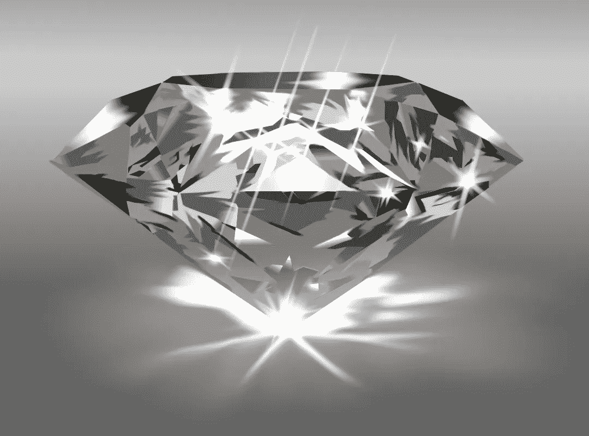

# 有多珍贵？

> 原文：<https://medium.com/mlearning-ai/how-precious-5e050d9fbc50?source=collection_archive---------5----------------------->

## 钻石价格预测

## 用集合 ML 模型估计物品的价值。

商界正在寻找答案的一个重要问题是他们的产品值多少钱？
买卖双方都想知道他们商品的真实价值。特别是如果你是一个卖家，你将卖给客户的产品的价值将确保你不亏本，在市场上变得更加可靠。影响价格的参数有很多。根据可用数据，我们发现通过检查影响价格的因变量和自变量，我们可以使用集成机器学习模型获得非常高精度的估计价格。
在这个名为“**有多珍贵**的项目中，我们以钻石价格为例，这对于珠宝行业和市场都非常重要。我们测试了如何才能高精度地计算出这种产品的价格，这对珠宝行业非常重要。为此，我们使用了集成机器学习模型。

考虑到钻石的 9 个基本属性(克拉、切工、颜色、净度、深度、表、x、y、z 尺寸和价格)，我们在现有的 53940 pc 上实现了集成机器学习库、[**【Ada Boost 回归器**](https://scikit-learn.org/stable/modules/generated/sklearn.ensemble.AdaBoostRegressor.html#sklearn.ensemble.AdaBoostRegressor) 、 [**随机森林回归器**](https://scikit-learn.org/stable/modules/generated/sklearn.ensemble.RandomForestRegressor.html) 和 [**梯度 Boosting 回归器**](https://scikit-learn.org/stable/modules/generated/sklearn.ensemble.GradientBoostingRegressor.html) ，它们具有[**sci kit-learn**](https://scikit-learn.org/stable/modules/classes.html)API 支持
**结果**我们可以用从我们拥有的大量钻石数据中学习的集成机器学习模型来建立一个训练好的模型**98%的准确率**。😊
您可以在此 处尝试训练好的模型结果，学习**您的钻石** [**的** **值。
您可以从**](https://items-price.herokuapp.com/) **[**这个链接**](https://www.kaggle.com/resulcaliskan/diamonds-price-prediction) **中查看数据分析的结果和应用的模型。**
如果你还在寻找更多产品，并想知道其他产品的估价，请**联系我**。**