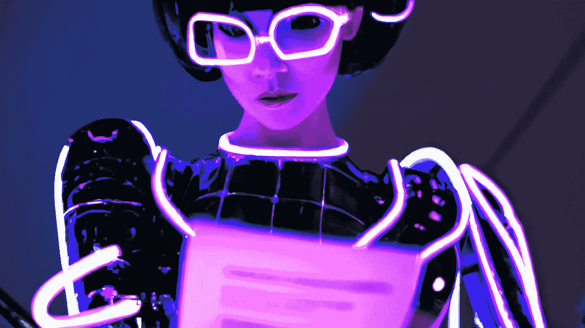

# 机器人如何使用人工智能艺术生成器

> 原文：<https://medium.com/mlearning-ai/how-robots-use-the-ai-art-generator-cdac54caa6a1?source=collection_archive---------8----------------------->

## [AI 的力量](https://evartology.substack.com/p/complete-photos-with-one-click?r=9hp4d&utm_campaign=post&utm_medium=web)

## [机器人](/mlearning-ai/how-quickly-can-the-robot-learn-324913686ca0)的“想象引擎”

[the human and robot can create an arrangement collaboratively](https://mlearning.substack.com/p/i-am-a-shepherd-of-ai-art-robots?r=z7zu8&utm_campaign=post&utm_medium=web)

对于机器人学习来说，这是一条令人兴奋的途径，因为[扩散模型](https://mlearning.substack.com/p/how-does-a-diffusion-model-work?r=z7zu8&utm_campaign=post&utm_medium=web)将继续给各个领域的研究人员带来惊喜和灵感。

## [8 个经过验证的创意经济人工智能工具](https://mlearning.substack.com/p/8-verified-ai-tools-for-creative?r=z7zu8&utm_campaign=post&utm_medium=web)