# 如何利用机器学习获得新客户？

> 原文：<https://medium.com/mlearning-ai/how-to-acquire-new-customers-utilizing-machine-learning-9e59cb66c85f?source=collection_archive---------1----------------------->

# **简介**

你想扩大你的客户群吗？如果你渴望知道如何，你正在阅读它。这篇文章欢迎您了解如何使用一般人群和先前客户的人口统计数据来确定您的未来客户。是的，它需要对数据集进行一些工作，如数据探索、评估、清理和预处理，以适应机器学习模型，最终为您提供潜在客户的性质。

该报告是由 Udacity 提供的数据科学家 Nanodegree 的顶点项目的一部分。这个问题是由 Avarto Financial Solutions 发现的，他们与 Udacity 团队合作，提出了由未来的数据科学家解决这一挑战的想法。整个项目分为两部分:

在第一部分，公司现有客户的人口统计数据和德国的一般人口必须相互比较。因此，必须使用无监督学习技术来识别最能描述邮购公司核心客户群的人群。

在第二部分中，提供了另一个数据集，该数据集具有公司营销活动的目标的人口统计信息。为了预测哪些人最有可能转变为公司的客户，必须应用监督学习技术。

# 客户细分部分

此部分包含数据理解、一般人口数据的人口统计数据预处理(清理、要素缩放和构建适当的清理函数，以便用于任何类似的数据集)并使其准备好适合模型。让我们来看看数据集和特征信息文件，以获得清晰的认识。

**数据:**

有四个数据文件与此项目相关联:

*   Udacity_AZDIAS_052018.csv:德国一般人口的人口统计数据；891 211 人(行)x 366 个特征(列)。
*   Udacity_CUSTOMERS_052018.csv:邮购公司客户的人口统计数据；191 652 人(行)x 369 个特征(列)。
*   uda city _ MAILOUT _ 052018 _ train . CSV:作为营销活动目标的个人的人口统计数据；42 982 人(行)x 367 人(列)。
*   uda city _ MAILOUT _ 052018 _ test . CSV:作为营销活动目标的个人的人口统计数据；42 833 人(行)x 366 人(列)。

CUSTOMERS 文件包含三个额外的特性(CUSTOMER_GROUP、ONLINE_PURCHASE 和 PRODUCT_GROUP)，这些特性提供了关于文件中描述的客户的广泛信息。此外，还提供了两个描述性文件，以便进一步了解这两个数据集的特征:

*   DIAS 信息级别—属性(2017):为每个功能提供信息级别、描述和附加注释
*   DIAS Attributes-Values(2017):为每个功能提供描述和价值/意义图。

属性文件有助于理解特征的属性。描述与人口统计数据集的要素和要素属性文件不匹配，并且许多要素在后来的文件中不可用。这使得识别所有属性并将其存储为 Features_info.csv 文件成为一项艰巨的任务。最后，在 DIAS 信息级别-属性(2017)文件和 DIAS 属性-值(2017)文件的帮助下，手动创建此类文件。它按字母顺序对要素进行排序，并将对应于缺失信息的类型(分类、混合、数值、序号)和值映射到每个要素。

**数据预处理**

通过以下步骤将一般人群数据转换成干净的数据。共有六个步骤，前五个步骤被放入一个函数中，以便在客户数据集中进行进一步分析。

***第一步:掉落未描述的特性***

查看 Features_info.csv 文件的详细信息后，azdias 数据框中删除了缺失的属性。清洗后有 334 个可用的特征列。

***第二步:转换缺失值***

下一步是使用 features_info.csv 文件找出 azdias 数据框中缺失的值，该文件包含与缺失信息对应的所有值。这些占位符必须转换为 NaN 值，并转换为数据集中已经存在的 NaN 值。

***第三步:删除未知值百分比高的要素***

在这一步，我删除了缺失值超过 20%的列。由于与数据框的其他部分相比，这些列的数量并不多，因此 20%是进行此类要素消除的较好阈值。下图解释了更好的理由。

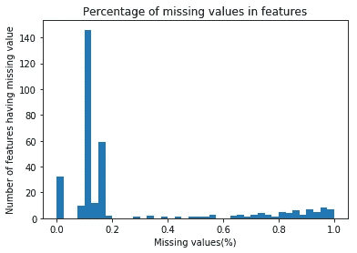

Figure1\. Features with missing value percent

***第四步:删除未知值百分比高的行***

在识别每一行中缺失的值时也遵循上述过程。然后，数据集被拆分并保存为两个数据集，分别包含高于和低于原始数据帧中缺失值的阈值(在本例中为 30%)。下图显示了详细信息。

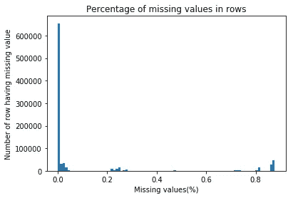

Figure2\. Features with missing value in row

***第五步:重新编码特征***

剩下的数据集包含四种类型的特征:分类、混合、数值和序数。大多数特征是数字或序数，可以不重新编码。

对 26 个分类特征的评估表明，其中 4 个在早期预处理步骤中已经被丢弃。另外三个(CAMEO_DEU_2015，LP_FAMILIE_FEIN，LP_STATUS_FEIN)可能会因冗余而从原始数据集中删除(精细和粗略要素可用)。只有一个要素(KZ 西部)必须是热编码的。所有其他的都有数值，出于简化的原因没有改变。

此外，评估了四个混合特征。功能 PRAEGENDE _ JUGENDJAHRE 拆分为新功能 DECADE 和 MOVEMENT，功能 CAMEO_INTL_2015 拆分为 WEALTH 和 LIFE_STAGE。剩余的两个混合特征(LP _ leben phase _ FEIN，LP _ leben phase _ GROB)中包含的信息对于其他特征来说是多余的，并且由于某种原因没有清晰的结构，因此决定丢弃这两个特征。

***第六步:输入和缩放***

现在是插补的时候了，因为它确保不会有任何缺失信息，以便我们的机器学习模型可以有目的地工作。缺失值用相应要素的中值进行估算。由于大多数分类和顺序特征，它优于输入平均值。后来这些特征被标准化了。

**并发症**

用 NaN 输入缺失值不是一件简单快速的任务。第一种方法是手工迭代每一列和每一行:它的缺点是源代码复杂和性能差。最后熊猫数据帧的屏蔽功能解决了这两个问题。

# **对客户数据集的实现**

上述步骤是在客户数据集上实施的，以便它可以与一般人群数据集进行比较，并且可以应用 PCA。主成分分析是一种非常有效的降低噪声的方法，因此聚类方法能够更好地区分不同的聚类。

因为 PCA 包含受限形式的特征的可变性，并且有助于降低维度，但是它在计算上也是昂贵的。所以随着组件数量的增加，它可能不会像预期的那样变得更好。因此，我选择用 150 个成分作为最终的 pca，它显示了超过 85%的数据可变性，因此损失了较少的信息。

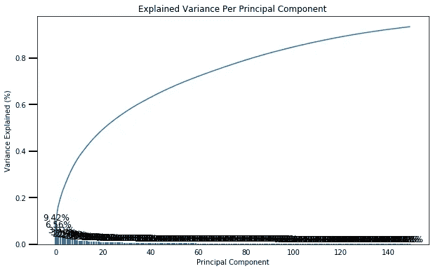

Figure3\. Variance Explained % with number of Principal Component

由于每个主成分都是一个指向最高方差方向的单位向量，因此我根据前三个主成分的权重绘制了前三个特征和后三个特征。权重离零越远，主分量在相应特征的方向上就越多。如果两个特征具有相同符号的较大权重(都是正的或都是负的)，那么一个特征的增加会与另一个特征的增加相关联。相比之下，具有不同符号的特征可能会表现出负相关性:一个变量的增加会导致另一个变量的减少。**第一主成分**与**正相关**为:

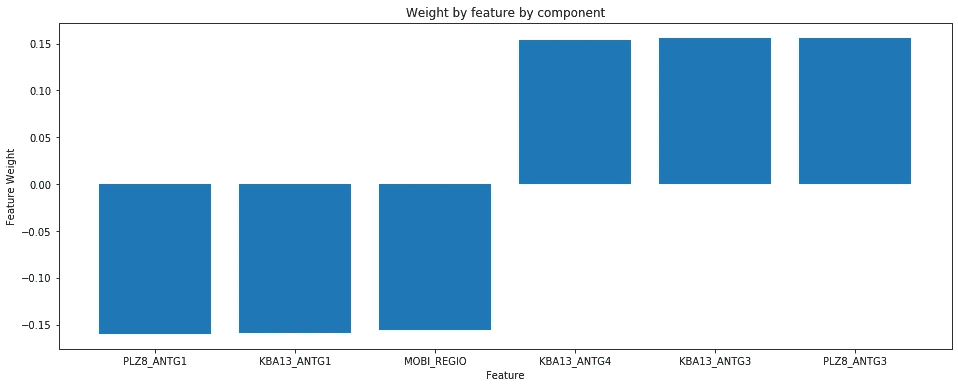

Figure4: PC 1 by top and bottom three features’ weight

1.  plz 8 _ ant G3:plz 8 中 6-10 户家庭住宅的数量
2.  kba 13 _ ant G3:plz 8 中超过 10 户家庭住宅的数量
3.  KBA13_ANTG4:此 was 功能的描述不可用

并且**与**负相关:

1.  PLZ8_ANTG1:单元中 1-2 户家庭房屋的数量
2.  KBA13_ANTG1:未找到描述
3.  MOBI 地区:移动模式

第**个分量**与**正**相关:

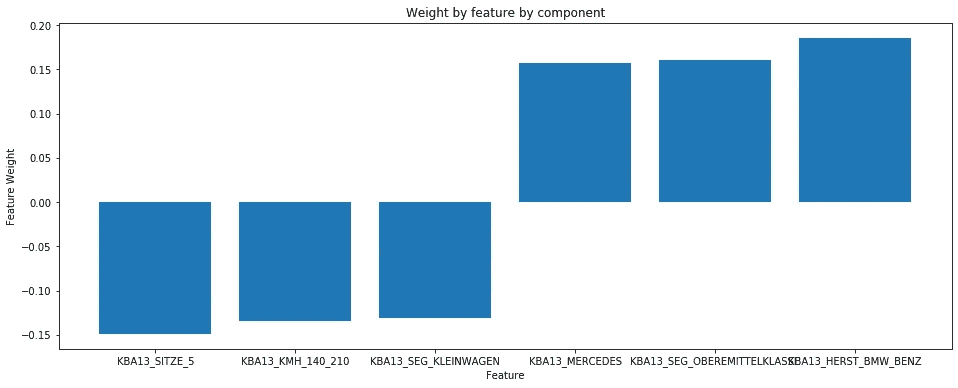

Figure5: PC 2 by top and bottom three features’ weight

1.  KBA13_HERST_BMW_BENZ:大众和奥迪在 PLZ8 中的份额
2.  KBA13 _ SEG _ OBEREMITTELKLASSE:中上档次车和上档次车(BMW5er，BMW7er 等)的份额。)
3.  kba 13 _ MERCEDES:MERCEDES 在 PLZ8 中的份额

与**负相关的**为:

1.  kba 13 _ SITZE _ 5:plz 8 中 5 座汽车的数量
2.  KB13 _ KMH _ 140 _ 210:plz 8 内最大速度在 140 和 210 公里/小时之间的车辆比例
3.  KBA13_SEG_KLEINWAGEN:小型和超小型汽车(福特嘉年华、福特 Ka etx)在 PLZ8 中的份额

**第三分量**正相关于:

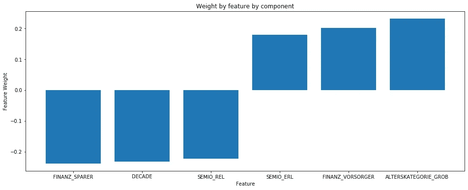

Figure6: PC 3 by top and bottom three features’ weight

1.  ALTERSKATEGORIE_GROB:通过姓名前分析进行年龄分类
2.  金融类型学:做好准备
3.  SEMIO_ERL:亲和力表明一个人在什么方面是多事的

并且**与**负相关:

1.  省钱者
2.  十年:个人青年时代的主导运动(先锋派或主流派)
3.  REL 塞米奥:宗教

**特征中的主要发现有:**

**家庭成员数量**:越多越鼓励消费天性。

**中上档次汽车的份额**:汽车的类型(宝马、大众、奔驰和奥迪的份额)也决定了它们是购买者。

另一方面，存钱的人、信教的人以及年轻时有小汽车且流动性差的人可能会减少支出。虽然车速显示出正相关关系，但这可以在进一步的分析中进行调查。

# **聚类**

在对数据集应用 k-means 聚类并使用从每个点到其分配的聚类质心的平均聚类内距离来决定要保留的聚类数后，使用肘方法，我决定保留 9 个聚类，然后将 k-means 模型重新调整为 AZDIAS 数据和客户数据，以获得一般人口统计数据和客户统计数据的聚类预测。下图显示了多个簇到质心的平均距离。

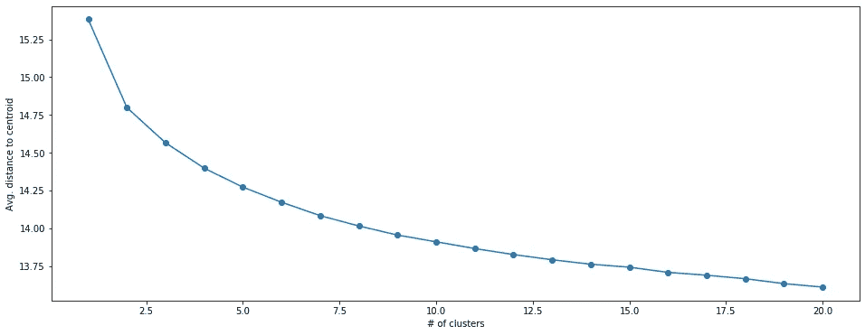

Figure7: Elbow method:Average distance from centroid for increasing cluster number

**比较客户数据和人口统计数据**

绘制两组(普通人群和客户)的聚类数的比例是一种简单的方法，可以找出哪些聚类代表过多/代表不足。代表人数过多的客户群可以明确地确定为目标群体。在这种特定情况下，具有许多缺失值(在预处理过程中被分离)的个体也可以作为自己的聚类来处理。

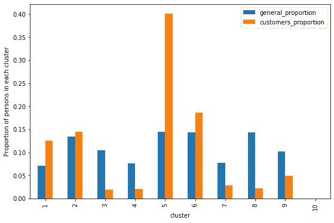

Figure8: Proportion of customer and general population in clusters

集群编号 5 和 1 清楚地表示大比例的客户存在，而集群 8 和 3 表现相反，即较少的客户存在。我们可以通过对这两个聚类进行逆变换来查看特征的权重，以找出最有影响力的特征。

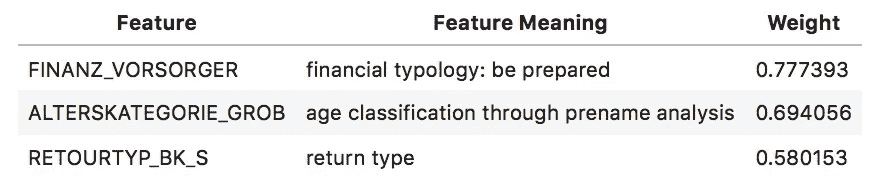

Table1: Positive Features ‘ weights share in Cluster 1

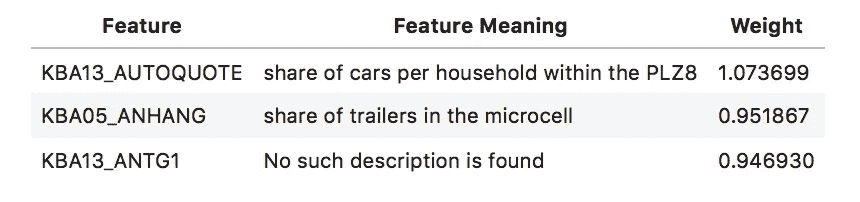

Table2: Positive Features ‘ weights share in Cluster 5

上述特征表明，在 PLZ8 中，每个家庭的汽车份额是一个重要因素，因为它们定义了移动性。有准备的金融类也成为了客户的一部分。显然，年龄是预测和被定义为客户的另一个重要标准。购买后的退货类型肯定表明他们参与了交易活动，即购物倾向。

# **监督学习模型**

随着客户细分的完成，我们继续进行项目的最后一部分，即分析 MAILOUT_TRAIN 和 MAILOUT_TEST 数据集，并预测一个人是否会在活动后成为公司的客户。使用为 AZDIAS 和客户数据集构建的相同预处理管道清理数据。

在 MAILOUT_TRAIN 数据集中，我们可以发现在 42962 个人中，只有 532 人对邮件发送活动做出了响应，这意味着训练数据非常不平衡，因此准确度/精确度/召回分数将不是合适的评估指标，我们将使用 ROC AUC。让我们看看 ROC_AUC 指标的细节。

*曲线下面积(AUC)* 是最广泛使用的评估指标之一。它用于二分类问题。分类器的 *AUC* 等于分类器将随机选择的正样本排列得高于随机选择的负样本的概率。在定义 *AUC* 之前，让我们先了解两个基本术语:

**真阳性率(灵敏度)**:真阳性率定义为 *TP/ (FN+TP)* 。真阳性率对应于所有阳性数据点中被正确认为是阳性的阳性数据点的比例。

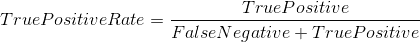

**真阴性率(特异性)**:真阴性率定义为 *TN / (FP+TN)* 。假阳性率对应于所有阴性数据点中被正确认为是阴性的阴性数据点的比例。

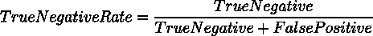

**假阳性率**:假阳性率定义为 *FP / (FP+TN)* 。假阳性率对应于阴性数据点相对于所有阴性数据点被错误地认为是阳性的比例。

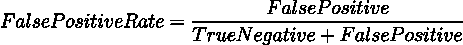

*假阳性率*和*真阳性率*都在**【0，1】**范围内。 *FPR* 和 *TPR* 都是在不同的阈值下计算的，例如(0.00，0.02，0.04，…)。1.00)并绘制图表。 *AUC* 为**【0，1】**中不同点的*假阳性率对*真阳性率的曲线下面积。

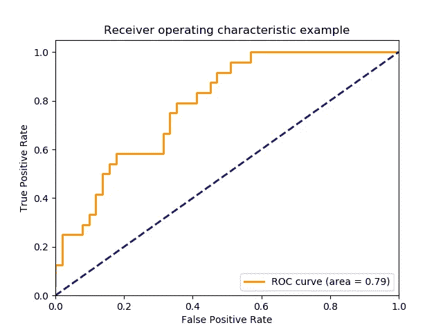

显然， *AUC* 的范围为[0，1]。当然，对于每个阈值，TPR 越高，FPR 越低越好，因此曲线越靠左上侧的分类器越好。我们之所以选择这个，是因为即使我们有不平衡的数据集，它也能更好地对真正值进行分类。

我们尝试了 4 种算法(RandomForestClassifier、AdaBoostClassifier、GradientBoostingClassifier 和 Logistic Regression)来评估和选择性能最佳的算法，并使用 ROC AUC 评估指标来最终确定要使用的最佳算法。

微调算法—验证各种超参数并选择性能最佳的参数。我们的最终选择是 GradientBoostingClassifier，mailout_train 集的 ROC/AUC 得分为 0.77。

然后我们应用它来提取最有影响力的特征。在前五大功能中，D19_SOZIALES 的份额最大。这意味着社会参与是一个至关重要的因素，尽管特征文件中缺少描述。为了获得更多的见解，我们可能希望在将来对此进行进一步的研究。

# Kaggle 提交

现在已经训练好了微调模型，我们使用 MAILOUT_TEST 数据集进行推理(在运行预处理管道之后),并将结果导出并提交给 Kaggle。

该模型能够在测试集上达到 20%的分数，这是相当低的。可能需要对我们的模型进行更多的微调，以获得更好的分数。

# 结论

这个顶点项目侧重于由德国邮购销售公司 Arvato Financial Services 提供的真实数据集的监督和非监督技能。这是一个很好的学习经验，学习如何有条不紊地解决问题。尽管在寻找特征描述和积累所有特征方面存在许多挑战，但我们已经成功地编码并使用它们来清理数据集，而没有丢失太多信息。

本可以做得更好或更好的事情有:

1.  我们不得不删除许多列和缺失的行。也许将来我们可以用另一种有效的方式来处理那部分。
2.  输入值可能不同？
3.  特征工程，进一步微调模型，我相信这将有助于我们进一步提高预测性能。

最后，我要感谢 Udacity 和 Arvato Analytics 提供了这样一个平台和绝佳的机会来解决现实生活中的问题，这在很大程度上帮助我磨练了我的数据科学技能。

# **参考文献**

1.  [https://www . ka ggle . com/sid 321 axn/principal-component-analysis-PCA](https://www.kaggle.com/sid321axn/principal-component-analysis-pca)
2.  [https://medium . com/@ Tobias . gorgs/how-to-use-machine-learning-for-customer-acquisition-BCD 52 f 42042d](/@tobias.gorgs/how-to-use-machine-learning-for-customer-acquisition-bcd52f42042d)
3.  [https://sci kit-learn . org/stable/modules/generated/sk learn . ensemble . gradientboostingclassifier . html](https://scikit-learn.org/stable/modules/generated/sklearn.ensemble.GradientBoostingClassifier.html)
4.  [https://stats . stack exchange . com/questions/77689/estimating-the-most-important-features-in-a-k-means-cluster-partition](https://stats.stackexchange.com/questions/77689/estimating-the-most-important-features-in-a-k-means-cluster-partition)
5.  [https://towards data science . com/metrics-to-evaluate-your-machine-learning-algorithm-f10ba 6e 38234](https://towardsdatascience.com/metrics-to-evaluate-your-machine-learning-algorithm-f10ba6e38234)
6.  [http://citeseerx.ist.psu.edu/viewdoc/download?doi = 10 . 1 . 1 . 10 . 9777&rep = re P1&type = pdf](http://citeseerx.ist.psu.edu/viewdoc/download?doi=10.1.1.10.9777&rep=rep1&type=pdf)
7.  [https://stats . stack exchange . com/questions/69157/why-do-we-need-normalize-data-before-principal-component-analysis-PCA/69159 # 69159](https://stats.stackexchange.com/questions/69157/why-do-we-need-to-normalize-data-before-principal-component-analysis-pca/69159#69159)