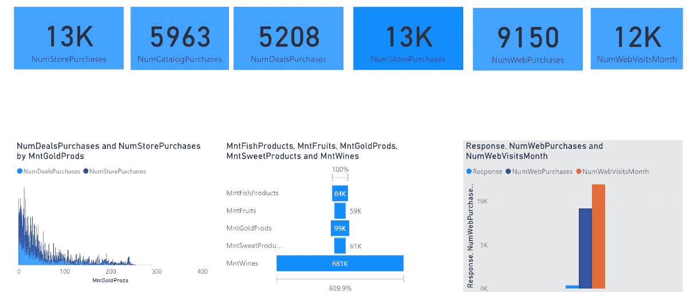

# 如何将商业智能应用于 AI 数据？

> 原文：<https://medium.com/mlearning-ai/how-to-apply-business-intelligence-to-ai-data-813e7ad94291?source=collection_archive---------1----------------------->

我们都知道，人工智能和商业智能截然不同，但在工业应用中经常协同增效。

人工智能指的是在复制人类行为时建立数据模型，而商业智能指的是精简业务数据以帮助人类决策。人工智能

# **AI 和 BI 如何搭配使用？**

人工智能收集数据并将其存储在数据库和服务器上，从而应用比自动化人工智能工作流提供的更先进的视觉分析。我们可以从聊天机器人和人工智能服务器导出数据，这些数据可以是结构化或非结构化格式，具体取决于人工智能用例。

## AI 数据采集？

人工智能设备和系统上的数据是通过各种方式以结构化和非结构化的形式收集的。

其中结构化数据以计算机日志的形式记录，测量的活动通过机器学习建模在 AI 系统内进一步拟合和分类，例如通过车辆、家庭中的传感器收集的所有数据以及从手机应用程序上的活动收集的数据。以后可以在 sql servers 上以表格形式导出，在 Excel 中以表格形式导出。

而非结构化数据可以通过计算机视觉以 JSON 文件、图像和视频的形式记录在无人机、火星车、高级安全摄像机等人工智能设备上。这些数据可以通过深度学习算法、集成技术甚至无监督学习算法和 nosql 数据库进一步分析并导出为结构化数据。

# 一旦收集的所有数据都是结构化的，该怎么办？

一旦生成的所有数据都是结构化形式，我们就可以在 excel 或 sql 服务器上将其转换为表格形式，然后将其加载到业务智能软件上，如 PowerBI、Tableau、IBM Cognos、SAS Business Intelligence 或适合个人技能和能力的任何类型的相关业务智能软件。

# **最后一步？**

一旦前面的所有步骤都完成了，我们就可以生成如下的可视化效果:

One of my sample PowerBI projects

# 注意

在我们决定开始任何可视化之前，首先仔细研究您正在使用的公司数据的数据和行业，因为我们需要知道该行业在生成您拥有的数据类型方面是如何操作的，例如:当测量空调生成的数据时，您需要知道空调的平均耗电量是否超过行业平均水平，以查看特定公司的空调对消费者是否有用。

**讲述你做的数据可视化的故事:**

当向包括公司董事会在内的所有相关 it 利益相关方展示可视化效果时，您需要特别研究获取更多利润和改善公司营销和销售计划或客户运营的数据需求，因为这些可视化效果的主要需求是如何让公司或客户获得比目前更多的利润。

*作者注*

*嘿，伙计们，我现在是联合利华巴基斯坦有限公司的数据专家，也是 Upwork 分析的自由职业者。如果您对任何基于分析的项目有任何评论、批评或任何建议需求。请随时在 LinkedIn 上联系我，并使用我的 Github/ka ggle python 代码模板库和已经制作的可视化实现或参考。:D*

*linked ln:*[*https://www . LinkedIn . com/in/goto-resumemuhammad-ammar-jamshed-029280145/*](https://www.linkedin.com/in/goto-resumemuhammad-ammar-jamshed-029280145/)

*Github:*[https://github.com/AmmarJamshed](https://github.com/AmmarJamshed)

*卡格尔:*[*https://www.kaggle.com/muhammadammarjamshed*](https://www.kaggle.com/muhammadammarjamshed)