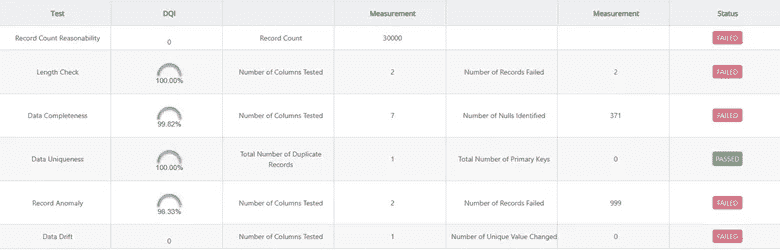

# 如何在雪花上构建数据质量——自治、无服务器和原位数据质量框架案例

> 原文：<https://medium.com/mlearning-ai/how-to-architect-data-quality-on-snowflake-a-case-for-autonomous-serverless-and-in-situ-data-fed352cba135?source=collection_archive---------1----------------------->

如果没有有效和全面的验证，数据仓库就会变成数据沼泽。

随着越来越多的人选择雪花作为云数据仓库，自主验证数据的需求变得至关重要。

虽然现有的数据质量解决方案提供了验证雪花数据的能力，但是这些解决方案依赖于基于规则的方法，该方法对于数百个数据资产是不可扩展的，并且经常容易出现规则覆盖问题。

## 当前的方法和挑战

Snowflake [数据仓库](https://www.dataversity.net/what-is-a-data-warehouse/)项目当前的重点是数据摄取，即将数据从多个数据源(通常是不同格式)移动到一个目的地的过程。数据接收后，业务利益相关者使用和分析数据，这是数据错误和问题开始出现的地方。因此，企业对雪花中托管的数据的信心降低了。我们的研究估计，在 Snowflake 的任何分析和报告项目中，平均有 20–30%花费在识别和修复数据问题上。在极端的情况下，项目可能会被完全放弃(【https://firsteigen.com/snowflake-data-quality-lp/】T2)。

当前的数据验证工具被设计成一次为一个表建立数据质量规则。因此，为数百个表实现这些解决方案会带来巨大的成本问题。对表的关注经常导致一组不完整的规则，或者经常不实现某些表的任何规则，从而导致未减轻的风险。

通常，数据工程团队在集成当前数据验证解决方案时会遇到以下操作挑战:

*   分析数据和咨询主题专家以确定需要实施哪些规则所花费的时间
*   特定于每个表的规则的实现。因此，工作量与雪花中的表数成线性比例
*   数据需要从雪花移动到数据质量解决方案，从而导致延迟和重大安全风险
*   现有工具的审计跟踪能力有限。为法规遵从性需求生成规则执行结果的审计跟踪通常需要数据工程团队花费时间和精力
*   随着数据的发展维护已实现的规则

## 解决方案框架

组织必须考虑至少满足以下标准的数据验证解决方案:

**支持机器学习:**解决方案必须利用 AI/ML([https://firsteigen.com/databuck/](https://firsteigen.com/databuck/))来:

*   识别并整理数据指纹，以检测与新鲜度、完整性、一致性、符合性、唯一性和漂移相关的数据错误([https://firsteigen.com/white-papers/](https://firsteigen.com/white-papers/))。

Essential Data Quality Checks

*   建立验证检查所需的工作不应该取决于表的数量。理想情况下，数据工程师或[数据管理员](https://www.dataversity.net/what-is-data-stewardship/)应该能够通过一次点击为数百个表建立验证检查。

**就地:**解决方案必须在源位置验证数据，而无需将数据移动到另一个位置，以避免延迟和安全风险。理想情况下，该解决方案应该由 Snowflake 提供支持，以执行所有数据质量分析。

**自主:**方案必须能够:

*   创建新表时，自动建立验证检查。
*   当表中的基础数据发生变化时，自动更新现有的验证检查。
*   一旦数据到达，就对增量数据执行验证，并在错误数量变得不可接受时提醒相关资源。

**可扩展性:**该解决方案必须提供与用于存储和计算的底层雪花平台相同级别的可扩展性。

**无服务器:**解决方案必须提供无服务器的可扩展数据验证引擎。理想情况下，解决方案必须使用雪花的底层功能([https://first eigen . com/WP-content/uploads/2021/04/first eigen-Case-studies . pdf](https://firsteigen.com/wp-content/uploads/2021/04/FirstEigen-Case-Studies.pdf))。

**数据验证管道的一部分:**解决方案必须作为[数据管道](https://firsteigen.com/2022/02/autonomous-data-pipeline-control-tools-and-metrics/)作业的一部分轻松集成。

**集成和开放 API:** 解决方案必须开放 API 集成，以便与企业调度、工作流和安全系统轻松集成。

**审计追踪/结果可见性:**解决方案必须提供一个易于导航的验证测试结果审计追踪。

**业务涉众控制:**解决方案必须为业务涉众提供对自动发现的实现规则的完全控制。业务涉众应该能够在没有数据工程师参与的情况下添加/修改/停用规则。

## 结论

数据是现代组织最有价值的资产。当前用于验证数据的方法，特别是雪花，充满了导致信任缺失的操作挑战，以及用于修复数据错误的昂贵、耗时的方法。迫切需要采用一种标准化的自治方法来验证雪花数据，以防止数据仓库成为数据沼泽。

 [## Mlearning.ai 提交建议

### 如何成为 Mlearning.ai 上的作家

medium.com](/mlearning-ai/mlearning-ai-submission-suggestions-b51e2b130bfb)