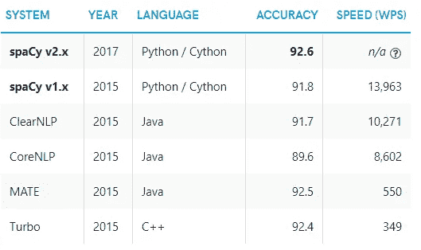
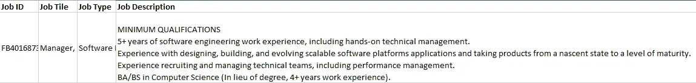
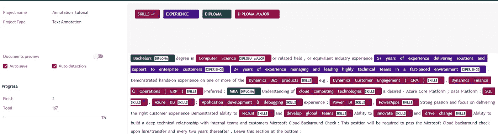
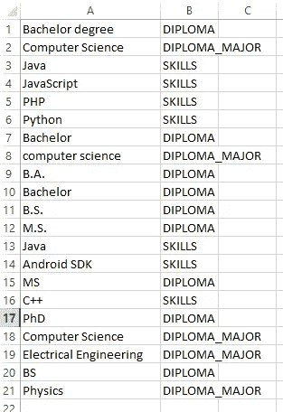
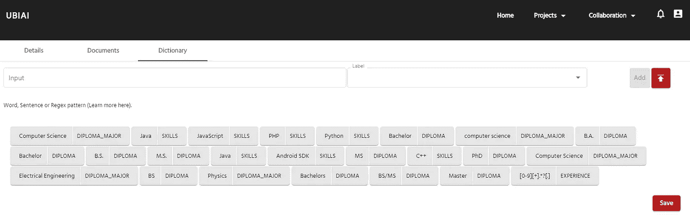
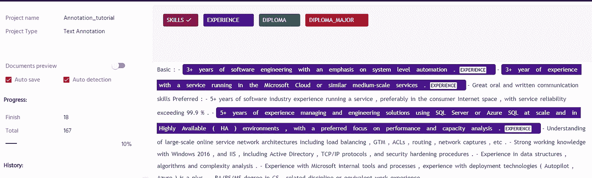
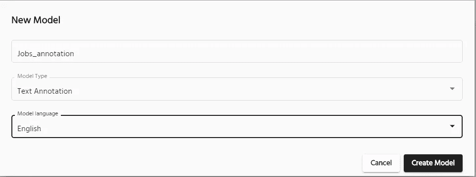
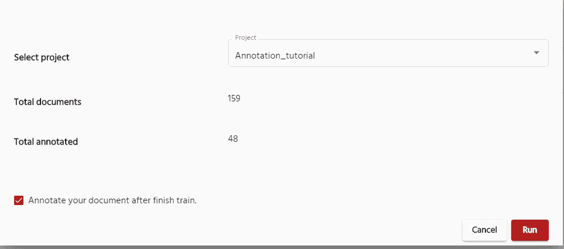
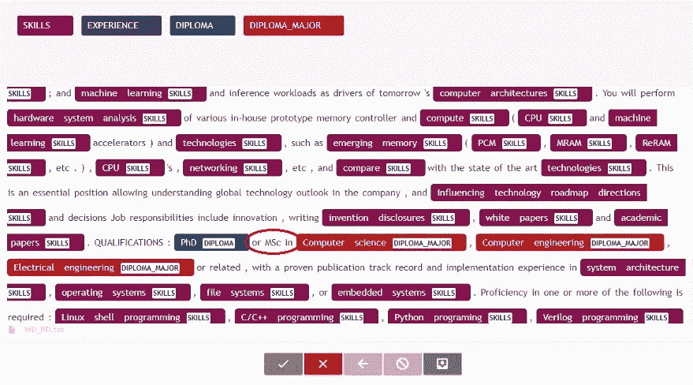
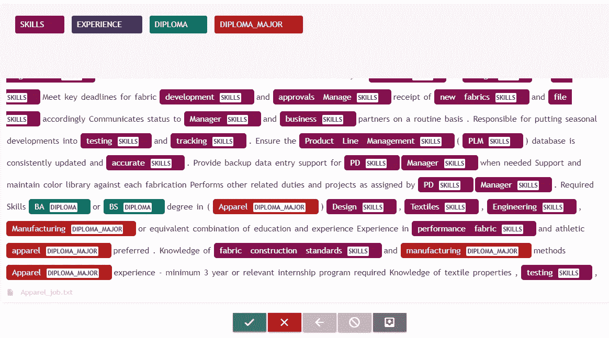

# 如何使用命名实体识别自动搜索工作—第 1 部分

> 原文：<https://medium.com/mlearning-ai/how-to-automate-job-searches-using-named-entity-recognition-part-1-16c150acafa0?source=collection_archive---------0----------------------->

找工作的简单有效的方法

你曾经找到过与你的技能和教育水平完全匹配的工作描述吗？是什么让一份招聘启事比其他的更相关？当今大多数求职平台依赖于将职位描述中的关键词与你的个人资料进行匹配，而没有掌握每个词的语义和意义，因此降低了求职效率。举个例子，假设你的简历里有关键词“JavaScript”。普通的关键字搜索将产生与完全相同的单词匹配的结果，错过了大量没有完全相同的关键字“JavaScript”但包含相关关键字如“Java”、“JS”、“HTML”和“CSS”的职位。

毕业后找工作的时候特别遇到这个问题；我收到了无数来自求职引擎的不相关的工作邮件，花了几个小时在网上试图手动寻找更相关的工作。另一方面，雇主在寻找优秀候选人时也面临类似的问题。据估计，公司每招错一个人平均损失 14，900 美元，近 74%的雇主说他们招错了人。

得到一份将候选人的个人资料与工作描述精确匹配的工作推荐不是很好吗？这正是本教程中使用命名实体提取将演示的内容。我们已经在[ubai](https://ubiai.tools)开发了一个易于使用的文本注释工具来创建实体提取的命名实体识别(NER)模型。

# 面向实体抽取的命名实体识别

获得更相关的工作建议的一个方法是将单词分类，如技能、经验、学位等。(实体)而不是搜索静态关键字。一旦从职位描述中提取出实体，您就可以对您的简历进行相似性分析，以获得更相关的职位推荐。为了这个项目，我使用 NER 机器学习工具从招聘启事和我的简历中提取相关实体。有几个可用的 NER 工具，如斯坦福 NER，NLTK，Spacy 等。我选择了开源空间库，因为它速度快，精确度最高，如下表所示:

NLP models accuracy and speed comparison.

# 刮掉招聘启事

为了训练 Spacy 模型来提取实体，我需要从各种公司网站收集数据，并将这些数据用作训练材料。在这个项目中，我主要从事工程工作(包括硬件工程、软件研究等)。)来自各个科技公司。我从招聘启事中提取的主要信息有:**职位 ID** 、**职位名称**、**职位类型**和**职位描述**。以下是输出文件的示例:

Scraped job description in excel.

一旦收集了数据(来自科技公司的至少 200 个职位发布)，您就可以为实体提取训练模型了。

# 使用注释工具的工作模型培训

我训练模型提取 4 个实体:文凭，文凭 _ 专业，技能和经验。第一个任务是注释来自不同公司的几百个职位发布，用作训练数据。这一部分既费力又耗时，因为你必须手动注释成千上万的单词和句子。幸运的是，在 [UBIAI](https://ubiai.tools) 我们已经开发了一个注释工具，尽可能地简化、最小化和精简注释过程。该工具包括以下功能:

*   **字典**:能够使用用户定义的具有相应实体的单词字典自动注释语料库中的单词。如果您的语料库包含重复的模式，如电话号码、姓名、位置等，您可以选择输入单词列表及其对应的实体类型，或者创建正则表达式模式。
*   **自动注释**:自动注释文档中重复的带注释的单词
*   **机器学习标注**:持续训练一个 ML 模型，根据你之前的标注自动标注一个文档。
*   **注释度量**:可视化注释统计，例如:1)被注释的文档数量，2)跨文档的实体分布，以及 3)跨文档的每个实体类型内的单词分布。这将有助于跟踪注释进度和发现欠采样或过采样的实体。

我首先注释了几十份来自多家公司的招聘启事，如下所示(关于如何使用该工具的文档可以在[这里](https://ubiai.tools/Docs)找到)。由于每个公司都有不同的职位描述风格，如果您想要创建一个准确的 NLP 模型，对来自不同公司的多个职位发布的文档进行同等的注释是很重要的。

UBIAI annotation page.

为了加快注释过程，我们使用了工具中的字典功能。在下表中，单词被输入到字典中，它们的相关标签如下所示:

Excel lookup table for dictionary auto-annotation

除了手工输入单词，您还可以使用正则表达式来捕获文档中的重复模式。例如，通过使用 regex r "[0–9][+]。*?[.]“您注释的句子以数字[0–9]开头，后跟+并以“.”结尾例如在机器学习、信息检索、自然语言处理或数据挖掘领域有 2 年以上的经验。“然后，该工具将浏览所有文档，并自动用标签标注单词，从而加快标注过程。

Dictionary inputs for auto-annotation.

Auto-annotation with regex.

UBIAI 提供了团队成员之间的协作(在这里阅读)来促进注释过程。

我建议在注释过程中跟踪实体统计数据，以防止有偏见的注释。下面是 100 个文档的实体分布:

Entities distribution across annotated documents.

职位描述中的大部分实体都偏向于实体技能。这对于训练目的来说并不理想，因为您想要更均匀的实体分布。所以在这种情况下，你应该注释更多有经验、文凭和文凭 _ 主要实体的文档。

该工具的第二个有用特性是使用 ML 模型的自动注释。在这里，我使用手动注释的文档作为训练数据来创建一个 ML 模型，该模型自动对文档进行预注释(详细信息可以在[文档](https://ubiai.tools/Docs)中找到)。ML 模型支持多种语言，如英语、西班牙语、阿拉伯语等。选择语言后，按“创建模型”按钮。

NER model creation.

然后，模型将被初始化，但不会被训练。若要训练 NLP 模型，请选择您想要的项目。

* *注意:通过选中“完成训练后注释您的文档”框，您可以选择在模型训练后注释剩余的未注释文档。*

Model training settings.

下面是仅在 100 个文档上训练的 ML 自动注释的结果。用于测试的职位描述来自不同的公司，并且该职位描述从未被模型看到过。

ML Auto-Annotation

虽然我们可以看到自动注释在实体上犯了一些错误，例如，遗漏了作为文凭的“Msc ”,但总体而言，我们获得了几乎 70%的成功率。事实上，考虑到我们只注释了 100 个文档，这是一个非常可观的分数。为了进一步提高成功率，我们采用已经自动注释的文档，并手动纠正它们。然后，我们使用修正后的文档和原始文档重新训练模型。我们重复这个过程几次，直到我们达到一个良好的成功率。

我决定对我们的模型进行压力测试，并尝试注释不同领域的工作(与硬件或软件工程无关)。下面是服装行业职位描述的自动标注结果。与工程工作描述相比，模型犯了更多的错误。例如，它混淆了 DIPLOMA_MAJOR 实体和 SKILLS 实体，并且遗漏了一个 EXPERIENCE 实体。也就是说，我们能够正确地提取文凭实体以及大部分技能。

Job description from a different domain using ML auto-annotation.

# 结论

在职位搜索查询中实施 NLP 不仅会加快搜索过程，还会提供更准确的结果，为雇主和雇员创建简化的职位/候选人匹配。在本教程中，我们参观了使用新的注释工具 UBIAI 训练 NER 模型所需的注释过程。我们仅用 100 个培训文档就成功地提取了相关实体，如技能、经验、文凭和文凭专业。在[第 2 部分](https://walidamamou.medium.com/building-a-knowledge-graph-for-job-search-using-bert-transformer-8677c8b3a2e7)中，我们将利用实体相似性的力量，根据从职位描述和申请人简历中提取的实体来获得职位推荐。那里见！

在推特上关注我们 [@UBIAI5](https://twitter.com/UBIAI5)