# 如何使用机器学习实现 MEP 布局自动化

> 原文：<https://medium.com/mlearning-ai/how-to-automate-mep-layout-using-machine-learning-d7270285701f?source=collection_archive---------0----------------------->

Mathieu Josserand——2021 年 9 月 15 日

# 介绍

今天我想分享一个我已经工作了几个月的项目。我选择了一个“点击诱饵”的帖子标题来吸引眼球(营销策略 lol)。更重要的是，该项目首次尝试在 Revit 模型中实现 MEP(机械、电气、管道)实施附件的自动化。我邀请你阅读[我的第一篇文章](/@mathieu.josserand_86865/presentation-bim-revit-automation-programming-1a06c89f6269)，在这篇文章中我解释了我今天写作的动机。

设计办公室的工程师和建模师通常同时从事几个项目。根据客户和项目类型的不同，这些项目或多或少是有利可图的。一些项目，尤其是住房，利润最低，但同样耗时。事实上，尽管这些公寓彼此非常相似，但建模者必须一个接一个地设计和实现每件设备，并将它们正确地放置在模型上。
这里我想提出的需求是 2021 年所有建模软件的共性，尤其是 Revit:没有任何形式的智能来辅助建模者。无论建模者一开始是想要建模一个房间还是一个浴室，他都必须从头开始。将房间设计成卧室，至少需要放置一张床、3-4 个插座、一个开关、一个灯具、一个加热器，然后对每个部件进行正确的旋转、正确的高度和正确的连接……
我的意思是，要正确设计房间，有一条循环往复的途径。不管住宅项目如何，所有房间的形状、面积和布局都是相似的。从长远来看，这个想法将是获得一个代理，它可以预测建模者的需求，并根据植入的元素提出一个连贯的方案，根据房间的标签放置其余的设备。每件设备在高度、旋转、水平、功率和区域方面的技术信息将被直接整合。这种推理可以应用于其他房间标签，如走廊、入口、客厅、厨房。这样的过程不是乌托邦。在没有任何信息的情况下，从住宅的空楼层平面图，该过程可能能够识别每个房间，然后从每个房间标签，如上所述不恰当地填充它们。的确，我借此机会与你分享一些我非常欣赏的作品。事实上，这些作品用纯粹的统计方法来思考和处理 BIM。通过有监督的机器学习方法，该算法显示出令人信服的结果。我让你在这里发现这项研究。

 [## 建筑信息建模(BIM):建筑行业的机器学习

### 这篇客座博文最初由 Ibim Building Twice S.L .和 Pedro Núez，I+D+I 的首席执行官 David Martínez 撰写

blog.bigml.com](https://blog.bigml.com/2018/08/07/building-information-modeling-bim-machine-learning-for-the-construction-industry/) 

我喜欢这项研究，因为研究人员发现房间的原始几何形状和它们在住宅中的作用之间有着密切的联系。通过使用巧妙的变量，比如多边形的平方，他们证明了房间的几何形状不言自明。如下图所示，60%的情况下，厨房是最小的房间(不包括卫生间)。相反，一个房间的面积越大，就越确定是客厅。

通过添加新的解释变量，如正交或层次，问题会自行解决。甚至有可能应用一个“简单的”决策树来解决这个问题。因此，这项研究用数据科学家的方法提出了一个真正的解决方案，其中使用的解释变量的质量至关重要。

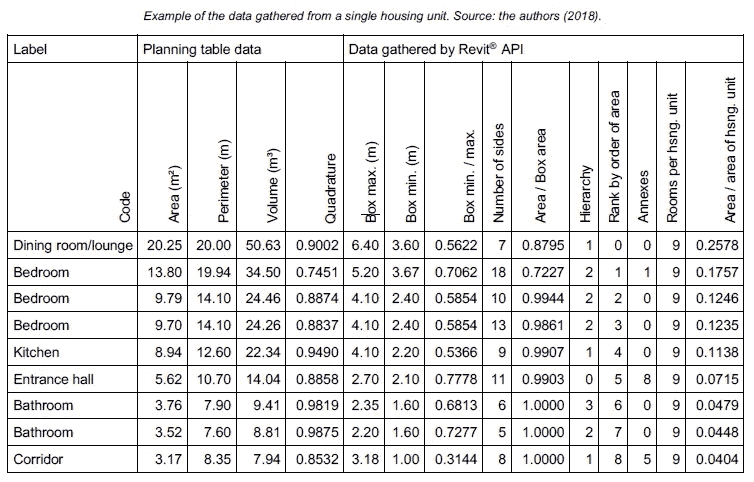

从长远来看，这是一块砖，我设想将其集成到我的最终流程中，以进一步自动化 Revit 中的设备布局。

在本文中，我介绍了我使用机器学习(ML)实现 MEP 附件布局自动化的工作。我的工作分为 5 个部分:
*o Revit 模型中的空间数据收集(C#，Revit API)
o 深度 Q-Learning agent 的培训(Python，Keras，Tensorflow，MCTS)
o 基于 Revit 模型中的 ML 预测(C#，Keras.NET，Revit API)o Revit 系列实现的讨论和反馈

o C #设置项目和 Python 设置环境*

目前，我的项目仅限于房间的处理和现场设备的实施，尤其是电源插座。深度 Q 学习代理还没有像我希望的那样进行优化，但是框架已经在那里了。当我使用新设备和新房间类型时，项目的结构将保持不变。

# Revit 模型中的空间数据收集[1/5]

*我的空间数据收集项目的 GitHub 链接:*

 [## GitHub-MathieuJsrd/Revit 中的空间数据收集

### 通过在 GitHub 上创建帐户，为 MathieuJsrd/Spatial-Data-Collection-in-Revit 开发做出贡献。

github.com](https://github.com/MathieuJsrd/Spatial-Data-Collection-in-Revit) 

要使用自动设备布局工具，首先必须为机器提供有用的数据。我目前的项目是在 Revit 上安装住宅项目卧室的电源插座。为此，我需要获得每个 Revit 房间的几何图形。
Revit API 允许我查询数字模型以获得我需要的信息。数字模型(Revit)在一个文件中包含所有可以想象的建筑数据。对于像医院这样的大型项目来说，包含所有这些数据的文件大得惊人。不可能给出这些模型中包含的数据量的数量级。我们可以谈论一个真正的数据库，它必须根据需要进行更新、丰富和查询。我们必须意识到这一点，这就是为什么使用计算机处理数据是合理的。因此，Revit API 可以为每个卧室收集每个形状线的(笛卡尔)坐标。红色的形状是我们需要通过存储每个顶点的坐标(x，y，z)来收集的。

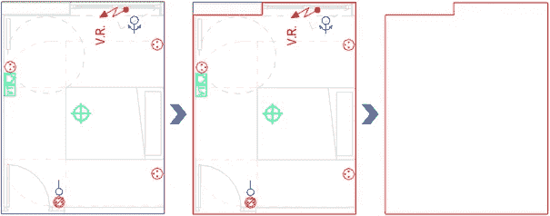

In the Revit API, these red lines are [BoundarySegment](https://www.revitapidocs.com/2016/9a8fc43c-7a89-b6b4-e8ad-3e1e331ac153.htm) objects. the code below shows how to browse them. By following the hyperlink, a code is available showing how to browse them.

我留下一个可用的代码，允许我收集每个卧室和每张床的形状。我小心翼翼地对代码进行了注释。每个人都可以按照自己的意愿构建代码，这里最重要的是关注数据恢复的动态性。
首先，收集每个顶点的坐标相当容易。这是在 [*c_CloneRoom.cs*](https://github.com/MathieuJsrd/Spatial-Data-Collection-in-Revit/blob/main/SpatialDataCollection/SpatialDataCollection/c_CloneRoom.cs) 类中，更具体的是在*GetRoomShapesFromGroundFace(room)*函数中。

在上面的函数中，我“简单地”浏览了定义给定房间地板面积的一组线。我创建了我的 C#对象，以便于管理和操作我收集的数据。这样，每个房间的边界都恢复了:迈出了好的一步！只是，利用这些形状不允许任何事情。事实上，这些多边形并不表示零件方向的任何信息。因此，有必要查询模型以恢复填充每个房间的所有设备。

第二步，我检索放置在数字模型中的床的轮廓。小心，这里有一个微妙之处。恢复设备的轮廓比恢复房间的轮廓要精细得多。首先，MEP 配件是 Revit API 中的 [*族实例*](https://www.revitapidocs.com/2018/0d2231f8-91e6-794f-92ae-16aad8014b27.htm) 对象。然而，这些对象不包含任何清晰的属性来检索轮廓。的确，从编程的角度来看，不可能浏览每个房间，浏览里面的对象。因此，有必要遍历数字模型的整个数据库，过滤“床”对象，然后根据它们的位置坐标，确定哪个是主房间。

这需要一些疯狂的过程，但凭借代码中的严谨性和结构，是可以做到的！ *GetAllBeds()* 函数( [*c_Start.cs*](https://github.com/MathieuJsrd/Spatial-Data-Collection-in-Revit/blob/main/SpatialDataCollection/SpatialDataCollection/c_Start.cs) 类)连接代码来实现这一点。在这个函数中，我给出了一个收集床形状的典型例子，并将每个形状分配给它的主房间。这一过程可以用同样的方法对门、窗等进行重复。有些设备有特定的并发症，但随着时间的推移，它的工作。Revit API 对此很敏感。

我还要强调我的*GetHostRoom(family instance fi)*函数在 [*c_Bed.cs*](https://github.com/MathieuJsrd/Spatial-Data-Collection-in-Revit/blob/main/SpatialDataCollection/SpatialDataCollection/c_Bed.cs) 类中不可否认的重要性。此函数将族实例对象作为参数，并根据其 XYZ 位置来确定主体房间，以防对象的房间属性不可用(这种情况很常见)。这个功能并不完美，但在大多数情况下，它允许您找到房间。这个函数克服了 API 中的属性问题。我使用代码中解释的不同技巧(参见函数)。

使用[边界框](https://www.revitapidocs.com/2016/3c452286-57b1-40e2-2795-c90bff1fcec2.htm)可能是相关的，但是由于我不会深入的原因，边界框不够可靠和准确。

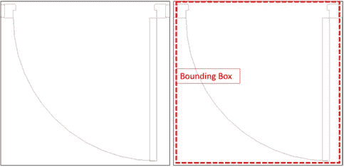

The Bounding Box is equal to the smallest rectangle that can contain the object. In this example, the Bounding Box looks like it would be a good fit (and it is) but Revit generates too many exceptions for this option to be adopted. (Depending on how the Revit family is configured, the Bounding Box can be distorted by annotation objects, which make the Bounding Box larger).

应用所有这些，我们得到了示例中房间和床的所有空间数据。这是我们添加门和窗时生成的结果。

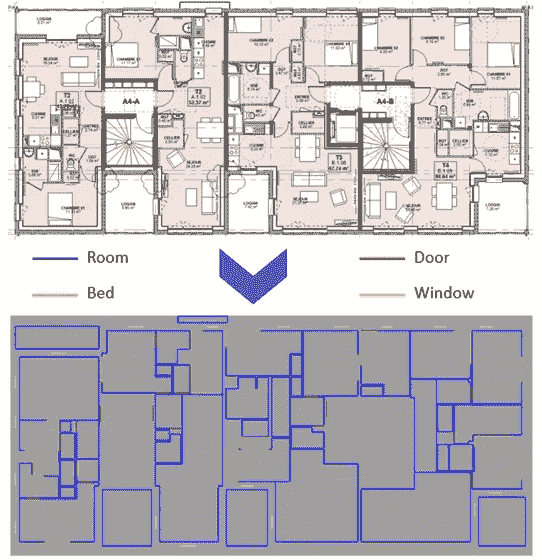

All boundaries segments extract from Revit 2D sketch

所有这些信息都是图形化的，最终不会被机器使用。代表不同实体的一组 2D 点对计算机来说意义不大。这就是为什么我使用栅格化…来获得实数矩阵的图像。这些数字矩阵很容易存储在一个目录中。txt 文件。这个目录然后被用作一个真实的数据库来多样化我的强化学习(RL)代理的训练。

 [## 光栅化—维基百科

### 光栅化(或光栅化)的任务是采取一个矢量图形格式(形状)描述的图像和…

en.wikipedia.org](https://en.wikipedia.org/wiki/Rasterisation) 

为了将我所有的 2D 点(笛卡尔数据)转换成图像(整数矩阵)，我使用了光栅化(2D)和 Bresenham 技术。光栅化是将矢量图像转换成光栅图像以便在屏幕上显示的过程。这是一个有价值的 GitHub，我用它来实现这个目标。

 [## 第一课:Bresenham 的画线算法 ssloy/tinyrenderer Wiki

### 第一课的目标是渲染线网。要做到这一点，我们要学会如何画线段。我们可以…

github.com](https://github.com/ssloy/tinyrenderer/wiki/Lesson-1:-Bresenham%E2%80%99s-Line-Drawing-Algorithm) 

这个话题我就不多赘述了，因为网上所有的来源都已经很充分很清楚了。让我们看看我的项目产生的结果。

Here you can see the result of the Bresenham’s Line Drawing Algorithm applied on different accessories (From the top left to the bottom right : a RJ45, a bed, a light fixture, a door). (15cm x 15cm pixel)

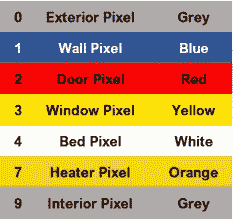

We can see the steps of the process. On the left, the Revit plan with its Cartesian data, then after application of the rasterization, a 50x50 matrix of resolution 0.15 cm x 0.15 cm is recovered. The last image on the right corresponds to the rendering with colors for each integer of the matrix.

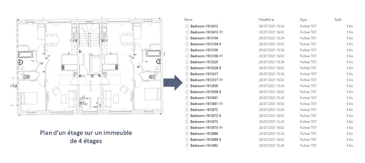

Each bedroom is stored as an 50x50 matrix in a .txt file.

这些图像将被用于馈送给强化学习(RL)代理以应用卷积原理。(这一切将在文章的下一部分详述)。

这里没有提到一个重要的细节。它涉及到从 Revit 坐标系(***(x；y) ∈ |R*** )到光栅坐标(***(x；y) ∈ |N 其中 x∈[0；49]和 y∈[0；49】***)。不需要深究主题，但是应该知道矩阵位置(0；0)并不对应于 Revit 中每个矩阵的相同位置。因此，对于每个矩阵，从 Revit 到光栅化矩阵的位置转换是唯一的。为此，还必须加上 Revit 中 15 厘米或 0.5 英尺的分辨率。

# 深度 Q 学习代理的训练[2/5]

*大卫·福斯特文章:*

 [## 如何使用 Python 和 Keras 构建自己的 AlphaZero AI

### 通过自我游戏和深度学习，教机器学习 Connect4 策略。

medium.com](/applied-data-science/how-to-build-your-own-alphazero-ai-using-python-and-keras-7f664945c188) 

我使用的技术是[强化学习](https://wiki.pathmind.com/deep-reinforcement-learning)，更具体地说是[深度 Q 学习](https://www.analyticsvidhya.com/blog/2019/04/introduction-deep-q-learning-python/)。我不会停留在深度 Q 学习技术是如何工作的，因为互联网上的所有资源都已经足够和清晰了。
我的工作基于谷歌对 AlphaGo 的研究，特别是大卫·福斯特(David Forster)进行的一个项目，该项目使用 AlphaGo 的技术，但应用于 Connect 4 的游戏。

这项工作对我来说非常有价值，因为他非常成功地普及和解释了代理操作的不同阶段。他的文章是完整的，并重定向到许多相关资源。非常感谢大卫·福斯特！我想用来自极客频道的一系列视频来补充这些来源，这些视频让我更好地理解了深度 Q 学习技术的功能。

我已经根据我的需要修改了大卫·福斯特的项目。我保留了游戏板和计数器。代理的训练，(蒙特卡罗树搜索)，神经网络，在我的项目中被完全相同地复制。这份备忘单是理解工作原理的良好开端。

 [## 用一张图解释 AlphaGo Zero

### 一张解释强化学习、深度学习和蒙特卡罗搜索树如何用于…

medium.com](/applied-data-science/alphago-zero-explained-in-one-diagram-365f5abf67e0) 

我做了一些工作来使这个项目适应我的需要。以下是我做的五个主要改变:

1.  **游戏动态**

在 Connect 4 中，就像在 Go 中一样，环境意味着两个玩家轮流对抗。因此，每个玩家两局中出一局:注意力的过程使得考虑对手的最后一步棋成为可能。这个注意力过程是一个变量，它在 Connect 4 项目中选择下一步行动时发挥作用。对于我的项目，我将自己从这种特殊性中解放出来，因为我的游戏机制有些不同。我的游戏更接近于海战:事实上，玩家从一块游戏板开始，玩所有允许的动作。一旦游戏结束，玩家以满分 100 分评估他的棋盘。换句话说，玩家并不关心他的对手，而是根据自己的良心来填写棋盘，没有任何外部因素来干扰游戏的进程。为了优化性能，我由两个代理同时玩两个游戏，在每个游戏结束时，我收集获胜的棋盘，以将游戏体验整合到我的记忆中，从而用“好的体验”来填充我的记忆。在我的例子中，一旦放置了 4 个插座，游戏就结束了。所以，我的博弈的一部分由 5 个状态组成(初始状态+ 4 个 1，2，3，4 持有的状态)。

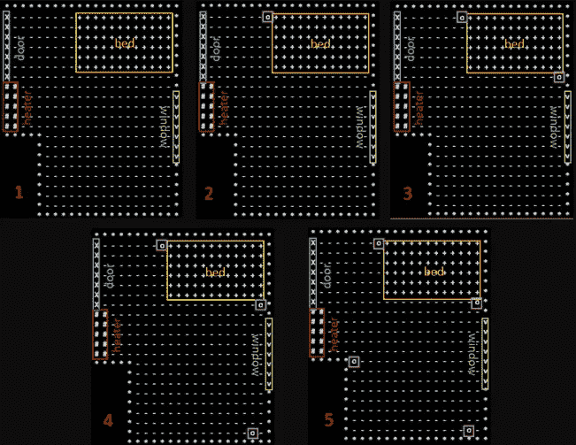

Here, we can see that one game consists of 5 states as explained above. Therefore, we can see the power outlets appearing as we go along (indicated by a pink square). At the end of state 5, the score is 81 / 100\. This good score is explained by the good socket distribution in space with the proximity to the bed.

2.**输入格式**

每个矩阵由 2500 个像素/块(50x50)组成，其值范围从 0 到 9。最后，每个矩阵相当于具有 1 个色调的真实图像，而不是 RGB 图像的 3 个色调。矩阵的大小与训练的持续时间成正比。事实上，光栅化矩阵越小，MCTS 搜索就越快。然而，矩阵越小，每个像素的分辨率越高。它越高，空间信息损失就越高。目前，我选择了一个代表 15 厘米 x 15 厘米的像素。这里有一些优化工作要做，以减少矩阵的大小，至少对于两个维度中的一个，但这不是我在这里的优先事项。

3.**评估体验质量——评分功能**

在我继续之前，我需要和你分享我的方法来判断一个游戏是否是一个真正“好”的体验。在 Connect 4 处，问题没有出现。事实上，一场游戏要么赢，要么输，要么平局。因此，奖励是离散的，用以下值来描述:1，-1 或 0。在我的例子中，一个场景被评估为 100 分。房间里有电源插座并不意味着只有一个理想的解决方案。许多场景可以被认为是令人满意的。但是在什么程度上我们可以认为一个场景是令人满意的呢？我们如何分配一个分数来正确判断每个场景的性能？

为此，我创建了一个得分函数 S，它将一个有限的游戏棋盘作为输入，并将一个小于或等于 100 的值作为输出。S 值是我的项目中最重要的值，因为正是根据这个值，奖励被分配给代理。S 函数是我自己和我的学业定义的。关于插座，S 输出的值取决于插座之间的接近度、插座形成的多边形面积、插座与门的接近度或床的接近度。根据所有这些变量，分数会被分配为加分/扣分。这是给定场景的分值形成方式。S 函数越接近现实，奖励的质量就越好。

Above is the same room with 4 different scenarios. The first one on the left is made by the human. One of the important variables defining the S-score function is the ratio between the surface of the polygon formed by the outlets and the surface of the chamber. Quickly, we can assume a ratio equivalent to at least 50% and less than 70% seems to converge towards a satisfactory scenario…

该 S 功能是设备特有的。对于给定类型的房间标签，插座有一个 S 函数，开关有一个 S '-函数，灯具有一个 S ' '-函数。
举个例子，对于浴室来说，应用在插座上的功能会有所不同，因为要特别注意确保它们离淋浴/浴缸足够远(根据[NFC 15–100 标准](https://www.bati-diags.fr/diagnostic-immobilier-obligatoire-essonne/diagnostic-electrique-salle-de-bains.php))。

In the case above, we can see a difference in the distribution of electrical outlets (not to mention the quantity). In the bedroom, we can see that the human has placed one socket on each side of the bed and then scattered two other sockets to make it even. In the bathroom, the two sockets are on the same wall. Firstly, to get away from the shower, but also because the one on the right is intended for the washing machine. Therefore, it is important to know this before designing a bathroom. If there is a washing machine, it is almost certain that a socket will have to be placed at the washing machine location. This example shows that, depending on the type of room, the way of thinking is not the same.

4.**自弹动态**

我的项目中的“自我游戏”对 Connect 4 来说也是新的。事实上，在 Connect 4 中，初始板总是相同的:一个空矩阵。相比之下，我游戏的初始状态从来都不一样。房间的形状是不一样的，门、窗、床从来都不是以同样的布局来组织的。因此，学习与 Connect 4 略有不同。不在于战胜对手，而在于获得尽可能高的分数，不管初始矩阵如何。因此，这是一个让代理理解所有元素之间的逻辑安排的问题；考虑到无限可能的情况，这种逻辑不可能用单一的程序来描述。最后，完美的分数是不存在的，目的是即使在最混乱的初始情况下也能产生令人满意的场景。因此，对于每个新游戏，从棋盘数据集中随机抽取初始棋盘。没有这种板的改变，代理在单一配置上训练，并且不可避免地代理在这种环境上过度适应。所以一遇到很新的造型或者房间布局就崩溃了。因此，这是强化学习的一个特例，其中**初始环境的上下文并不相同，尽管在所有初始情况下都没有放置插座。**

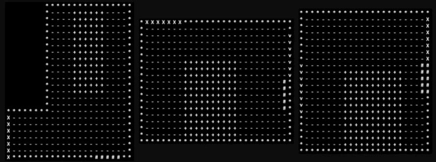

Here are different initial cases representing different bedrooms. As can be seen, they are not the same size, shape, or bed size. The possible diversity between the rooms is quite important, which is why it is important to immerse the agent in these different arrangements during his training so that he is as efficient as possible when he goes into production.

5.**训练神经网络**

关于训练神经网络，我的方法在训练数据集的水平上略有不同。事实上，对于 Connect 4，神经网络仅由代理游戏产生的游戏经验来训练。的确，在 Connect 4 中总有一个赢家，这意味着给一个游戏体验分配一个好坏的奖励。就我而言，赢家不一定能创造出‘好’的游戏体验。有时候两个玩家都会搞错，所以“两害相权取其轻”。所以我的训练数据集由旧模型的真实数据组成。这些数据作为好的游戏体验对待，满分 100 分。为了丰富数据集，如果分数高于阈值 70，我们会给实验分配一个正奖励。这个阈值是我的项目根据训练结果任意设置的一个超参数。在强化训练期间，添加从真实模型恢复的真实场景对于促进代理的收敛是重要的。事实上，虽然初始游戏板有几种可能的情况，但让代理意识到在房间内分散插座以获得安全游戏体验的需要是很重要的。

# 对受训代理的讨论和反馈[3/5]

关于深度 Q 学习的这一节我就要结束了。所有的代码都可以在 David Forster 的 GitHub 上找到，在这里我再次感谢他。
使用深度 Q-Learning 的主要原因是我缺乏数据。RL 提供了培训对数据需求最少的代理的机会。想法是通过错误学习使其收敛。这个学习过程允许坏的场景被逐渐消除，从而逐渐向好的行为靠拢。

在 BIM，没有海量的数据库，在我工作的领域就更没有了。直到现在，集成到模型中的数据都没有经过处理:既没有结构化，也没有标准化。因此，必须对其进行收集、清理，甚至格式化。所有这些都需要大量的上游工作，甚至在着手解决最初问题的实质之前。要在 BIM 中应用机器学习，有真正的数据架构师的工作要完成。必须设计和组织数据库。数据基础设施对于促进对它的访问也是至关重要的。我的项目还有很多需要改进的地方。我说的是我的 50x50 输入矩阵的大小。这仍然太大，可以通过将矩形室旋转 90°来容易地减小。目标是具有相同的主要尺寸(长度)和另一个尺寸(宽度)。
我将不得不研究这样一种情况:我给他展示一个没有任何家具(尤其是床)的房间。那么代理的行为会是什么呢？
为了进行培训，我的电脑上有一个 NVIDIA GeForce RTX 2060 超级显卡，但我希望有更强的计算能力来促进我的培训和 MCTS 研究。这就是为什么我正在考虑尽快使用 Google Colab。
需要添加其他元素使 RL 代理收敛。事实上，就目前而言，我没有给他开门的方向，这是相当决定性的。把插座放在门洞边上似乎更符合逻辑。这将意味着我的 S-score 函数的额外奖励。我们还可以谈论插座的数量，这些数量可以根据房间面积而变化。如果多边形由 3 个或 5 个插槽组成，这将影响面积比(如上所述)。
总之，我收集的数据越完整、越定性，代理就越容易向一致的场景靠拢。但是，这些信息必须直接从 Revit 中提取，这并不总是容易的。

# 基于 Revit 模型中 ML 预测的 Revit 族实施[4/5]

在最后一节中，我将讨论 Revit 模型中设备布局的 RL 模型实现。我们在这里的任务的困难是在一个 C#项目中成功地提取由经过训练的 RL 模型做出的预测。事实上，之前我们详细地看到了深度 Q 学习代理的创建，全部都是用 Python 完成的。因此，由于处理 Revit 的语言是 C#，因此数据的互操作性工作至关重要。

此外，我们不能忘记一个关于代理人所做预测的重要细节。实际上，代理返回的位置的 x 和 y 对应于 50x50 矩阵的索引。因此，这些位置对于我们的 Revit 模型来说无关紧要。因此，我们必须将这些矩阵位置转换到 Revit 坐标系中。(每个栅格化矩阵中的位置(0，0)并不对应于 Revit 坐标系中的相同位置，因为并非所有零件都位于模型中的相同位置)。这在第 1/5 部分的最后有解释。

所以我们将通过[Keras.NET 库](https://github.com/SciSharp/Keras.NET)来看看如何用 C#开发一个机器学习模型。整个 C#安装项目将在下面的最后一节中详细介绍。在这一部分中，我将解释如何安装 Keras 库并将其链接到 C#项目，以及如何定义 Python 环境(第 5/5 部分)。
第一步是获得 RL 代理。为此，可以通过. h5 文件保存机器学习模型。文件一旦生成，就必须合并到 C#项目中。就我而言，该文件包含在我的计算机上的一个目录中。理想情况下，这个. h5 文件应该链接到项目的资源，以便可以在本地执行，但是目前，当我在本地合并 model.h5 文件时，它会生成异常。

在 Revit 中实施设备可能相当麻烦。事实上，如果不使用外部插件，Revit 中的族旋转是非常繁琐的。一种解决方案是创建 4 个族，每个族对应一个方向北、东、南、西。在 C#中，由于我的函数，实现过程干净而快速。根据主墙的方向，你所要做的就是对它应用相应的角度，用一个等式就大功告成了。这个问题在下面左侧的 GIF 中显示的很清楚。

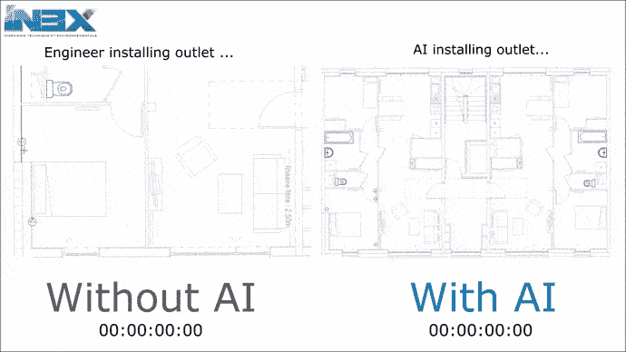

在左手侧，可以看到用户努力将插座正确地对准到正确的角度。相反，在右边的例子中，在人工智能的帮助下，安装的插座被直接很好地定向。用户根据他对情况的判断来调整位置。RL 代理执行和优化得越好，用户就越不需要调整已安装设备的位置。

下面，找到代码，根据给定的 XYZ 位置，靠着最近的墙(垂直投影)植入插座。

Here is the pseudo-code with the FindClosestWall() function. This function finds from a given XY position the closest wall. Very useful for applying small corrections to socket positions

# C#安装项目[5/5]

首先，你需要通过 NuGet 包将[Keras.NET](https://github.com/SciSharp/Keras.NET)库下载到你的 C#项目中。

> Microsoft csharp . 4 . 5 . 0
>python net _ net standard _ py38 _ win . 2 . 5 . 1
>Numpy。Bare3.8.1.25
> Keras。净 3.8.5

在 Visual Studio 中:为:
>Keras.dll
>MicrosoftCSharp.dll
>Numpy 设置“本地副本”属性为 False。裸露的
>巨蟒。运行时间

在这之后，尝试执行下面一行:

if the execution is a success then Keras.NET is correctly initialized

如果您未能执行上面的行，这里有一些有用的建议:

>此[链接](https://jagathprasad0.medium.com/deep-learning-using-keras-net-with-c-1d1fceac4531)是我解决问题的主要来源

为了完成这篇有用的文章，如果你还有问题，我做了一些处理来解决它:

>安装 Python 3.8.6(。exe) : [此处](https://www.python.org/downloads/release/python-386/)

确保将 Python 安装在以下目录:*C:\ Users \ Mathieu . josserand \ AppData \ Local \ Programs \ Python \ Python 38*

>要管理“没有名为 numpy 的模块”问题:

确保“numpy”出现，如图所示…

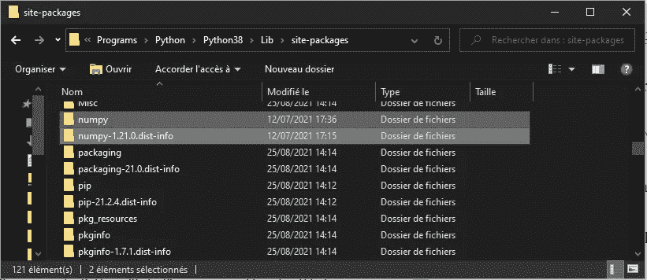

C:\Users\mathieu.josserand\AppData\Local\Programs\Python\Python38\Lib\site-packages

…如果没有，请打开您的 cmd 并以管理员身份运行它，然后在您的 python 环境中运行 *pip install numpy*

>确保所有这些文件都存在于你的 C#项目的‘bin’文件夹中:
-Keras.dll
-Numpy.Bare.dll
-Python.Runtime.dll
-Python。python38.dll 的 Runtime.xml

>我还在以下目录下添加了上述文件:*C:\ program data \ Autodesk \ Revit \ Addins \ 2019*

# 结论

谢谢你，到目前为止阅读我的人。这是我关于这个机器学习项目的文章的结尾。就个人而言，这个主题让我发现了很多关于强化学习和深度学习的新东西。值得注意的是，这是一个横向项目，Revit 中的数据收集工作是启动 MCTS 公司研究之前的基本工作。冒险并未就此停止，相反，该项目将进行许多改进。我已经在回顾我生成像素矩阵的算法了。
也许一年后，我会再次发表一篇文章，继续我在这个项目上的进展？
很快，为了让我的读者高兴，我将发表两篇关于 Revit 专有主题的新文章:空间和空间生成。
我将开发一个关于“INEX 空间管理器”的主题，这是一套允许在我们的 Revit 项目中管理空间的工具。空间很难设置和维护。此外，这些物品本身没有什么附加价值。因此，它们经常未被充分利用，然而它们却是开发更先进工艺不可或缺的要素。
看看我的第一篇介绍性文章，在这篇文章中，我解释了为什么我今天要写作，以及我对我工作环境的愿景。我还介绍了未来文章的计划。继续在 LinkedIn 上关注我，这样你就不会错过任何东西。请随时给我评论或通过电子邮件(mathieu.josserand@inex.fr)给我反馈。

我的写作方法也是开启关于这些 BIM 主题的争论。

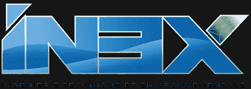

# 常见问题解答

*在这里，我将发表我对相关问题的回答。*

 [## 马蒂厄·若瑟兰—英格尼尔·毕姆·R&D—INEX 打赌| LinkedIn

### ESILV 刚毕业的工程师(2020)，专攻计算机科学(机器和深度学习),开放给…

www.linkedin.com](https://www.linkedin.com/in/mathieu-josserand-b46899106/)