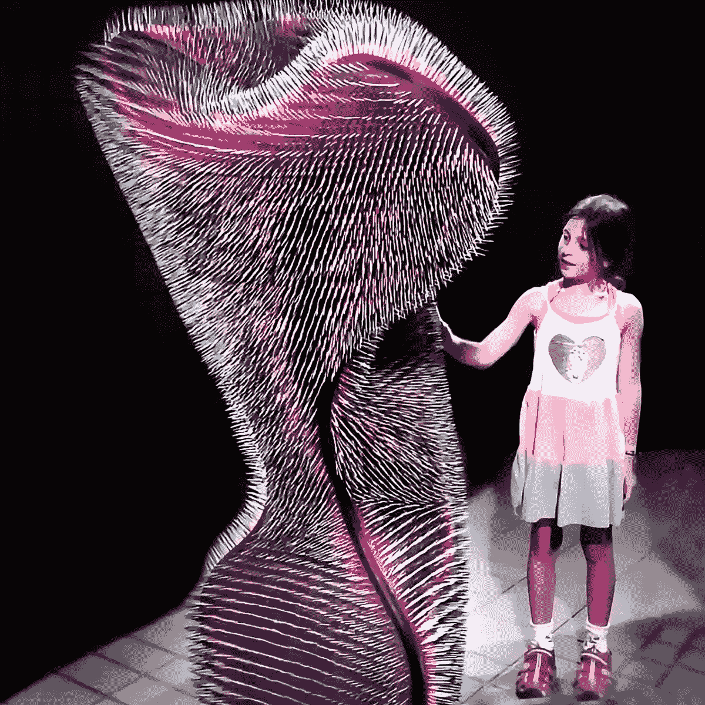

# 如何成为一名馆长

> 原文：<https://medium.com/mlearning-ai/how-to-become-a-curator-3c0c75f74637?source=collection_archive---------3----------------------->

## 艺术与人工智能和收入的真相

🟣要成为会员，使用此链接: [**获得全媒体权限**](https://evartology.medium.com/membership)

[https://vimeo.com/582851292](https://vimeo.com/582851292)

**成为一名策展人有多难？**

通过使用[机器学习](/mlearning-ai/what-is-machine-learning-2ec9cacb986c)来呈现艺术，策展人可以改变我们体验世界的方式。感谢数字艺术，我们都可以使用[技术](/mlearning-ai/turings-nose-a3980fb4b390)来创造新的生活环境。人工智能艺术家正在改变…