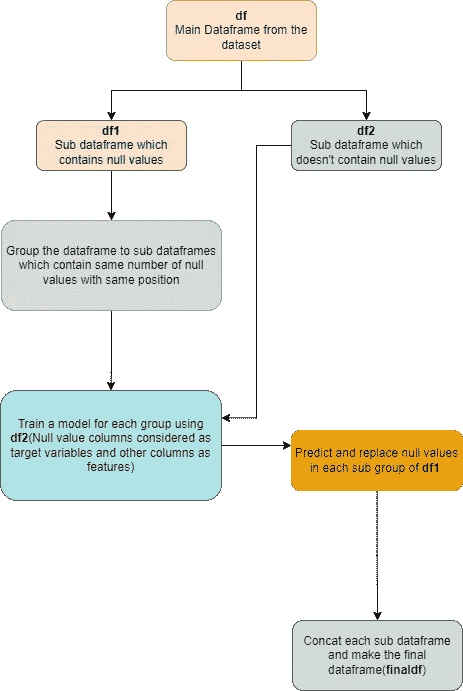
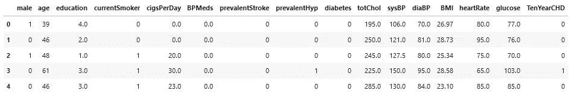
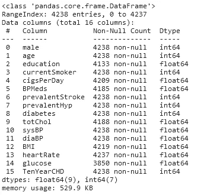
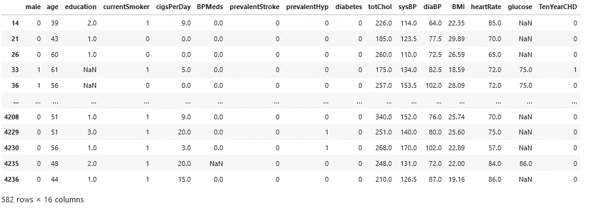
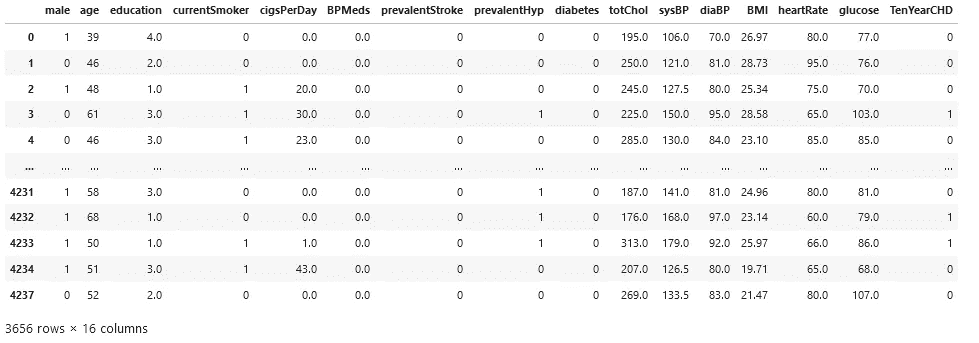
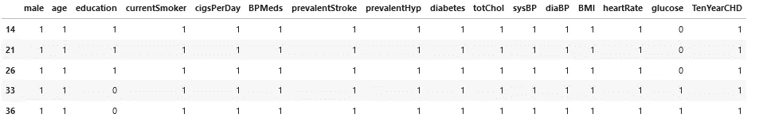
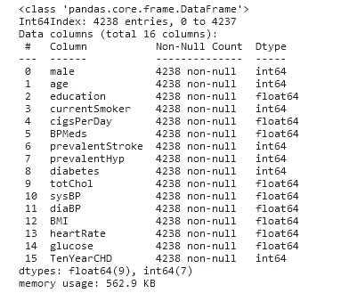

# 如何在机器学习中建立自定义多元插补模型

> 原文：<https://medium.com/mlearning-ai/how-to-build-a-custom-multivariate-imputation-model-in-machine-learning-a1322ad4aa82?source=collection_archive---------8----------------------->


处理数据集的缺失值是数据清理和模型开发过程的重要部分。更常见的是，数据科学家试图通过用均值/中值/众数/零值/常数值替换它们或使用内置的 scikit-learn 类来避免丢失值，如 SimpleImputer，**iterative inputr**(在本文中，我试图建立一个类似于此的模型)，KNNImputer。

基于机器学习的缺失数据填补方法通常使用建模来挖掘不完整数据中的有效信息。在本文中，我将介绍如何构建一个自定义的多元插补模型，用于对数据集中的缺失值进行插补。

我将在本文中使用的数据集可以在 [**Kaggle**](https://www.kaggle.com/datasets/dileep070/heart-disease-prediction-using-logistic-regression) 上找到。此外，您可以在那里参考数据集的详细信息。

在开始建模之前，下面我已经给出了这种方法的基本流程，以获得主要思想。



Figure 01:Basic Process

现在，让我们开始这个过程。

因此，让我们首先导入所需的库:

```
**from sklearn.linear_model import LinearRegression
import pandas as pd
import numpy as np**
```

在本文中，我只构建了一个线性回归模型来预测缺失值。但是，我会给出一个资源来引用可以用于这类问题的算法。

现在，让我们将数据读入熊猫数据框:

```
**df=pd.read_csv(‘heart_disease_data.csv’)**
```

让我们打印前五行数据:

```
**df.head()**
```



Figure 02:Dataframe Head values

让我们看看数据帧的信息

```
**df.info()**
```



Figure 03:Dataframe Information

可以看出，有 7 列由空值组成。因此，让我们开始构建这些空值的插补模型。

首先，让我们将包含一个或多个空值的数据帧拆分成行。

```
*#filter only 1 or more nan values rows and make a sub dataframe*
**df1 = df[df.isna().any(axis=1)]
df1.head()**
```



Figure 04:Dataframe which contains 1 or more null values in the rows

现在，让我们得到不包含任何空值的数据帧(这是在下一阶段训练模型所需要的)

```
*#dataframe which not containing null values*
**df2=df.dropna()
df2**
```



Figure 05:Dataframe which does not contain any null values

一些行组包含相同位置的相同数量的空值。如果我们可以对这些行进行分组，那么我们就可以减少训练模型的计算量。因此，为了对行进行分组，在代码段下面用 0 替换空值，用 1 替换非空值(在 **df1** dataframe 中)。

```
*#replace null values to 0 and not null values to 1(purpose:for grouping the rows in the next codes)***df3=df1.notnull().astype(“int”)
df3.head()**
```



Figure 06:After replacing df1 with 0s and 1s

现在，他们可以使用上述数据框(df3)根据空值位置和数量对行进行分组。下面的代码段做了分组。

```
#grouping the dataframe based on null value quantity and position
**dfGrouped=df3.groupby(list(df3.columns))**
```

现在，让我们开始为每组建立一个模型。然后预测并替换空值。下面的代码段给出了整个过程(每一行都有注释)

在上面的代码中，你可以使用类似的模型(只有**多输出回归**模型，你可以在这里参照详细的**[](https://machinelearningmastery.com/multi-output-regression-models-with-python/)**)****

*   ****线性回归(及相关)****
*   ****KNeighborsRegressor****
*   ****决策树回归器****
*   ****RandomForestRegressor(及相关)****

****让我们看看用预测值替换空值后的数据帧，****

```
**finaldf.info()**
```

********

****Figure 07:Dataframe after replacing null values****

****因此，可以看出，整个数据帧不包含任何空值，这些空值被上面建立的模型(线性回归模型)所替代。您可以根据自己的意愿定制该过程。你可以在这个 [repo](https://github.com/Ravinath98/Multivariate-Imputation-Model) 里看到完整的源代码。如果你对这篇文章有任何批评，请留下评论。谢谢你。****

# ****参考****

*   ****sci kit-学习。2022. *6.4。缺失值的插补*。[在线]可在:<https://scikit-learn.org/stable/modules/impute.html>[2022 年 6 月 5 日访问]****
*   ****j .布朗利，2022。*如何用 Python 开发多输出回归模型*。[在线]机器学习掌握。可从以下网址获取:<https://machine learning mastery . com/multi-output-regression-models-with-python/>【2022 年 6 月 5 日获取】****

****[](/mlearning-ai/mlearning-ai-submission-suggestions-b51e2b130bfb) [## Mlearning.ai 提交建议

### 如何成为 Mlearning.ai 上的作家

medium.com](/mlearning-ai/mlearning-ai-submission-suggestions-b51e2b130bfb)****