# 如何在节省 1500 美元的同时搭建深度学习 GPU 工作站？

> 原文：<https://medium.com/mlearning-ai/how-to-build-a-deep-learning-gpu-workstation-while-saving-1500-e7a8c9a9af86?source=collection_archive---------4----------------------->

像 [Lambda](https://lambdalabs.com) 、 [Bizon](https://bizon-tech.com/) 、 [Digital Storm](https://www.digitalstorm.com/) 这样的公司提供预先构建的深度学习 GPU 平台，这些平台往往比从头构建平台更昂贵。然而，从这些公司购买的好处是您可以获得支持和预构建的软件堆栈，但是如果您不需要这些，从头构建钻机可以为您省钱。在这篇博文中，我们的目标是构建相同的 [Vector](https://lambdalabs.com/gpu-workstations/vector/customize) GPU 工作站，但价格便宜 1500 美元！工作站是可定制的，因此为清楚起见，以下是其确切的规格:

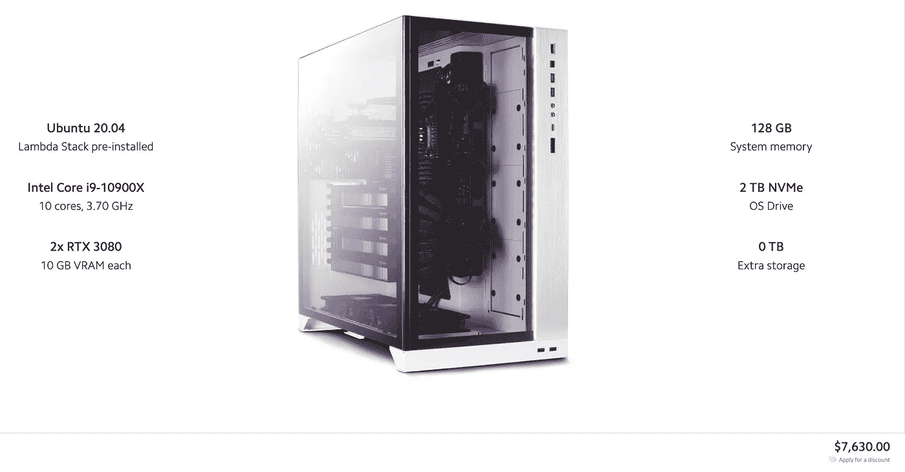

The [Vector](https://lambdalabs.com/gpu-workstations/vector/customize) rig from Lambda labs we’d like to build from scratch. As we see, the pre-tax price of this machine is $7630 on 12/04/2021 which is $1513 higher than what we paid Newegg.com for all the pieces.

每个硬件的价格如下所示:

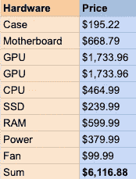

Hardware piece pre-tax prices on Newegg.com purchased on 12/04/2021.

以下是通过链接到 [Newegg](https://newegg.com) 产品页面购买的硬件清单。组装说明也在下面描述。

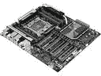

[Asus 2066 Intel X299 Motherboard](https://www.newegg.com/p/N82E16813119058?Item=9SIAFJ8A1A6008)

*   将电源安装在计算机机箱上。电缆管理和电线包装在这里至关重要，因为 PSU 有很多电线。

[Intel Core I-9–10900X](https://www.newegg.com/intel-core-i9-10th-gen-core-i9-10900x/p/N82E16819118111?Item=9SIASGMGK88777)

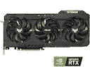

[NVIDIA GeForce RTX 3080](https://www.newegg.com/asus-geforce-rtx-3080-tuf-rtx3080-o10g-v2-gaming/p/N82E16814126525?Item=9SIAGKCGMK8504)

[CORSAIR 4x32GB DDR4 RAM](https://www.newegg.com/corsair-128gb-288-pin-ddr4-sdram/p/N82E16820236614?Item=N82E16820236614)

*   将主板安装在电脑机箱上。安装前，不要忘记连接配流盘。
*   将 CPU 安装在主板上。不要触摸针脚，确保没有灰尘。将导热膏涂在芯片上。
*   将 CPU 冷却器安装到 CPU 上
*   在主板上安装两个 GPU

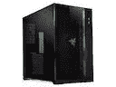

[Lian Dynamic Razor Computer Case](https://www.newegg.com/black-lian-li-pc-o11dynamic-razer-edition-atx-mid-tower/p/N82E16811112590?Item=9SIA0ZX95W7922)

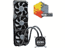

[EVGA CPU Liquid Cooler](https://www.newegg.com/evga-clc-360-liquid-cooling-system/p/N82E16835288014?Item=N82E16835288014)

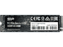

[Silicon Power 2TB SSD NVMe](https://www.newegg.com/silicon-power-2tb-us70/p/N82E16820301431?Item=N82E16820301431)

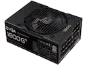

[EVGA 1600W Power Supply](https://www.newegg.com/evga-supernova-1600-g-220-gp-1600-x1-1600w/p/N82E16817438191?Item=N82E16817438191)

*   在主板上安装 NVMe 固态硬盘
*   在主板上安装所有四个内存
*   连接所有电源电缆和计算机机箱电缆，例如前面的电源按钮和 USB 端口。

**备注:**

1.  如果您正在构建一个 4 GPU 平台，因为每个 GPU 大约需要 250-350 w，您需要确保总功率由您的 PSU 和插座支持。
2.  通过读取主板、CPU 和 GPU 的温度，确保内部温度良好。

构建过程中的照片:

After PSU installation.

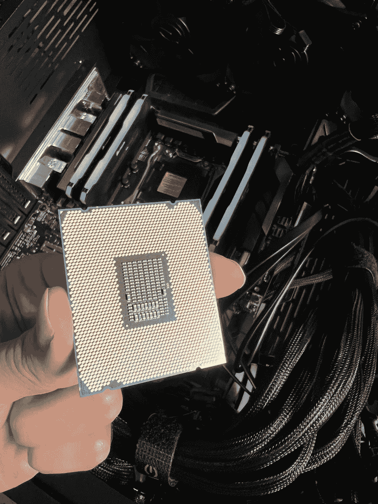

[Intel Core I-9–10900X](https://www.newegg.com/intel-core-i9-10th-gen-core-i9-10900x/p/N82E16819118111?Item=9SIASGMGK88777)

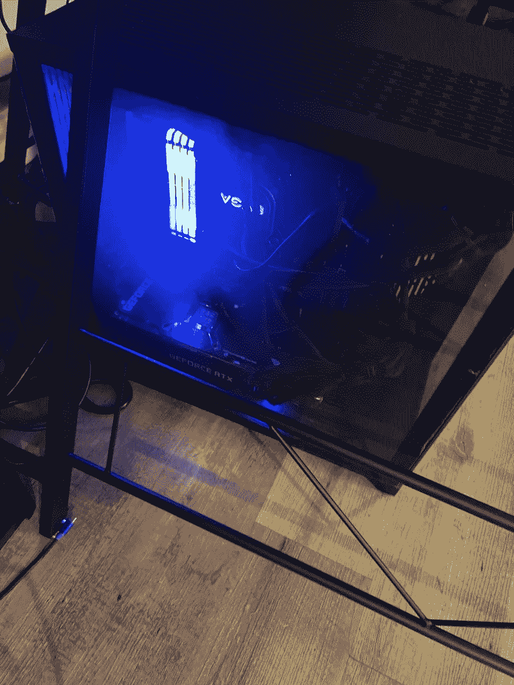

The RAM lightning looks nice!

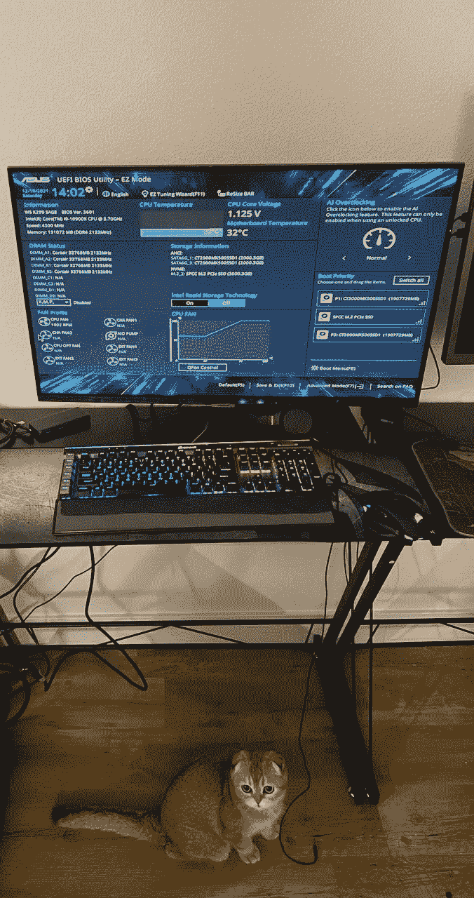

All hardware pieces are detected successfully!

如果你对更多信息感兴趣，请打电话给我:[https://amirerfan.com](https://amirerfan.com)

 [## Mlearning.ai 提交建议

### 如何成为 Mlearning.ai 上的作家

medium.com](/mlearning-ai/mlearning-ai-submission-suggestions-b51e2b130bfb)