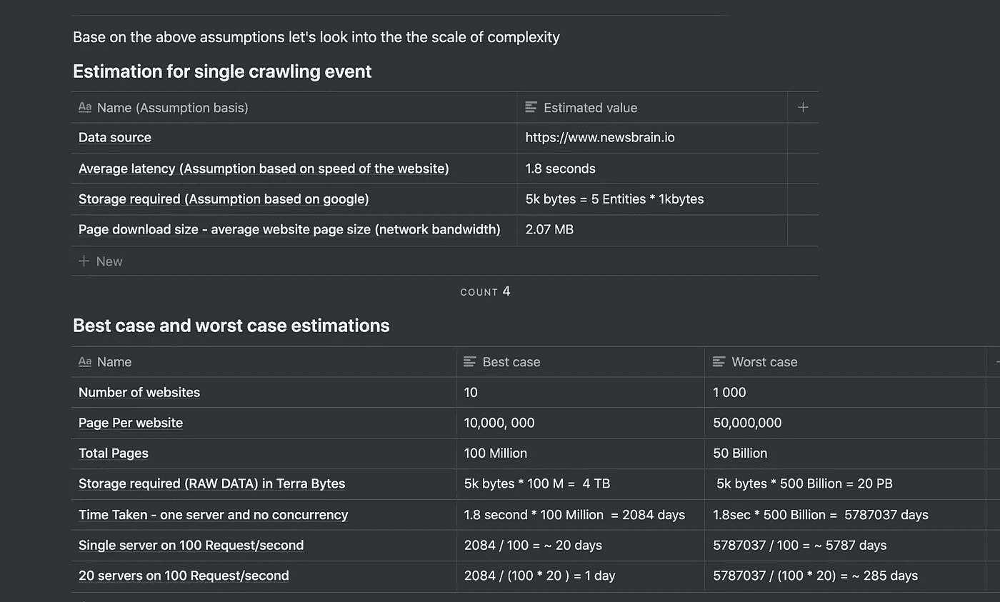
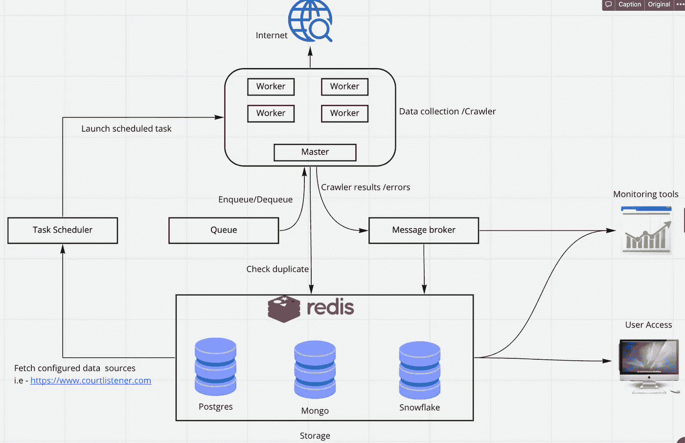
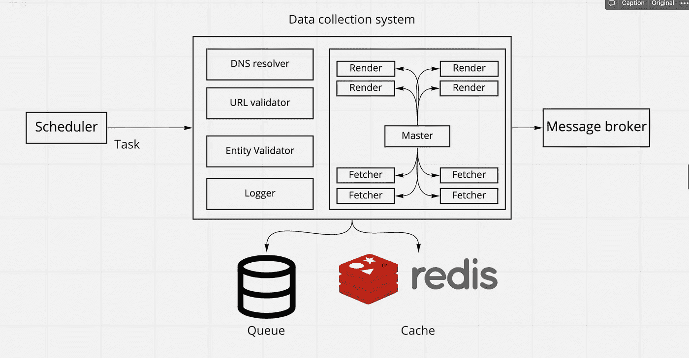

# 如何构建可扩展的数据收集系统

> 原文：<https://medium.com/mlearning-ai/how-to-build-a-scalable-data-collection-system-9703a2367735?source=collection_archive---------2----------------------->

# 介绍

随着新技术在一个激动人心的创新时代的展开，收集数据对任何组织来说无疑都很重要。数据催生了分析洞察力和人工智能，而这些在其他情况下是很难实现的。

随着公司挖掘获取大数据的潜力，他们必须用最好的技术和设计技巧来染指。在这篇博客文章中，我将分享我多年来在构建多个爬行系统时作为系统设计师的经验。

**那么什么是数据采集系统呢？**

数据收集系统是一种软件系统，可用于从互联网网站、存储系统、ftp 和更多数据存储解决方案中收集非结构化数据，并将其提供给中央数据仓库。

本系统设计文档首先描述了可扩展数据收集系统的高级架构。然后重点介绍了 web 爬行系统的低级架构和伪代码，该系统可扩展到数千个数据源，每个数据源都有数百万页。

作为一个系统的架构师，能够描述我们设计的范围和局限性是明智的。因此，在本文档结束时，我们应该能够拥有这样的系统的清晰体系结构，能够有效地收集、验证、流式传输、存储和分析所收集的数据。

# 假设

**法律考量**

*   对于您设计的任何系统来说，考虑非法访问、使用和分发所采集的数据是很重要的。
*   特别是像检查每个网站的 **robot.txt** 这样的规定对这个项目来说非常重要。但是为了完成这项任务，让我们假设国际和国内的法律实践都适用。

**设计范围**

*   在设计系统时，良好的抽象层次解决了大量的问题，如开发成本、时间、系统性能、可扩展性和业务目标。
*   这是为了支持从 web(或任何数据源)中收集任何类型的数据，如果它实现了底层契约和模式定义的话。

**用户体验**

*   博客文章假设我们的数据被数据工程师使用，而不是最终用户，他们需要一个花哨的用户界面来访问数据。基于这个假设，没有面向用户界面开发的客户端。
*   仅使用 cloud️数据可视化解决方案来显示结果。这对数据分析师和科学家来说非常方便。

**量表**

让我们假设

*   网站或数据源可能会更改
*   可以添加网站或数据源
*   我们可能还想添加更多的数据源(网站)
*   让我们假设数据源的规模是数千个，每个都有数百万页

基于这些假设，以下两个表预测了我们最终在带宽、存储、时间和硬件要求方面的复杂性水平。

让我们定义用于计算存储、带宽和时间的公式

## 估计

假设您平均从每个数据源获取五个实体。只要遵循下面描述的数据定义，获取的数据并不重要。

我们有 **5 个实体**将被存储到数据库，请查看下面的数据定义部分，以了解为什么考虑 5 个实体。

```
psql> desc entities (let's take one of the tables on database);+-------------+----------+------+-----+---------+----------------+
| Field       | Type     | Size |                                |
+-------------+----------+------+-----+---------+----------------+
| ID          | double   | 8 Byt|                                |
| Name        | char(35) | 35Byt|     |         |                |
| Address     | VARC(255)| 255  |     |         |                |
| ........    | ........ |      |     |         |                |
| ..........  | .......  |      |     |         |                |
+-------------+----------+------+-----+---------+----------------+let's take the average of the three columns  = (8+35 + 255)/3 ~ 100 bytes
Single column takes average of 100 bytes. 
One RowSize = 10 columns * 100 bytes = 1000 bytes per row = 1k Bytes per a row
```

如果我们假设对每个爬行事件我们创建五个实体(数据库记录)

```
$DataBaseRowSize = NoOfRows * RowSize$$DataBaseRowSize = 5 Records * 1k Bytes = 5k Bytes$
```

对于每次报废，我们有 5 个新闻实体，这意味着我们将需要 5k 字节。

```
$TotalTime = (NetworkLatency * NoOfRquests) /  (ConcurrencyLimit*NoOfServers)$
```

就网络延迟而言，假设没有下载附加的多媒体文件(如 pdf 和图像),每个网络请求平均需要 1.8 秒。

基于上述假设，让我们来看看复杂程度



estimation table

根据我们预测的数字，如果我们有 **20** 台服务器，每台服务器可以请求 **100 个请求/秒**，我们可以预期接收 4 TB 到 20PB 的**卷**，持续时间范围为**单日**到**年**。由于依赖于不同的资源，这些数字可能总是在变化。例如并发级别和硬件基础设施。

它还假设被废弃的网站或数据源能够处理这种负载，这是不太可能的。因此，我们将为此进行权衡。

**该假设的优点**

*   我们可以很容易地找出资源限制
*   举例。如果我们使用一台服务器，即使在最好的情况下，我们也可能需要等待数月才能达到目标。
*   考虑多个数据源和数据源类型，而不是只对一个数据源进行约束
*   它使用并发和分布式计算，这是非常重要的

**这个假设的缺点**

*   不太可能在一天之内以如此高的并发量将所有这些请求发送到数据源网站。
*   在现实生活中，我们可能希望改变 IP 地址，并且在废弃数据源之前随机等待，以避免过度破坏被废弃的网站。
*   因此，需要针对这些场景调整时间
*   假设不包括下载 PDF 等多媒体文件
*   一些假设的基础可能是错误的。举例。页面加载延迟/页面大小，但是您应该能够根据需要对其进行参数化和更新。

# 高层建筑

高级架构描述了在逻辑层中分组的块级组件。

如设计所示，每一层都在某种程度上处理数据，然后将其传递给下一层。高层次设计非常重要，因为它展示了组件如何交互，使您的基础架构对每个人都是透明的。

需要注意的是，每一层都是由单个/多个微服务组成的。在现实生活中，层之间的连接可能看起来有点不同


*High level architecture drawing* [*https://miro.com/app/board/o9J_lCgtSGE=/*](https://miro.com/app/board/o9J_lCgtSGE=/)

# 第 1 层—数据源

将数据源抽象为它自己的微服务是很重要的，因为这是关键的系统需求之一。

为什么数据源的抽象很重要

*   如果想要添加更多的数据源。
*   如果我们把数据源改成 CSV，S3 甚至 ftp 会怎么样
*   独立于其他系统的开发和测试
*   关注点的分离以及与其他系统接口的方便性
*   隐藏实现和细节

抽象数据源层将给我们的系统一个下降的自由度，以适应未来可能的需求变化。此外，与整个系统分离的独立测试将非常容易。

根据需求和性能优化水平，我们可能需要存储数据源的关键元素。

那么样本数据源应该包含什么呢？

**你如何定义它？**

以下是您如何详细指定

*   类型—示例。网站，CSV，S3 …
*   定义-将包括数据源的详细信息
*   根据数据源的类型，详细信息可能会有所不同。

例如，让我们为**网站数据源**定义一个样本定义

*   网址→网站的网址
*   计划→覆盖系统计划
*   身份验证→存储凭据如果我们需要在抓取之前登录，
*   字段和选择器→要清理的字段和 HTML 选择器清理时，配置主 url 和详细信息
*   列表→页面上选项列表的选择器。我们想要废弃或收集的所有东西都将有 html 选择器配置
*   字段和验证器→基于定义的验证方案的数据类型输入和输出的验证规则
*   DNS →性能搜索的 DNS 解析设置
*   状态→轻松启用或禁用信号源。

# 第 2 层-数据收集

数据收集系统将负责从数据源向数据处理器传输数据。这个系统处理外部系统，如网站和存储器。因此，在这个层面上实现并发和分布式计算非常重要。

由于这一层是本文的核心部分，因此将在底层架构部分详细讨论。

将在这一层执行的步骤有

*   从已配置的数据源中读取
*   使用资源和队列调度来确定要爬网的数据源
*   检查缓存和数据新鲜度
*   对配置的数据源中的数据进行爬网
*   验证输入和输出。在这个阶段抛出的错误被记录到我们的监控系统中

一旦完成上述步骤，结果将通过管道传输到第 3 层的数据处理。

# 第 3 层-数据处理

这一层是关于数据转换的。我们希望将来自第 2 层爬虫的结果进行转换，以便以非常高的性能、高吞吐量和分布式的方式进行验证和处理。

在此阶段，可以执行的几个主要流程是

*   数据验证对于保持**数据质量和完整性**至关重要。在这个阶段抛出的错误被记录到我们的监控系统中。这将确保系统是否按计划运行。验证在管道的每个阶段完成。
*   转换用预处理器定义的相关数据结构包装数据，并与作为上下文存在的数据相关联。
*   处理批量数据处理请求
*   像 NER、NLP 这样的底层数据上的机器学习过程可以在这个阶段完成
*   存储到数据存储系统或交付到商业智能层

为了让我们的解决方案有效地工作，在管道的每一步结束时都有一个数据验证阶段是非常重要的。

为此，我们可以为每种数据类型设计验证方案。

**举个例子。**

实体的每个属性都应该用它的类型验证器来验证。我们还可以在需要时添加验证块

*   日期验证器→用于不同的日期类型，如文件日期、浮点数、字符串等
*   正则表达式验证器→用于匹配模式
*   唯一性验证器→确保数据在数据存储中是唯一的
*   新鲜度→确保数据是新鲜和最新的

这一层的技术选择相当容易。由于行业积累了非常有趣的选择。像 **Kafka、** Apache Hadoop 和 Spark 这样的工具在巨大的名气和社区支持下派上了用场。

# 第 4 层-存储

存储数据对于应用程序的数据可访问性和组织级别的共享非常重要。

下面列出了我们系统的重要属性

*   并发性—每秒写入数百万数据的高并发性
*   分布式—它们可以以分布式方式水平扩展
*   文档存储—灵活性和易用性，因为数据形状发生了变化
*   速度—支持海量数据和高吞吐量

像 MongoDB 和 Cassandra 这样的分布式数据存储最适合这种情况。

# 第 4 层-数据查询、分析和监控层

在这个阶段，我们创建一个透明层，使应用程序数据访问更加容易。

企业主可以与软件和数据工程师合作，快速开发工具并交付面向业务的决策。

这部分回答了我们如何衡量我们的成功，可视化和查询我们的数据。

该层的建议工具列表如下

*   使用 Kibana 进行日志记录、搜索和可视化的弹性搜索
*   用于生成和共享报告的 Data studio
*   Grafana 用于快速分析、警报和可视化

作为一名系统设计师，你需要留意可能出现的主要系统和业务问题。如果您使用以下关键指标设置监控系统，您可以充分利用上述工具。

*   当误差阈值超过某个数值时
*   当系统在一定时间内无法运行时
*   当数据的形状不同并且验证不起作用时
*   网站报废时还禁止…
*   当系统运行状况不佳或服务器停机时
*   当出现错误并且监控服务关闭时
*   当您一些系统关闭时

好了，现在你的房子里有了数据，你如何不断地改变它，移动和转换它。如何让您的数据模型文档保持最新？

别担心，DBT 会支持你的。感谢我的同事费利克斯·维默，他把我介绍给了 DBT，现在我可以像普通程序一样处理我的数据模型了。像 DBT(数据构建工具)这样的工具非常适合对数据进行 ETL。

您可以使用它将数据移动到 Postgres DB，进行数据转换，或者通过构建模型的依赖图来记录您的数据模型。

好了，现在你已经完成了数据处理和 ETL，相应地存储了你的数据，然后是可视化的时候了。

# 第 5 层-视觉层(用户界面层)

一些基于云的工具，你可以快速设置你的数据可视化是 Kibana，Grafana 和 Looker

太棒了，现在你在这里，最酷的部分还在后面。

# 数据收集层的低层体系结构

很难为上面讨论的所有阶段做底层架构。为了这个职位，低层次架构高度集中在**数据收集层。**



*Low level architecture* [*https://miro.com/app/board/o9J_lCgtSGE=/*](https://miro.com/app/board/o9J_lCgtSGE=/)

让我们详细解释每个组件。

该说明将讨论以下要点

*   为什么数据收集组件很重要
*   它如何与其他系统通信
*   可能的设计瓶颈和建议
*   更适合我们需求的工具

# 储存；储备

让我们深入了解存储组件是如何使用的，以及它如何适应体系结构。

随着系统的扩展，我们将针对不同的目的使用多种类型的存储系统。我们使用 **Redis** 进行快速查找缓存存储，并检查缓存中的 URL 是否与**重复**。Postgres 用于存储对我们的业务逻辑至关重要的关系实体。所有输入到**任务调度器**的数据源都存储在 **postgres** 中。

要存储来自我们的**消息代理的事件，Mongo DB** 是最合适的，因为它以高并发&吞吐量分布。

此设计中存储系统的关键设计瓶颈**是数据处理和冗余。最好的例子之一是确保 URL 被提取一次，并且没有重复的项目被保存。**

为系统收集的每个数据精心设计实体识别(ID)技术也非常重要。url 规范化和名称间距等技术以及对数据源结构的良好理解非常重要。还有其他瓶颈，如确保数据质量和完整性，这些主要由爬虫和消息代理服务来完成。最佳实践是将错误从消息代理传送到我们的监控系统，如图所示。这将为我们如何实现业务目标提供一个透明而高效的视图。

# 任务调度程序

任务调度器通过跟踪预定的后台 cron 工作负载和启动任务来发挥重要作用。

现阶段的瓶颈是保持工作负载**运行和可用资源**的良好平衡。任务调度器将与**爬虫/数据收集**服务通信，以调用调度的任务。

举例。如果想要在每天的午夜运行计划任务来收集数据，我们可以像这样配置我们的调度程序`00 00 * * *`

有很多像 AWS scheduler & Active batch 这样的工具来完成这样的任务。

# 爬虫/数据收集

这是爬行系统中最重要的部分，所以我会深入解释。

该服务结合队列系统将负责与互联网通信，并根据下面定义的**数据源定义**获取数据源。



*Data collection system design drawing* [*https://miro.com/app/board/o9J_lCgtSGE=/*](https://miro.com/app/board/o9J_lCgtSGE=/)

让我们来看看这一层的主要组件。

**DNS 解析器**

缓存最新的请求 IP 地址。这将通过减少 DNS 解析的往返行程来大大减少我们的网络爬虫的延迟。

**网址验证器**

*   这确保了 url 操作，如
*   URL 规范化和名称间距
*   基于过滤器和排除的*数据源定义*
*   检查缓存和复制

**实体验证器**

处理每个数据源的实体及其属性的验证和转换。

**记录器**

确保日志通过管道传输到监控服务，以便我们可以测量系统的健康状况和性能

现在，让我们看看通过访问互联网和获取 html 数据来完成长时间运行工作负载的核心部分。

**提取器**

向数据源发送 http 调用，并分析结果 html 文本。这是一个轻量级的 scrapper，如果网站是服务器端渲染的话，应该尽可能地使用它。

**无头渲染**

Headless render 将呈现数据源页面，就像在普通浏览器中呈现一样。这对于 javascript 密集型页面来说很好。

由于渲染器和 fetcher 服务上运行的工作负载非常密集，资源可能有限。如体系结构所示，运行这些工作负载的机器可以被复制，这样系统可以以分布式方式更快地运行。

让我们深入研究 fetcher 的部分并进行渲染。

**主节点**需要保持工作节点上的运行状况、并发级别和工作负载。例如，确保并发级别低于/高于某个限制。

**工人**(显示了提取器和渲染器)，其主要目标也是读取**数据源定义**并从互联网上获取。理想情况下，它不应该知道数据源。所有关于数据源的信息都应该通过如下所示的配置来传递。

这一点至关重要，因为每次我们添加源代码时，只需要再添加一个这样的配置。然后，crawler 服务知道如何基于定义的接口下载、解析和验证数据源定义中的每个字段。

此阶段的关键瓶颈是

*   **分布式工作负载:**可以使用分布式计算模式和微服务来解决
*   **存储和缓存:**可以通过缓存技术来解决
*   **IP 轮换** : IP 可以通过使用私有或云 VPN 技术进行路由
*   **数据质量:**可通过数据验证和处理技术解决
*   **监控**:可以通过将错误和系统健康状态记录到监控系统中来解决

在我们开始描述伪代码之前，让我们用一个简单的网站为演示创建一个示例数据源定义。

这将有助于我们可视化对数据源的期望。

在注释中解释了数据源定义的最重要的属性

**数据源定义示例**

```
{
   "name":"Name of your data source ",
   "data_source_type":"website",
   "source_urls":[
      {
         "name ":"Data source",
         "section":"chicago",
         "tags":"USA,chicago",
         "url":"<[https://www.newsbrain.io](https://www.newsbrain.io)>"
      }
   ],
   "authentication":{
      "username":"${user}",
      "password":"${pass}"
   },
   "crawler_type":"renderer",
   "config":{
      "config_type":"legal_option",
      "list":{
         "name":"legal_option_urls",
         "selector":{
            "value":"value"
         },
         "validator":{
            "type":"regex",
            "value":{
               "regex":"*.newsbrain.ai/category/*",
               "filter_list":[
                  "*.newsbrain/options/chicago/*"
               ]
            }
         }
      },
      "fields":[
         {
            "name":"ID",
            "key":"id",
            "selector":{
               "value":"#id"
            },
            "validator":{
               "type":"number"
            }
         },
         {
            "name":"Field Name",
            "key":"name",
            "selector":{
               "value":"div.name"
            },
            "validator":{
               "type":"string"
            }
         }
      ]
   }
}
```

让我们讨论一下关于数据源定义的一些关键要点

*   数据源有一个名称，URL 和一些你想作为上下文传递的元数据。现在，使用它的名字，很容易识别数据源。如果我们想添加更多的源，甚至在需要的时候配置部分和标签，这也是可能的
*   数据源可能有嵌套的链接和页面。因此，对于这种情况，有一个管道一个接一个地获取是很好的。我们的数据源定义试图处理这种情况。首先是页面列表，然后从这些页面中获取字段/属性。在复杂的情况下，这应该是一个串联的管道。
*   字段/属性也有名称、关键字、html 选择器和验证方案。
*   重要的是要知道，crawler 服务没有特定数据源的逻辑，但它只是支持任何数据源类型的通用接口。

**当前系统限制和可能的改进**

*   目前，开发人员必须使用上述数据定义配置数据源。这可以是自动化的，使用用户界面，ML 服务和网站元标签
*   应该添加 IP 轮换和 VPN
*   应该添加数据仓库以进行归档
*   对于嵌套页面的复杂场景，Scrappers 应该是流水线式的

**词汇表**

*   **数据定义**:用于定义传入[数据源](https://www.notion.so/How-To-Build-a-Scalable-Data-Collection-System-64501a771b994e8490856410cf7a191b)的对象/地图
*   **Crawler/scraper:**可互换使用，表示从互联网获取数据的任务
*   **实体**面向对象的方式表示业务逻辑的主要参与者。

感谢您通读。非常感谢您的反馈。

如果你觉得这个帖子有用，请给它竖起大拇指。

**关于作者**

本文作者为 [Dagm Fekadu](https://medium.com/u/590f8c2e9818?source=post_page-----9703a2367735--------------------------------) 。

Dagm 目前是一名高级软件工程师，在 [priceloop.ai](https://priceloop.ai) 构建数据驱动的定价解决方案。他还是 newsbrain.io 的联合创始人兼首席技术官，该网站让你随时随地都能听到你最喜欢的文章。

在 [LinkedIn](https://www.linkedin.com/in/dagmfekadu/) 上连接

跟随 Github

跟随[介质](/@dagmfekadu)