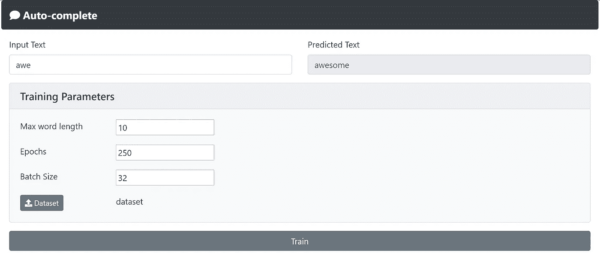
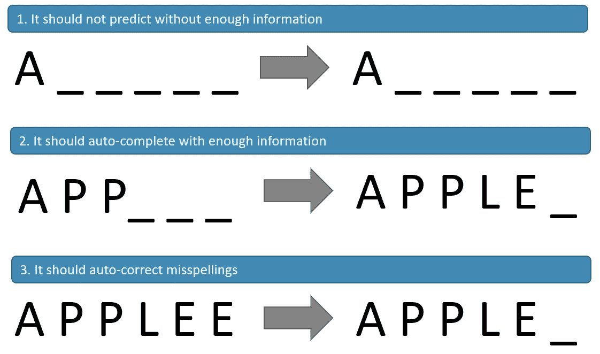
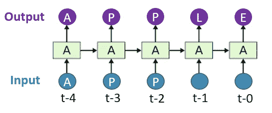
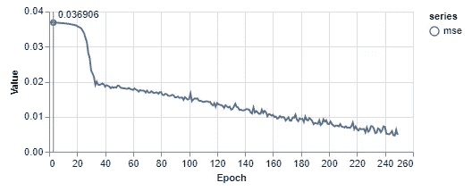
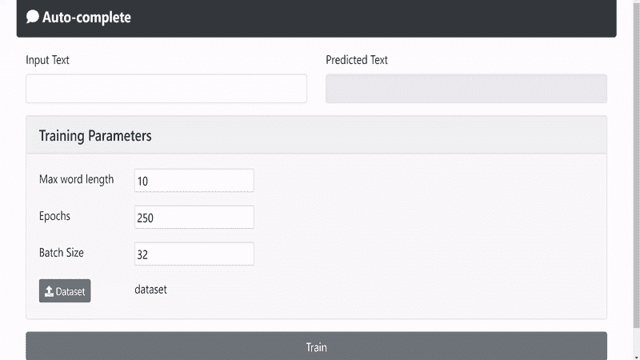

# 如何使用 tensorflow.js 构建自动完成模型

> 原文：<https://medium.com/mlearning-ai/how-to-build-an-auto-complete-model-with-tensorflow-js-56c027cafc2f?source=collection_archive---------0----------------------->



Demo link: [https://ohyicong.github.io/portfolio/autocomplete_model.html](https://ohyicong.github.io/portfolio/autocomplete_model.html)

自动完成是每部手机和电脑都内置的一个基本功能，它可以从你的打字习惯中学习，并神奇地将新单词添加到字典中。有时候，它是如此的直观，以至于我们忘记了它的存在。

但是你想知道它是如何工作的吗？我做到了。

出于好奇，我做了一些研究，并意识到没有一个简单的教程来实现机器学习的自动完成模型。所以我决定写这篇文章来分享和解释我构建、训练和部署自动完成模型的过程。

为了让每个人都能跟上我的教程，我决定使用 Tensorflow.js 来实现。这是一个令人惊叹的 javascript 库，允许您在 Edge、Chrome 和 Firefox 等 web 浏览器上开发您的机器学习(ML)模型。

所以任何有网络浏览器和文本编辑器的人都可以跟随我的教程。

## 自动完成直觉

一般来说，理想的自动完成功能具有以下特征。



**选择机器学习模型**

有许多可用的 ML 模型，但并不是所有都适合我们的环境。我们必须选择一个模型，它能够从一系列输入中进行处理和推断，以预测最可能的输出。

考虑到这一点，我选择了长短期记忆(LSTM)模型。LSTM 模型具有递归神经网络架构，允许其从 *t-0 到 t-n* 推断输入，其中 *t* 表示当前时间步长， *n* 表示序列号。



Simplified Overview of an LSTM Model

**创建数据集**

选定模型后，我们需要弄清楚什么样的数据适合训练。以下是一些有助于你思考的问题:

1.  有什么特点和标签？
2.  有哪些数据限制？
3.  需要哪种数据格式？
4.  数据形状是什么？

Qn 1:有什么特点和标签？

要决定培训的特点和标签，把自己放在英语老师的位置上。想想你可以用什么方法教一个蹒跚学步的孩子英语。

其中一种方法是“填空”，其中一些字符模糊不清，幼儿被训练写下正确的字符组成一个单词。

同样，这种方法可以应用于创建数据集来训练我们的模型。

例如，为了训练模型识别单词“apple”，我们可以从左到右模糊该单词中的字符，如下表所示。

```
Dataset
+------------+------------+
|  features  |   labels   |
+------------+------------+
| a          | apple      |
| ap         | apple      |
| app        | apple      |
| appl       | apple      |
| apple      | apple      |
+------------+------------+
```

Qn2:数据限制是什么？

您应该注意两个数据限制。

1.  最大单词长度*(这个数字由你决定，对于本教程，我将使用 10)*
2.  仅字母*(数据集中不应包含任何数字和特殊字符)*

因为最大长度是 10，我们需要用零填充空白，如下表所示。

```
Dataset
+------------+------------+
|  features  |   labels   |
+------------+------------+
| a000000000 | apple00000 |
| ap00000000 | apple00000 |
| app0000000 | apple00000 |
| appl000000 | apple00000 |
| apple00000 | apple00000 |
+------------+------------+
```

Qn3:什么样的数据格式？

由于计算机只和数字打交道，我们需要找到一种方法把字符转换成数字。一种简单的方法是使用整数编码，其中 padding=0，a=1，b=2，c=3 … z=27，这将产生如下所示的输出。

```
apple00000 = 1,16,16,12,5,0,0,0,0,0
```

即使我们可以使用这个数据集来训练模型，它也可能不会产生好的结果。这是因为每个字符的整数表示不公平，其中 ML 模型假设字符“z”比“a”具有更高的优先级，因为表示“z”的整数具有更高的值。

抵消优先效应的一个简单方法是使用一键编码，用 1 和 0 的数组来表示字符。请参见下面的一键编码输出。

```
apple00000 = 
[0,1,0,0,0,0,0,0,0,0,0,0,0,0,0,0,0,0,0,0,0,0,0,0,0,0,0]
[0,0,0,0,0,0,0,0,0,0,0,0,0,0,0,0,1,0,0,0,0,0,0,0,0,0,0]
[0,0,0,0,0,0,0,0,0,0,0,0,0,0,0,0,1,0,0,0,0,0,0,0,0,0,0]
[0,0,0,0,0,0,0,0,0,0,0,0,1,0,0,0,0,0,0,0,0,0,0,0,0,0,0]
[0,0,0,0,0,1,0,0,0,0,0,0,0,0,0,0,0,0,0,0,0,0,0,0,0,0,0]
[1,0,0,0,0,0,0,0,0,0,0,0,0,0,0,0,0,0,0,0,0,0,0,0,0,0,0]
[1,0,0,0,0,0,0,0,0,0,0,0,0,0,0,0,0,0,0,0,0,0,0,0,0,0,0]
[1,0,0,0,0,0,0,0,0,0,0,0,0,0,0,0,0,0,0,0,0,0,0,0,0,0,0]
[1,0,0,0,0,0,0,0,0,0,0,0,0,0,0,0,0,0,0,0,0,0,0,0,0,0,0]
[1,0,0,0,0,0,0,0,0,0,0,0,0,0,0,0,0,0,0,0,0,0,0,0,0,0,0]
```

Qn4:什么是数据形状？

使用零填充和一键编码，每个单词的结果形状将是(10，27):(最大单词长度:字母数+ 1)。

**建立机器学习模型**

现在，我们终于到了激动人心的部分，您将为这个应用程序构建 ML 模型。

模型架构由两层组成:

1.  LSTM 层(输入)。它用于从顺序输入中得出推论。
2.  Softmax 密集层(输出)。它用于一次性编码预测。

创建这两层之后，您需要定义输入和输出形状。这是非常重要的一步，因为指定错误的数字会导致“形状不匹配”的错误。

按照之前的计算，形状将是(10，27)。因此，我们应该定义 max_len = 10，alpha_len = 27。

```
// code for building auto-complete model
const max_len = 10;
const alpha_len = 27;
var model = tf.sequential();
model.add(tf.layers.lstm({
  units:alpha_len*2,
  inputShape:[max_len,alpha_len],
  dropout:0.2,
  recurrentDropout:0.2,
  useBias: true,
  returnSequences:true,
  activation:"relu"
}))
model.add(tf.layers.timeDistributed({
   layer: tf.layers.dense({
    units: alpha_len,
    dropout:0.2,
    activation:"softmax"
  })
}));
```

**训练机器学习模型**

为了训练模型，我们需要决定几个参数:

1.  优化器。adam 优化器用于训练我们的模型，因为它可以很好地处理稀疏数据，并具有有效训练模型的自适应学习率。
2.  损失函数。当模型需要预测具有分类数据类型的一键编码中的结果时，使用分类交叉熵。
3.  新纪元。默认设置为 250，应根据数据集大小进行调整。
4.  批量大小。默认设置为 32，应根据数据集大小进行调整。
5.  评估指标。由于损失函数的性质，使用均方误差(MSE)。

```
# code to train the model
model.compile({
  optimizer: tf.train.adam(),
  loss: 'categoricalCrossentropy',
  metrics: ['mse'] 
})
model.fit(train_features, train_label, {
  epochs,
  batch_size,
  shuffle: true,
  callbacks: tfvis.show.fitCallbacks(
    { name: 'Training' },
    ['loss', 'mse'],
    { height: 200, callbacks: ['onEpochEnd'] }
  )
});
```



Adam optimizer minimizing MSE over 250 iterations.

**示威游行**

培训之后，你将能够创建自己的用户界面并测试 ML 模型！



Prediction capability after training the model

**资源**

演示链接:[https://ohyi cong . github . io/portfolio/autocomplete _ model . html](https://ohyicong.github.io/portfolio/autocomplete_model.html)

源代码:[https://gist . github . com/oh yi cong/B1 e 9 dab 5 EEC 6371 b 404 DBE 603 AC 4685d](https://gist.github.com/ohyicong/b1e9dab5eec6371b404dbe603ac4685d)