# 预测事件时如何建立直觉

> 原文：<https://medium.com/mlearning-ai/how-to-build-intuition-when-predicting-events-983a6fbf560f?source=collection_archive---------4----------------------->

如果一个朋友让你预测一个未来的事件，你会怎么反应？你的直觉可能是运行一个线性回归或者在一个样本量内寻找它的概率。你可以尝试最大化概率分布或仔细检查测试统计。然而，如果不了解这些工具的基础，预测事件的起点可能会令人难以捉摸。在选择想到的第一个预测工具之前，让我们探索一下如何一路建立直觉。

你有一个赌博成瘾的朋友。他加入了一个游戏，让你预测在 50 次掷骰子中 6 应该出现多少次。他递给你一个骰子，祝你好运。在不知道如何开始的情况下，你掷骰子 50 次并记录结果。

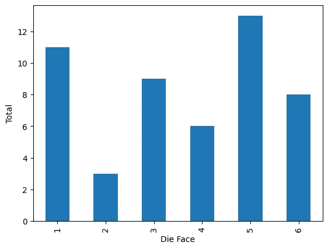

在你告诉你的朋友之前，你再执行一次 50 的迭代来确认你的结果。

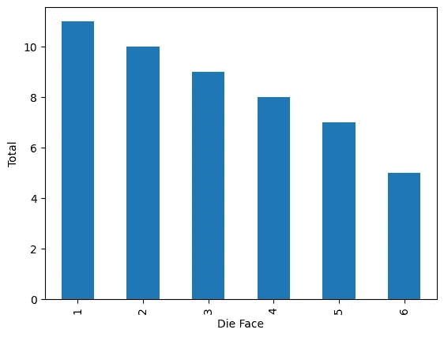

那不理想。额外的迭代使你对最初的结论不那么有信心。知道你的朋友需要支持，你卷起袖子，再执行 48 次迭代。对于每次 50 卷的迭代，记录 6 的数量并记录结果。

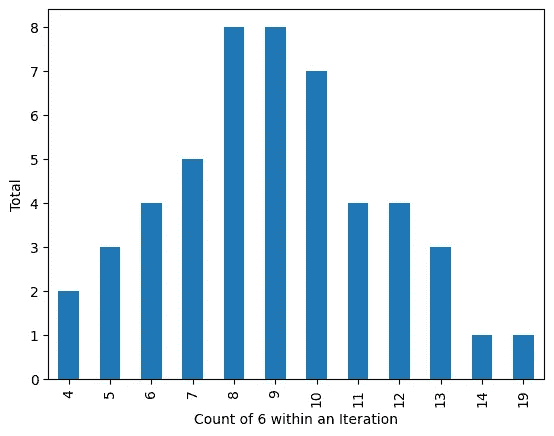

经验提高了对观察的信心。

那更好。虽然结果看起来仍然有点不可预测，但你厌倦了掷骰子，决定去找你的朋友。当你在当地的台球厅里搜寻时，第三个对数学感兴趣的朋友意识到了你的困境，并向你走来。“你真的应该考虑二项分布，”他强调说。注意到你面无表情的表情，他轻轻地提出了一个建议。"让我们来模拟如果你再进行 9950 次迭代会发生什么."使用一些计算机诡计，他复制了必要的迭代，并产生了下图。

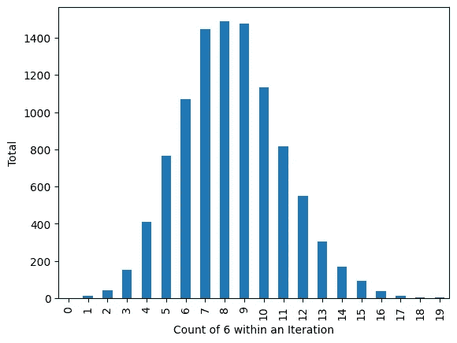

然后，当 n 是 50，p 是 1/6 时，他分享一个二项分布。

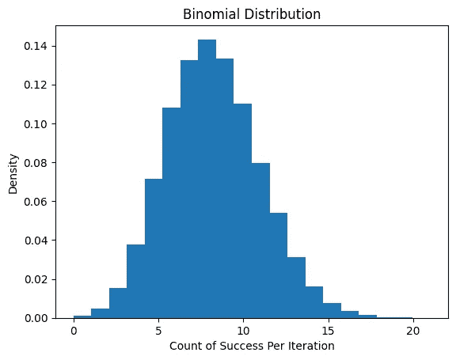

你承认这些图表看起来惊人的相似。第三个朋友抓住机会，开始他的阐述。

“二项式分布表示一组事件中成功事件的可能性。给定事件的总数和单个成功的概率，您可以估计任何成功和失败组合的可能性。

在这种情况下，我们假设骰子正面的每个数字出现的机会都相等。既然我们只关心看到 6s，那么成功的概率是 1/6，失败的概率是 5/6。在想到 8 个成功之前，让我们只想到 1 个成功。如果第一次掷出 6，那么接下来的 49 次掷出的一定是别的什么，结果的组合概率是 1/6 * (5/6)⁴⁹.)如果第二次掷骰子是 6，那么其他 49 次掷骰子一定还是别的什么，概率链保持不变。通过统计掷出 1 个 6 的独特情况，我们总结出 50 种不同的组合(第一次掷出 6，第二次掷出 6，…第 50 次掷出 6)。滚动这些组合中的任何一个的可能性因此变成 50 个组合* (1/6) * (5/6)⁴⁹ = .1%)。当我们将成功的次数增加到 2 时，组合的概率链会减少，但组合会不成比例地增加(1225 * (1/6) * (5/6)⁴⁸ = .5%)。当组合概率链的减少超过组合增加的任何好处时，可能性最大化为大约 8 次成功。"

方程式概括了对世界的观察。

你交换意见，试图跨越认知鸿沟。n = 50 和 p = 1/6 的二项式分布的最大似然性是否与选择 10，000 次迭代后最常见的成功次数得出相同的结论。您将 8 次成功的迭代总数除以 10，000，得到类似的结果。您还注意到 8 个成功出现的次数最多，这表明 8 是最有可能出现的组合。最有可能的组合与最大可能性同义。一个答案在手，你和第三个朋友前往寻找赌博成瘾。

“很好，但那场比赛几个小时前就结束了，我们已经向前看了。”嗜赌者反驳道。“现在他们想让我预测两次掷骰子的总和，因为我已经看到了第一次掷骰子。”

**不同的方程式回答不同的问题。**

“我们没有你想的那么遥远，”第三个朋友声称，他已经打开了他的笔记本电脑。“我们看到了第一个骰子的价值，因此我们只需计算第二个骰子的预期价值。我们可以以 1/6 的概率计算 1 到 6 之间的均匀分布的均值，也就是 3.5。”他开始解释均匀分布。

“第二个骰子的期望值是可能结果的加权平均值。第二个骰子有从 1 到 6 的六个可能值。这些价值中的每一个都有六分之一的可能性发生。所以第二个骰子的期望值是 1 *(1/6)+2 *(1/6)+3 *(1/6)+4 *(1/6)+5 *(1/6)+6 *(1/6)= 3.5。预测和是第一个骰子的*值* + 3.5。均匀分布是一个等式，它在一系列结果中赋予相等的概率。在这种情况下，发生的概率是 1/6，结果的范围在 1 到 6 之间。

偷他的笔记本电脑，你很快运行两个测试。第一个检验是离散均匀分布的均值，定义为(*下界* + *上界* )/2。这个均匀分布的均值是(1 + 6)/2 = 3.5。你也注意到每一个结果都有 1/6 的机会发生(0.167)。

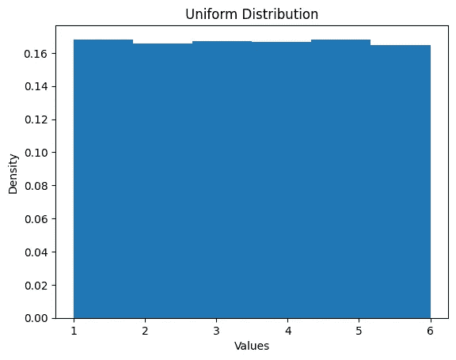

第二个测试是你屡试不爽的方法。你掷出两个骰子 10，000 次，然后记录下第一个骰子的预测值。

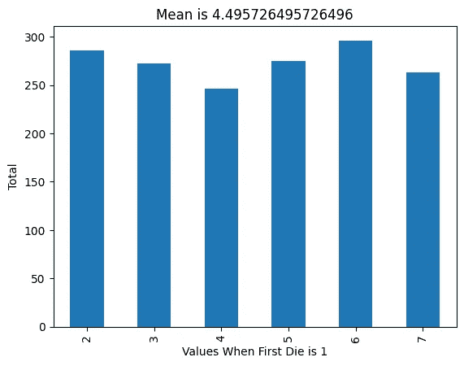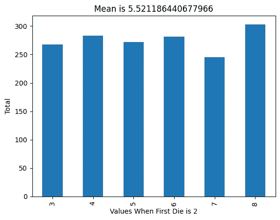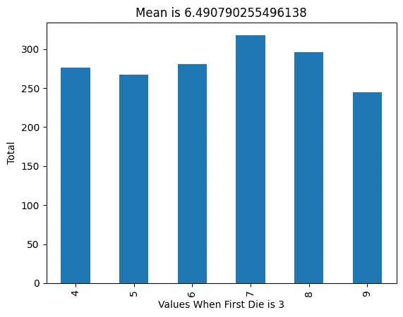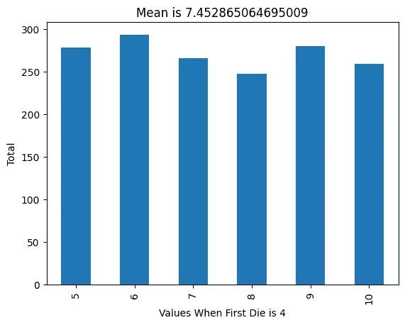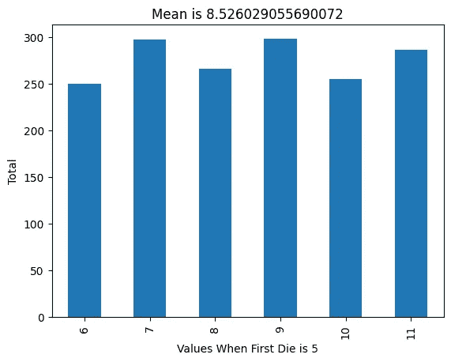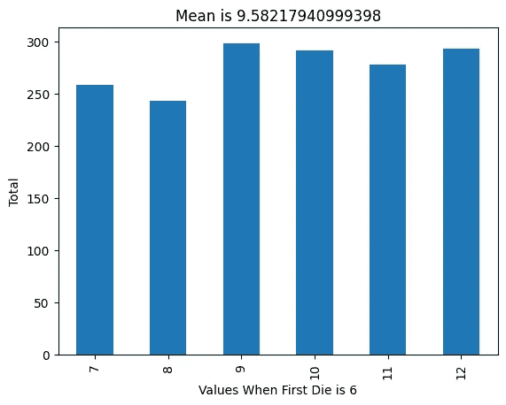

一旦减去第一个骰子的值，第二个骰子的期望值将与第三个朋友对齐。你和第三个朋友又回到了赌博成瘾。“这很好，但其他人都已经想通了。他们用独特的颜色覆盖了第一个骰子的数字，并希望我们再试一次。”你就要提供帮助了，但是你不能忽视第三个朋友脸上的兴奋。在第三个朋友偷走你之前，赌博上瘾者给你 50 个观察结果，包括颜色和结果。

**期望值的变化导致洞察力。**

你已经知道第二个骰子的期望值是 3.5。因此，您希望看到平均值如何根据呈现的颜色而变化。你看按颜色分层的平均值。

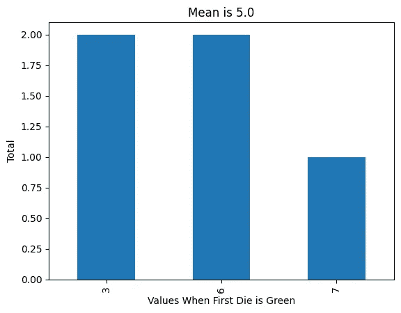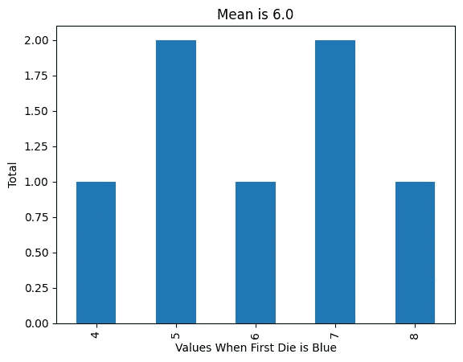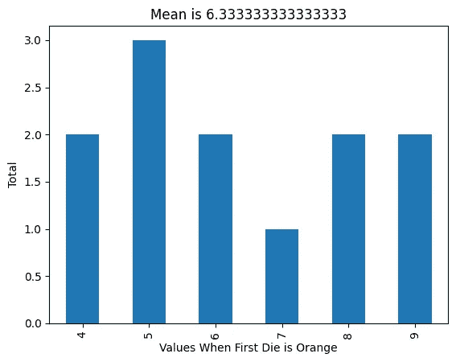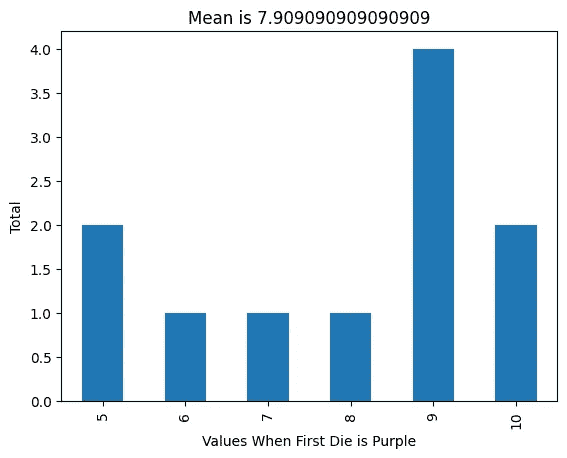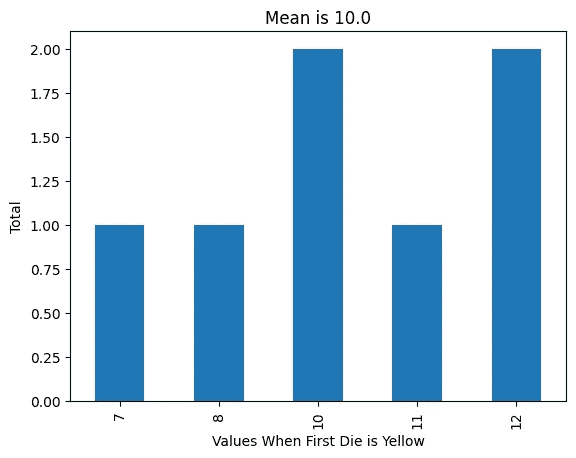

第三个朋友采取了不同的方法。他假设颜色可以解释总和的一部分，并提出线性回归将阐明这种关系。通过最小化线性预测和观察结果之间的误差平方和，他将能够为颜色变量分配系数。这些系数解释了每个颜色变量解释了总和的多少。在开始之前，他删除了一个变量以避免完美的多重共线性([虚拟变量陷阱](https://en.wikipedia.org/wiki/Dummy_variable_(statistics)))。

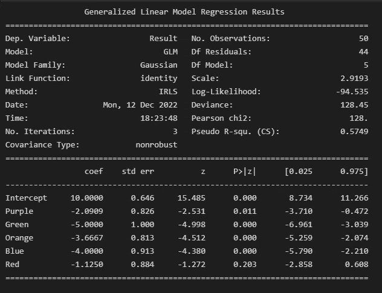

他报告说，“在一个假设的世界中，黄色是基本情况，这些其他颜色变量的引入将解释最终结果的系数值。”这听起来有点含糊不清，但是他的清单和你的清单是一致的。“我们对黄色、红色、紫色和绿色感觉很好，但橙色和蓝色太接近了，无法确定排名。”当橘子偶然出现在人群面前时，赌博成瘾的人眼中闪烁着光芒。

**最终想法**

数学不是消耗垃圾产生黄金的黑匣子。它接近我们基于假设的观察。因此，对我们的观察持有观点是很重要的。我们相信每一个结果都是同样可能的吗？我们同意结果是相互独立的吗？我们对使用一个开发人工基础案例的模型感到舒服吗？随着我们将更多的决策外包给计算机和模型，这些问题变得不那么迂腐了。为了安全起见，不要让数学自由运行。如果没有对潜在逻辑的感觉，被变化的条件削弱的假设将很难被注意到。当面对这种不确定性时，依靠你的直觉，谨慎行事。与其快速迷路，不如慢慢找路。

我用的代码。

```
import random
import pandas as pd
import matplotlib.pyplot as plt
import numpy as np
import statsmodels.formula.api as smf

data = {
    'Dice Roll': [],
    'Result': []
}

iteration_data = {
    'Iteration': [],
    'Total':[]
}

two_dice_data = {
    'Dice One Roll': [],
    'Dice Two Roll': [],
    'Result': []
}

colors = ['Red', 'Orange', 'Blue', 'Green', 'Purple', 'Yellow']

color_dice_data = {
    'Dice One Roll': [],
    'Result': []
}

glm_data = {
    'Dice One Roll': [],
    'Result': []
}

i = 1
count = 1

def dice_roll(i, count):
    while i <= 50:
        dice_one = random.randint(1,6)
        data['Dice Roll'].append(count)
        data['Result'].append(dice_one)
        count += 1
        i += 1

def two_dice_roll(i, count):
    while i <= 10000:
        dice_one = random.randint(1,6)
        dice_two = random.randint(1,6)
        result = dice_one + dice_two
        two_dice_data['Dice One Roll'].append(dice_one)
        two_dice_data['Dice Two Roll'].append(dice_two)
        two_dice_data['Result'].append(result)
        count += 1
        i += 1

def color_roll(i, count):
    global colors
    random.shuffle(colors)
    while i <= 50:
        dice_one = random.randint(1,6)
        dice_two = random.randint(1,6)
        result = dice_one + dice_two
        color_dice_data['Dice One Roll'].append(colors[dice_one-1])
        color_dice_data['Result'].append(result)
        count += 1
        i += 1

j = 1
iteration = 1

def one_dice_iteration(j, iteration):
    while j <= 10000:
        global data
        global iteration_data
        dice_roll(i, count)
        df = pd.DataFrame(data)
        roll_up = np.sum(df['Result'] == 6)
        iteration_data['Iteration'].append(iteration)
        iteration_data['Total'].append(roll_up)
        data = {'Dice Roll':[], 'Result':[]}
        iteration += 1
        j += 1

def glm_transformation(glm_data):
    global color_dice_data
    glm_data['Dice One Roll'].extend(color_dice_data['Dice One Roll'])
    glm_data['Result'].extend(color_dice_data['Result'])
    df=pd.DataFrame(glm_data)
    df['Red'] = 0
    df.loc[pd.DataFrame(glm_data)['Dice One Roll'] == 'Red', 'Red'] = 1
    df['Yellow'] = 0
    df.loc[df['Dice One Roll'] == 'Yellow', 'Yellow'] = 1
    df['Green'] = 0
    df.loc[df['Dice One Roll'] == 'Green', 'Green'] = 1
    df['Blue'] = 0
    df.loc[df['Dice One Roll'] == 'Blue', 'Blue'] = 1
    df['Purple'] = 0
    df.loc[df['Dice One Roll'] == 'Purple', 'Purple'] = 1
    df['Orange'] = 0
    df.loc[df['Dice One Roll'] == 'Orange', 'Orange'] = 1
    glm_data = df.to_dict('list')
    return(glm_data)

# One iteration of 50
dice_roll(i, count)
df = pd.DataFrame(data)
df['Result'].value_counts().sort_index().plot(kind='bar')
plt.xlabel('Die Face')
plt.ylabel('Total')

# 50 and 10,000 iterations
one_dice_iteration(j, iteration)
df = pd.DataFrame(iteration_data)
df['Total'].value_counts().sort_index().plot(kind='bar')
plt.xlabel('Count of 6 within an Iteration')
plt.ylabel('Total')

# binomial distribution
values = np.random.binomial(50, .167, 100000)
count, bins, ignored = plt.hist(values, 20, density=True)
#plt.plot(bins, np.ones_like(bins))
plt.title('Binomial Distribution')
plt.ylabel('Density')
plt.xlabel('Count of Success Per Iteration')
plt.show()

# uniform distribution
values = np.random.randint(1, high=7, size=100000)
count, bins, ignored = plt.hist(values, 6, density=False, weights=np.ones(len(values)) / len(values))
plt.title('Uniform Distribution')
plt.ylabel('Density')
plt.xlabel('Values')
plt.show()

# two dice roll by number condition
condition = 1
two_dice_roll(i, count)
df = pd.DataFrame(two_dice_data)
df= df[df['Dice One Roll'] == condition]
df['Result'].value_counts().sort_index().plot(kind='bar')
plt.ylabel('Total')
plt.xlabel('Values When First Die is ' + str(condition))
plt.title('Mean is ' +str(df['Result'].mean()))

# receive 50 observations of colors and results
color_roll(i, count)

# two dice roll by color condition
condition = 'Blue'
df = pd.DataFrame(color_dice_data)
df = df[df['Dice One Roll'] == condition]
df['Result'].value_counts().sort_index().plot(kind='bar')
plt.ylabel('Total')
plt.xlabel('Values When First Die is ' + str(condition))
plt.title('Mean is ' +str(df['Result'].mean()))

#glm model
glm_data = glm_transformation(glm_data)
formula = 'Result ~ Purple + Green + Orange + Blue + Red'
df = pd.DataFrame(glm_data)
mod = smf.glm(formula=formula, data=df).fit()
print(mod.summary())
```

[](/mlearning-ai/mlearning-ai-submission-suggestions-b51e2b130bfb) [## Mlearning.ai 提交建议

### 如何成为 Mlearning.ai 上的作家

medium.com](/mlearning-ai/mlearning-ai-submission-suggestions-b51e2b130bfb)