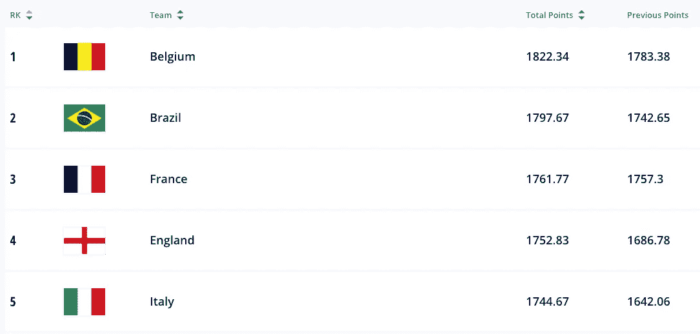
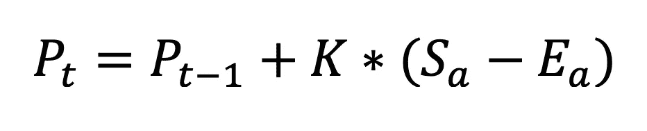
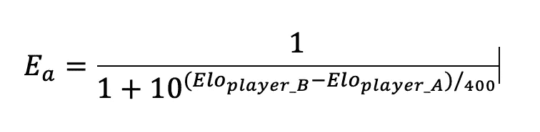

# 如何使用 python 计算国际团队的 ELO 分数

> 原文：<https://medium.com/mlearning-ai/how-to-calculate-elo-score-for-international-teams-using-python-66c136f01048?source=collection_archive---------4----------------------->

使用 python 中的历史比赛数据比较国际球队表现的简单方法

Fifa ELO Ranking ([source](https://www.fifa.com/fifa-world-ranking/men?dateId=id13372))

从历史上看，人们一直在讨论哪个国家队在当时是最好的。有人说欧洲球队总是更好，因为足球诞生在那里，有人说美国球队更好，带来了巴西的 5 届世界杯和许多出生在这个国家的天才球员，讨论一直在继续。跟着走。幸运的是，我们可以依靠数据来估计哪支球队是当时最好的，这是通过 ELO 系统(事实上，这是国际足联目前在官方排名中使用的系统)实现的。使用 Python 和[Kaggle](https://www.kaggle.com/martj42/international-football-results-from-1872-to-2017)**中的数据集，你可以找出有史以来最好和最差的 5 个选择。**

****什么是 ELO 体系？****

**ELO 系统的名字应归功于 Arpad Elo，他是一名国际象棋选手和数学家，他开发了这个评分系统来确定一名国际象棋选手的技能水平。比赛后计算 Elo 等级的公式考虑了当前自己的等级、赢得比赛的概率、比赛结果和调整系数 k。公式如下:**

****

**其中“t-1”处的 P 是比赛前的得分，K 是调整系数，“a”处的 S 是比赛结果(如果他们赢了，则为 1，如果他们输了，则为 0.5，如果平局，则为 0.5)。**

**“a”处的 e 是使用逻辑函数计算的比赛期望值，并且将两个球员的 Elo 评级作为参数。计算如下。**

****

**就足球而言，自 2018 年以来，国际足联一直在官方排名中使用这一系统。调整系数 K 作为比赛的重要性，友谊赛取值 5，四分之一决赛取值 60。国际足联世界杯决赛或之后。**

****如何用 Python 计算国家队的 ELO 分数？****

**为了计算一段时间内国家队的 ELO 得分，有必要获得一段时间内国家队之间发生的所有比赛。多亏了 Mart Jürisoo，这些信息可以在[这里](https://www.kaggle.com/martj42/international-football-results-from-1872-to-2017)找到。而我接下来要展示的 jupyter 笔记本可以在[我的 GitHub](https://github.com/danielguerreros/InternationalELo) 上看到。**

**在加载数据并将其命名为 df 之后，我们将只选择我们将使用的列。它们是什么:**

**日期**

**Home_team**

**客场 _ 球队**

**首页 _ 分数**

**客场得分**

**锦标赛**

**对于变量 K，我们将在国际友谊赛中使用 10，在 FIFA 世界杯预选赛中使用 25，在联合会比赛中使用 40，在 FIFA 世界杯比赛中使用 55，在其他比赛中使用 5。**

**为了计算预期结果(E_a)，我们将创建一个函数，该函数采用主队的 Elo 和客场队的 Elo，并返回一个数组，其中第一个条目是主队获胜的概率，而第二个数组是客场队获胜的概率。**

**为了获得实际结果(R_a ),我们创建了一个函数，该函数将两支球队的目标作为参数，并返回一个数组，其中主队的结果位于第一个位置，而客场队的结果位于第二个位置。**

**最后，我们将使用上面创建的函数来创建我们的主函数，该函数在一场比赛后计算两个队的等级。该功能需要比赛中的进球，正在进行的比赛，以及球队以前的评级。**

**将创建一个字典来存储每个团队的最后 Elo 分数。这个字典会在球队每次比赛的时候更新。创建这个字典后，我们可以迭代数据集，以获得每次匹配前后的评级。**

**通过这种方式，我们获得了国家队所有历史比赛的数据框架，以及他们在每个时间点的 Elo 得分。因此，我们将有一个客观的衡量标准来判断当前哪些选择是最好的，哪些是最差的。根据这一分数，有史以来排名前五的国家队是:**

1.  **德国(2014 年)。Elo = 1795.7**
2.  **西班牙(2010 年)。Elo = 1795.5**
3.  **法国(2021 年)。Elo =1775.6**
4.  **巴西(2021 年)。Elo = 1771.3**
5.  **荷兰(2010 年)。Elo =1759.4**

**最差的五个是:**

1.  **卢森堡(2006 年)。Elo = 879.4**
2.  **圣马力诺(2021 年)。Elo =895.5**
3.  **列支敦士登(2021 年)。Elo = 987.8**
4.  **安道尔(2016 年)。Elo = 993.1**
5.  **斯里兰卡(2021 年)。Elo =1005**

****免责声明:**请注意，这些结果取决于选择的权重和用于计算预期结果的公式。如果这些参数发生变化，分数可能会有所不同。请随意更改重量并分享您的结果！**

**感谢阅读这篇文章，评论中的反馈将会很受欢迎。在接下来的几周里，我会上传一些新的帖子，介绍如何在 streamlit 中可视化这些数据，以及如何通过 sckit learn 将 ELO 分数用于创建国际比赛的预测模型。要了解这些新帖子，可以考虑在本页关注我的博客，或者在 [Linkedin](https://www.linkedin.com/in/daniel-guerrero-santaren/) 上关注我的个人资料。**

**[1]“Elo 评级系统”维基百科。【https://en.wikipedia.org/wiki/Elo_rating_system **

**数据来源:[https://www . ka ggle . com/martj 42/international-football-results-from-1872-to-2017](https://www.kaggle.com/martj42/international-football-results-from-1872-to-2017)**

** [## Mlearning.ai 提交建议

### 如何成为 Mlearning.ai 上的作家

medium.com](/mlearning-ai/mlearning-ai-submission-suggestions-b51e2b130bfb)**