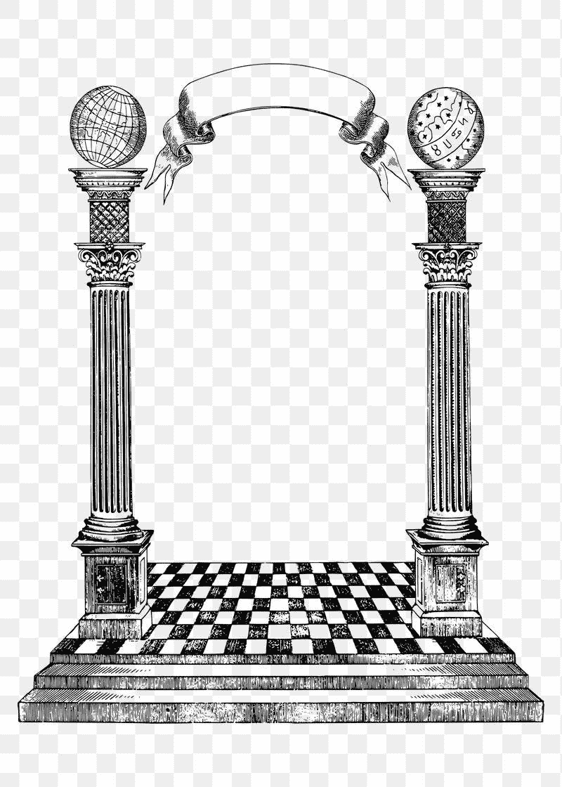

# 如何检查两列数据的余弦相似性

> 原文：<https://medium.com/mlearning-ai/how-to-check-cosine-similarity-in-two-columns-of-data-e9a45d7d6423?source=collection_archive---------1----------------------->

在以前的博客文章中，我讨论了如何测量两个或更多文本字符串之间的余弦相似性，但在这篇文章中，我决定测量一个数据帧中两列文本之间的余弦相似性。

在数据分析中，余弦相似性是两个数字序列之间相似性的度量。因为我一直在比较文本样本，所以我有必要…