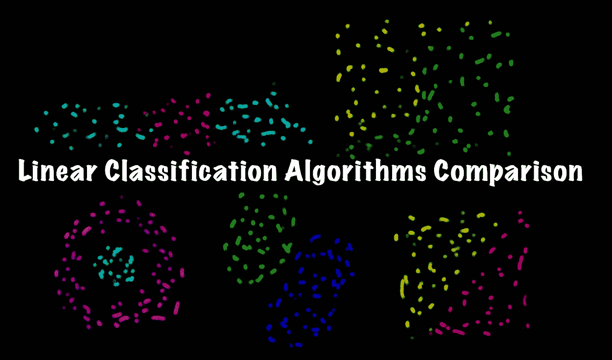
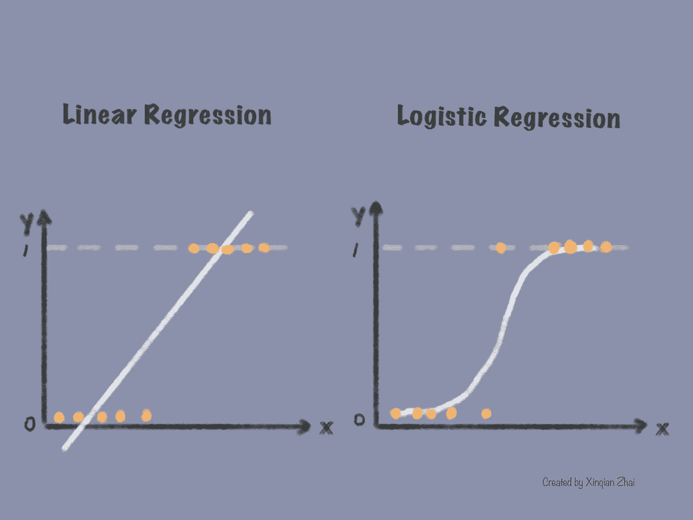
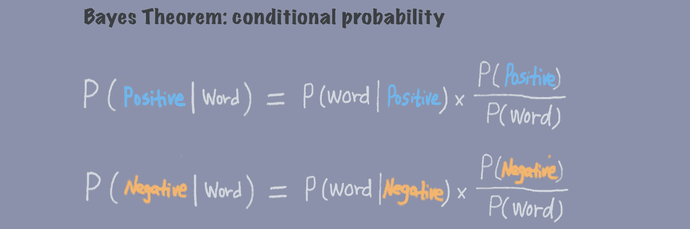
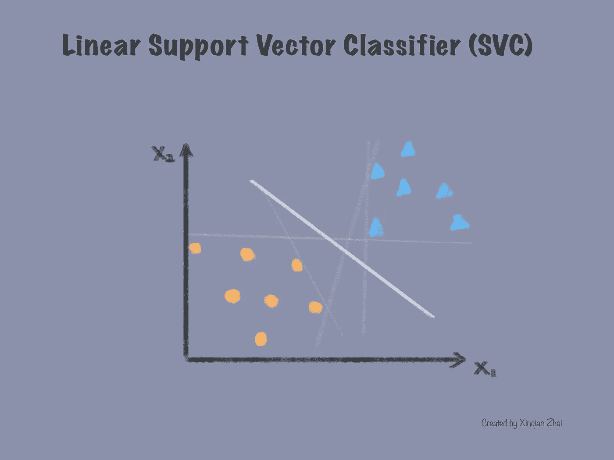
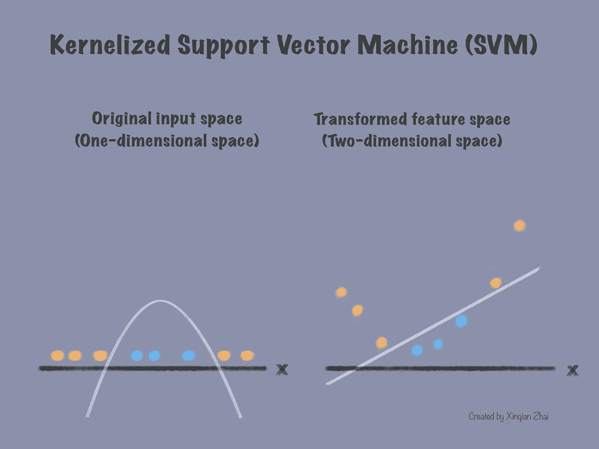

# 如何选择不同类型的线性分类器？

> 原文：<https://medium.com/mlearning-ai/how-to-choose-different-types-of-linear-classifiers-63ca88f5cd3a?source=collection_archive---------2----------------------->

Created by Xinqian Zhai

对不同类型的分类算法感到困惑，例如逻辑回归、朴素贝叶斯分类器、线性支持向量分类器(SVC)和核化支持向量机(SVM)？你是否试图理解它们是什么，以及在不知道它们背后太多数学知识的情况下，如何在高层次上为你的场景选择一个？如果是这样，这篇文章可能会有所帮助。

# 什么是线性分类器？

## 线性分类器

分类器是一种受监督的机器学习算法，用于解决分类问题。线性分类器是由线性函数构成的最简单的分类器，用于在线性和非线性空间中对观察值进行分类。

## 不同类型的线性分类器

最常见的二元线性分类器有**逻辑回归**、**朴素贝叶斯分类器、**和**线性支持向量分类器(SVC)**；最常见的多类线性分类器是**内核化支持向量机**。 [*点击这里*](https://xinqianzhai.medium.com/a-picture-shows-you-the-most-common-supervised-machine-learning-models-9519fa352373) 查看所有最常见的监督机器学习模型(分类器和回归器)。

# 如何理解每个线性分类器？

> 了解每个分类器的工作原理将有助于我们更好地选择它们。

## 什么是逻辑回归？

逻辑回归是预测二进制输出值概率的分类器。它将输出值限制在 0 和 1 之间的范围内，并产生 S 形逻辑曲线。请注意，尽管被称为“回归”，逻辑回归是用来解决二元分类问题，而不是回归问题。逻辑回归(分类器)被称为“回归”，因为它的基本技术非常类似于线性回归(回归器)，但用于预测类。

## 什么时候用？

如果您尝试进行二元分类，并希望获得输入数据属于该类的概率，请使用逻辑回归。逻辑回归是用于训练模型的简单而有效的分类器。它是预测离散关系的良好候选，例如，在给定一些测量属性的情况下，预测肿瘤是恶性还是良性。[*点击此处*](/@xinqianzhai/breast-cancer-classification-using-svc-and-logistic-regression-classifiers-6d34a41656af) 获取关于如何应用逻辑回归(以及稍后的 SVC)对恶性和良性乳腺癌进行分类的完整编码演练。

## 什么是朴素贝叶斯分类器？

朴素贝叶斯分类器也是基于[*贝叶斯定理*](https://en.wikipedia.org/wiki/Bayes%27_theorem) 解决分类问题的概率分类器。例如:基于贝叶斯定理，我们可以得到给定单词为正或为负的概率，如下所示:

通过比较这两个概率，我们可以将这个单词归类到更可能的类别(正或负)。之所以称之为天真，是因为它有一个简单的假设，即所有特性都是相互独立的，这意味着一个类中一个特性的存在不会影响另一个特性的存在，这在许多用例中并不成立。

## 什么时候用？

如果您的数据集相对较小，并且想要进行快速分类，那么朴素贝叶斯分类器可能是一个不错的选择。如果特征独立性假设成立，朴素贝叶斯分类器可以给出相当好的预测；因此，它也被用于自然语言处理(NLP)中对句子情感进行分类。

## 什么是线性支持向量分类器(SVC)？

线性支持向量分类器的目标是找到类别之间具有最大间隔的决策边界。边距是划分边界与其最近的数据点之间的距离，支持向量是指靠近边界的数据点。给定一些线性可分的输入数据，线性支持向量分类器可以找到“最佳拟合”超平面来分类。线性 SVC 的优点是它限制了异常值的影响，因为边界仅由靠近边界的数据点的子集确定。

## 什么时候用？

如果要对线性可分的大型数据集进行快速预测，请使用线性支持向量分类器。线性支持向量适用于稀疏数据，并且相对容易解释。如果数据集不是线性可分的，您可能希望使用内核化支持向量机(SVM)。

## 什么是内核化支持向量机(SVM)？

内核化支持向量机是一种线性模型，可用于解决非线性分类(和回归)问题。不同的内核对应不同的转化方法。作为分类器，它将原始输入数据从一个低维空间转换到一个新的高维特征空间来对数据进行分类。在高维空间中，原始的非线性可分数据可以通过一个超平面来分离。之后，我们将数据和超平面转换回原始的低维空间，从而使用线性分类器解决非线性分类问题。

## 什么时候用？

如果要进行线性分类，但输入数据不是线性可分的，请使用内核化支持向量机。此外，内核化支持向量机在许多不同类型的数据集上表现良好，如文本数据和图像数据，所以如果您想进行文本分类，请尝试一下。

以下是其他相关文章:

*   [*如何选择不同类型的线性回归？*](/@xinqianzhai/how-to-choose-different-types-of-linear-regression-d59e7aec50ac)
*   [*乳腺癌分类采用 SVC 和 Logistic 回归分类器*](/@xinqianzhai/breast-cancer-classification-using-svc-and-logistic-regression-classifiers-6d34a41656af)
*   [*一张图给你展示了最常见的监督机器学习模型*](/@xinqianzhai/a-picture-shows-you-the-most-common-supervised-machine-learning-models-9519fa352373)

 [## Mlearning.ai 提交建议

### 如何成为 Mlearning.ai 上的作家

medium.com](/mlearning-ai/mlearning-ai-submission-suggestions-b51e2b130bfb)