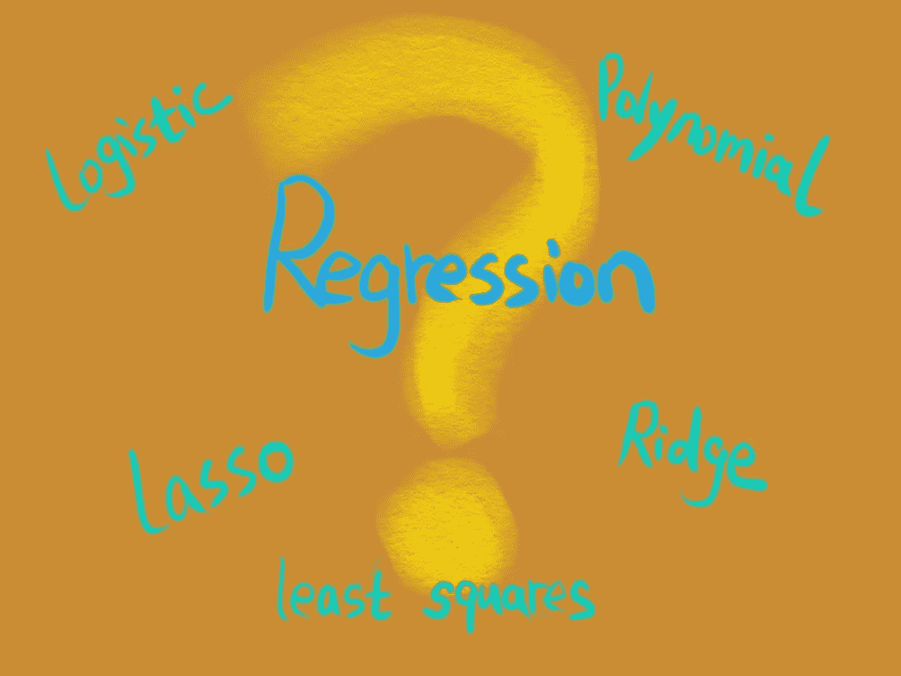
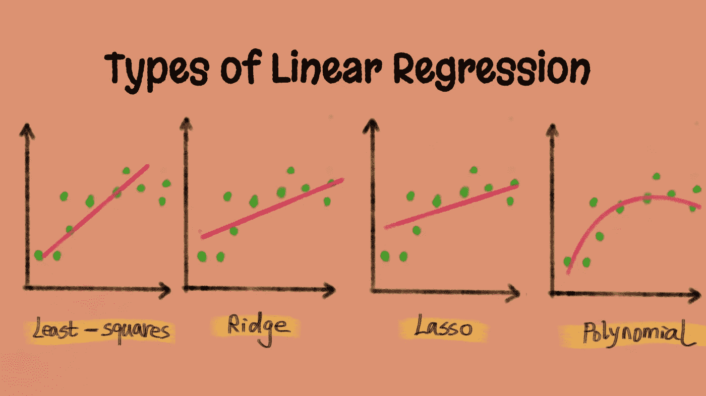

# 如何选择不同类型的线性回归？

> 原文：<https://medium.com/mlearning-ai/how-to-choose-different-types-of-linear-regression-d59e7aec50ac?source=collection_archive---------2----------------------->

Regression image created by the author

对不同类型的回归(如最小二乘线性回归、岭回归、套索回归和多项式回归)感到困惑？您是否试图理解它们之间的区别，以及如何在不了解它们背后的太多数学知识的情况下，从高层次上为您的场景选择正确的选项？如果是这样，这篇文章可能会有所帮助。

# 不同类型的线性回归之间有什么关系？

在学习岭回归、套索回归或多项式回归之前，让我们快速回顾一下什么是线性回归。**线性回归**是基于输入特征(x)预测输出值(y)的线性模型的一个例子。目标是通过估计特征权重(w)和恒定偏差项(b)找到给定数据的最佳拟合线。

简单来说，最小二乘法、岭回归、套索回归、多项式回归是解决线性回归问题的不同方法。其中，**最小二乘法是最基本最简单的一种，其他回归方法都是在此基础上添加自己的力量来解决更复杂的线性问题**。

更具体地说，岭回归和 Lasso 回归都使用相同的最小二乘准则，但对输入要素(x)的较大变化添加了不同形式的惩罚；多项式回归也使用相同的最小二乘标准，但可以从原始输入要素(x)生成新要素，以解决线性空间中的非线性问题。

# 我应该使用哪种类型的线性回归？

尽管它是基于你试图解决的问题，这里有一些我用来选择回归类型的指导方针。首先要注意的是**它们都是用来预测连续值的回归模型**，比如预测房价。(提醒一下，尽管被称为“回归”，逻辑回归还是一个分类模型。)

**如果您的数据集具有清晰的全局趋势和低方差，最小二乘线性回归是一个不错的选择**。最小二乘线性回归是一种简单有效的回归模型，它可以最小化预测目标值和实际目标值之间的差异，而无需额外调整控制模型复杂性的参数。它可以提供稳定但可能不准确的预测。

**如果数据集有许多输入要素，并且您希望防止过度拟合，则岭回归或套索回归会更好**。它们都增加了对输入特征的惩罚，以缩小影响最小的输入特征。换句话说，如果您想限制模型的复杂性，就使用它们。`**Use Lasso Regression**`如果你的要求是只选择最有影响的输入特征；否则，`**use Ridge Regression**` 如果你的要求是削弱影响力较小的特性。

Different types of linear regression plot created by the author

**如果全球趋势显示为曲线而非直线，多项式回归是最佳选择**。多项式回归的强大之处在于它可以解决线性空间中的非线性问题，而其他类型的线性回归(如最小二乘法、岭回归和套索回归)很难解决这些问题。通过做特征变换，输入特征和目标变量之间的非线性关系可以更好地用曲线而不是直线来表示，大大提高了预测精度。

关于多项式回归如何解决非线性问题的更多细节，请看我之前写的这篇文章。

**关键要点**

*   最小二乘线性回归是一种简单、有效但可能不准确的预测连续值的方法。
*   岭回归通过对影响较小的特征增加惩罚来帮助降低模型的复杂性。
*   套索回归通过将影响较小的要素的值缩小到零来帮助查找影响最大的要素。
*   多项式回归有助于解决线性空间中的非线性回归问题。
*   逻辑回归用于二元分类，而不是回归分析。

 [## Mlearning.ai 提交建议

### 如何成为 Mlearning.ai 上的作家

medium.com](/mlearning-ai/mlearning-ai-submission-suggestions-b51e2b130bfb)