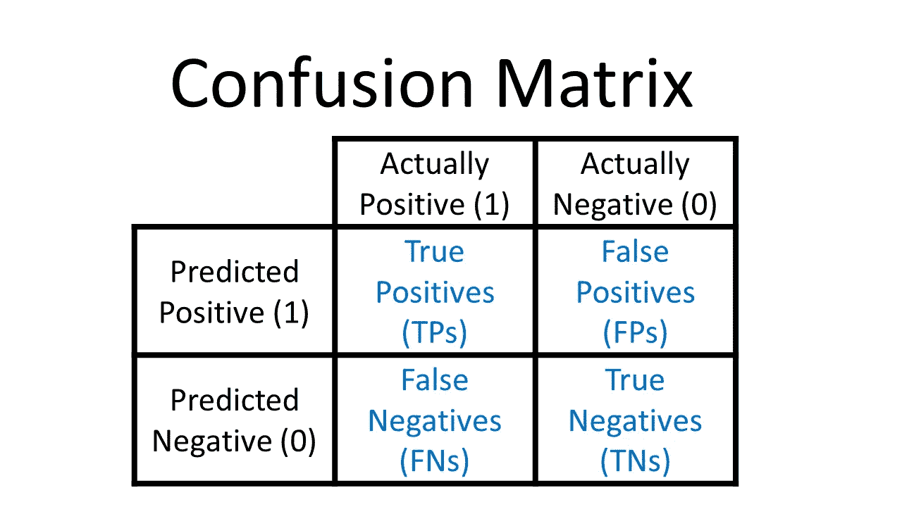
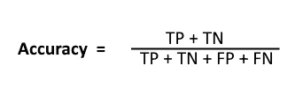
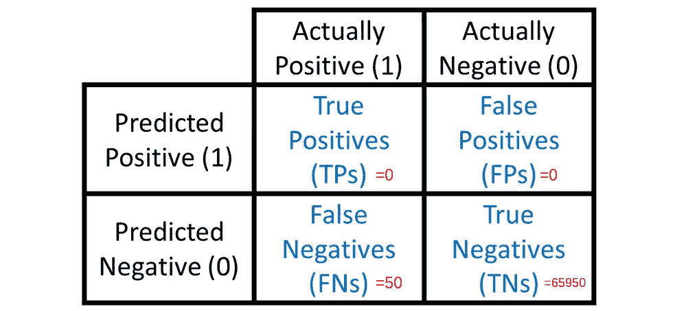
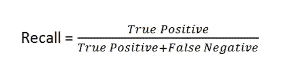
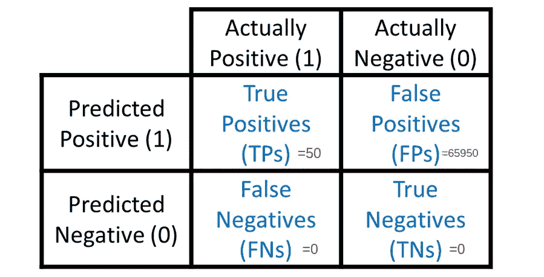
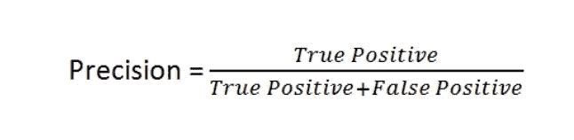
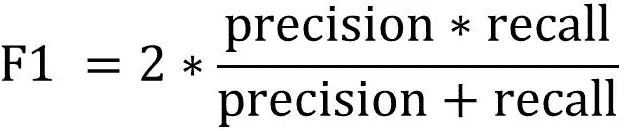
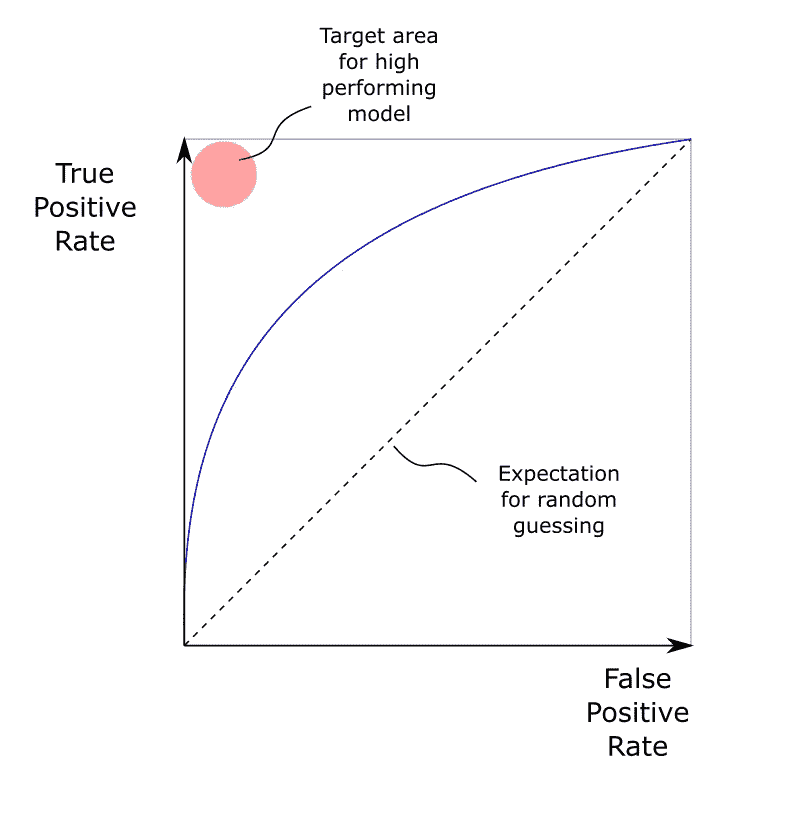
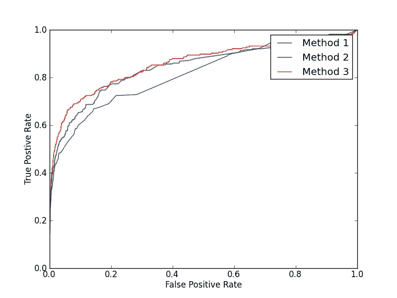
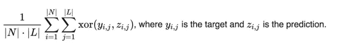

# 如何选择正确的指标来评估您的分类模型？

> 原文：<https://medium.com/mlearning-ai/how-to-choose-the-right-metric-to-evaluate-your-classification-model-30e4569021db?source=collection_archive---------2----------------------->

准确率、F1 评分、精确度、召回率还是 AUC/ROC 曲线？

# 介绍

选择正确的指标来评估机器学习模型有时可能很棘手。模型的准确性总是很重要吗？度量标准的选择是模型选择的主要关键。因此，为了确保我们为我们的分类任务选择最合适的模型，我们需要对我们可以使用的不同度量有深刻的理解，并有一个好的选择策略。

度量标准的选择必须基于分类类型等因素。是二元、多类还是多标记分类。以及我们希望我们的模型如何表现。我们是想要惩罚更多的假阴性或假阳性，还是想要在它们之间取得平衡。

为了更好地理解这个策略，我们首先需要理解不同的指标是如何计算的，并了解它们的局限性。

***我们将首先解释不同的分类指标，举例说明二元分类问题，然后我们将转向多类分类并简要讨论变化，最后我们将讨论多标签分类问题*** 。

# 准确(性)

让我们考虑下面的混淆矩阵，它是一个可以推广到多类的二进制分类示例:

image by [Rachel Draelos](https://glassboxmedicine.com/author/racheldraelos/) from [Glass Box](https://glassboxmedicine.com/)

精度公式如下

这里我们关注真正的正面和真正的负面，我们实际上想知道我们的模型有多少预测是正确的。换句话说，是的

正确预测数/预测总数

但是这个度量没有给我们足够的模型信息，让我们考虑一个例子，我们想把电子邮件分类为垃圾邮件(1)或者不是垃圾邮件(0)。假设我们有一个总是预测非垃圾邮件(0)模型，考虑除了 50 个标记为正(垃圾邮件或 1)的样本之外，所有标记为负(0 或非垃圾邮件)的 66 000 个样本。我们的混淆矩阵看起来像这样:

image by [Rachel Draelos](https://glassboxmedicine.com/author/racheldraelos/) from [Glass Box](https://glassboxmedicine.com/) Copied with edits

我们的准确度将是 ***65950/66000=99，92%，*** 我们的模型在这种情况下非常准确，但是它不能预测垃圾邮件的假阴性。让一封垃圾邮件溜走的成本是非常高的，所以我们不能用准确性来判断我们的模型，并试图在这种情况下最大化它。这里有另外两个指标可以帮助我们，召回率和精确度。

# 回忆

考虑到相同的混淆矩阵，召回度量计算如下:

召回实际上计算真阳性率，它从所有实际阳性中计算正确预测阳性的数量(TP + FN)。

在我们的例子中， ***回忆=0/50=0%*** 。我们的召回率是 0%，而准确率是 99.92%。我们可以看到，召回是一个更好的指标，因为它告诉我们，这个模型非常糟糕，不能选择。我们选车型的时候，召回也要最大化。

但是我们已经看到了这个指标的一个潜在问题，你可能想知道如果这个模型总是预测积极的而不是消极的呢？这也将是一个非常糟糕的模型，但召回指标会告诉我们这一点吗？我们自己看吧。

在我们的第二个假设中，混淆矩阵应该是这样的:

image by [Rachel Draelos](https://glassboxmedicine.com/author/racheldraelos/) from [Glass Box](https://glassboxmedicine.com/) Copied with edits

在这种情况下，召回是 ***50/(50+0)=100%，*** 因此，即使召回最大化，模型也可能是坏的，因为召回只惩罚假阴性的错误，这就是为什么我们也需要惩罚假阳性的错误。我们可以使用精度指标来实现这一点。

# 精确

考虑相同的混淆矩阵，使用以下公式计算精度度量:

虽然召回查看正确预测为所有阳性的阳性的比率，但是精度给出正确预测为所有预测阳性的阳性的比率。

上一个例子的精度是 ***50/(50+65950)=0.07%。*** 所以即使召回率是 100%,准确率也告诉我们模型不好。因此，一个好主意是使用这两个指标来评估模型，但是我们也可以只选择其中一个。例如，如果我们只想避免假阴性错误，我们可以使用 recall 如果我们只想避免假阳性错误，我们可以使用 precision。

注意，对于第一个假设(该模型只预测负数)，精度公式(TP+FP)的分母的值是 0。在这种情况下，精度为 NA，因为我们会遇到被零除的问题。这是不需要的，因为我们没有任何假阴性。

另一个需要补充的是，提高精确度会降低召回率，反之亦然，所以当使用这两个指标时，我们通常会权衡精确度和召回率。

# F1 分数

我们可以使用的另一个指标是 f1 得分，它是精确度和召回率的调和平均值，使用以下公式计算:

如果您正在寻求假阴性错误和假阳性错误之间的平衡，f1 分数是您想要使用的指标。f1 分数是精确度和召回率之间的平衡，因为当两个指标都很好并且彼此接近时，它具有很好的值。如果其中一个指标非常高，而另一个指标非常低，f1 将非常低，您可以在公式中看到，召回率=1，精确度=0，f1 为 0。这实际上是选择调和平均值的原因，而不是精确度和回忆的简单平均。

# ROC 曲线和 AUC

对于具有概率输出的分类问题，阈值可以将概率输出转换为分类。例如，我们无法设定正面和负面预测的阈值。改变这个阈值就改变了混淆矩阵，我们需要在混淆矩阵中找到给我们更好评价的阈值。但是，我们可以使用 ROC 或接收器操作符特性，而不是多次改变阈值并查看结果。它允许我们针对多个阈值绘制假阳性和假阴性。

Image from [https://deparkes.co.uk/2018/02/16/the-roc-curve/](https://deparkes.co.uk/2018/02/16/the-roc-curve/)

右上区域是理想的场景，我们有很高的真阳性率和很低的假阳性率，中间一行是随机猜测模型的表现，而右下区域是最差的场景。

ROC 曲线允许我们选择分类阈值，但它也用作选择模型的评估方法。让我们看看怎么做。

image from [https://stats.stackexchange.com/questions/15127/evaluating-and-combining-methods-based-on-roc-and-pr-curves](https://stats.stackexchange.com/questions/15127/evaluating-and-combining-methods-based-on-roc-and-pr-curves)

这里我们有三种不同方法的 ROC 曲线，正如我们在前面的图中看到的，我们希望我们的 ROC 曲线尽可能靠近右上方。因此，我们可以猜测模型 3 是最好的，因为它位于图的右上方。我们可以用来测量的指标是 AUC 或曲线下面积，它测量从(0，0)到(1，1)的 ROC 曲线下的面积，我们可以将其视为积分。

对于这种情况，我们将有 AUC(方法 3) > AUC(方法 2) > AUC(方法 1)，我们将选择具有最高 AUC 的模型 3。

# 从二元分类到多元分类

我们看到的所有度量标准都是基于每个类的多类分类。例如， **precision** 衡量分类器只识别每个类的正确实例的能力，而 **recall** 是分类器找到每个类的所有正确实例的能力。F1 分数是两者的调和平均值。

对于在每个类的基础上工作的度量，使用平均方法来为跨多个类的每个精度、召回和其他度量提取单个数字。例如，我们可以在 sklearn 中实现的度量函数中选择这些平均方法。

我们可以找到**宏平均，**通过计算总的真阳性、假阴性和假阳性来计算全局指标。以及**微平均，**计算每个标签的度量，并找到它们的未加权平均值。这没有考虑标签不平衡。这两个定义是从 f1_score 函数的 sklearn 文档中复制的，在这里我们可以找到其他不常用的平均方法。

# **多标签分类案例**

对于多标签分类，预测是一组标签。例如，每个样本可以有三个二进制标签，预测的标签大约是 110。因此，预测可能是完全正确的(预测的标签与实际标签完全匹配)，也可能是部分正确的，预测集中的一些标签是正确的，而一些标签是不正确的。或者完全不正确。这使得多标签分类更具挑战性，因为我们之前看到的所有指标都无法以其原始形式工作。例如，多标签分类的精度度量只会将完全正确的标签视为正确的预测，而不允许我们看到部分正确的标签。

她我们可以引入一个非常有用的度量标准，**海明损失。**用最简单的术语来说，*汉明损失*是被错误预测的标签的分数，即错误标签占标签总数的分数。它是使用以下公式计算的:

**结论**

因此，我们已经看到，选择一个度量来评估我们的分类模型首先取决于问题的类型。如果我们有二进制或多类分类，我们可以简单地使用一些经典指标，如准确度、f1、精确度和召回率。但是，如果我们有一个多标签分类，我们必须更加小心地使用这些指标，因为它们只会考虑完全正确的标签。我们还讨论了我们必须如何在精确度和召回率之间做出选择，但是我们也可以使用 F1 分数来使用两者的调和平均值。我们还提到了 ROC 曲线和 AUC，它们是一个非常有趣的工具，可以通过选择最佳阈值来改善我们模型的性能，但也可以用于评估和选择模型。