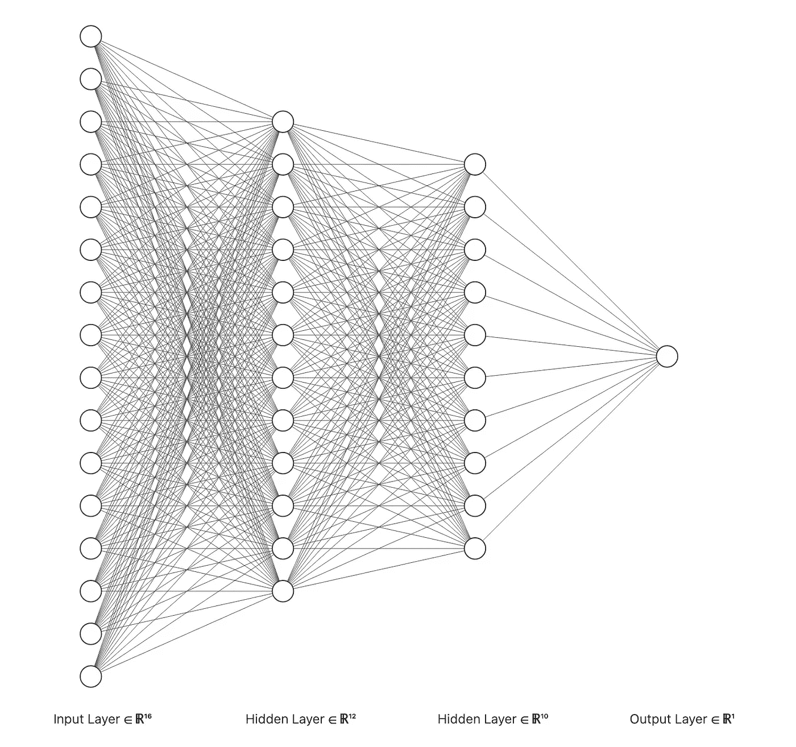

# 如何使用多层感知器分类器对手写数字进行分类

> 原文：<https://medium.com/mlearning-ai/how-to-classify-handwritten-digits-using-a-multilayer-perceptron-classifier-212b7bd6e6d1?source=collection_archive---------3----------------------->

## 什么是多层感知器？MLP 的利与弊是什么？我们能用 MLP 分类器准确地分类手写数字吗？学来的重量是什么样的？

Figure 1: A Multilayer Perceptron Network ([source](https://alexlenail.me/NN-SVG/index.html)).

# 1.简短介绍