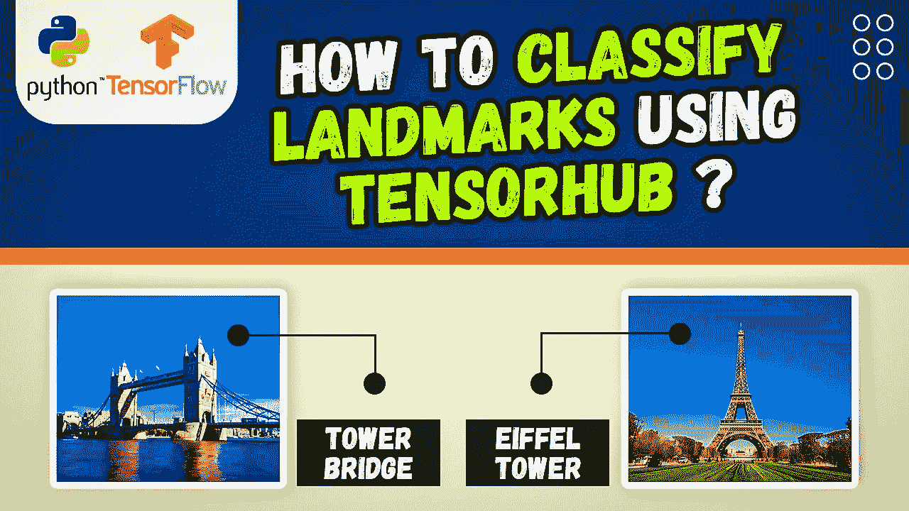

# 如何用 Tensorflow，Tensor-Hub，Python 对地标进行分类？

> 原文：<https://medium.com/mlearning-ai/how-to-classify-landmarks-using-tensorflow-tensor-hub-and-python-f69d6c39cc22?source=collection_archive---------8----------------------->

嗨，

这是一个 Tensorflow 教程，使您能够使用预先训练的 Tensor-Hub 平台对世界地标进行分类。

在本教程中，我们将安装相关的 Python 库，并寻找正确的预训练模型，并学习如何使用它对欧洲的地标图像进行分类。

另外，我推荐这款显卡:NVIDIA GeForce RTX 3060 Ti。我用它来训练我的张量流模型。

完美的成绩和表现:[https://amzn.to/3mTa7HX](https://amzn.to/3mTa7HX)

视频教程的链接在这里:【https://bit.ly/3ccrmlv 

我还分享了视频描述中的 Python 代码。

享受

埃兰

#Python #Cnn #TensorFlow

 [## Mlearning.ai 提交建议

### 如何成为 Mlearning.ai 上的作家

medium.com](/mlearning-ai/mlearning-ai-submission-suggestions-b51e2b130bfb)