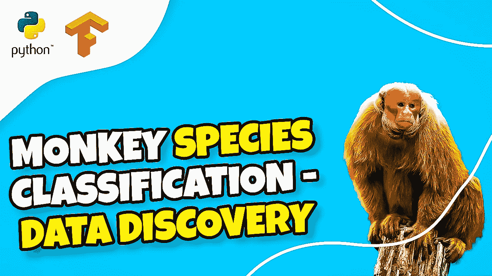

# 如何使用卷积神经网络、Keras tuner hyper parameters、迁移学习对猴子图像进行分类？(第一部分)

> 原文：<https://medium.com/mlearning-ai/how-to-classify-monkeys-images-using-convolutional-neural-network-keras-tuner-hyper-parameters-2733911a7713?source=collection_archive---------5----------------------->

嗨，

这是一个由四部分组成的张量流教程，可以让你用几种方法对猴子的物种图像进行分类。

在学习了图像数据、规划和编码了一些初始函数之后，我们将开始构建一个神经网络模型，使用 CNN 对图像进行分类

然后，我们将使用 Keras tuner 改进我们的模型，并学习为几个重要参数选择正确的超级参数，如多少层，过滤器，学习率等..

最后，我们将教你一种迁移学习，用不同的方法对图像进行分类。

我推荐这款显卡:NVIDIA GeForce RTX 3060 Ti。我用它来训练我的张量流模型。

完美的成绩和表现:[https://amzn.to/3mTa7HX](https://amzn.to/3mTa7HX)

这是第一部分的链接:【https://bit.ly/3czlNOr 

我还分享了视频描述中的 Python 代码。

享受

埃兰

#Python #Cnn #TensorFlow

 [## Mlearning.ai 提交建议

### 如何成为 Mlearning.ai 上的作家

medium.com](/mlearning-ai/mlearning-ai-submission-suggestions-b51e2b130bfb)