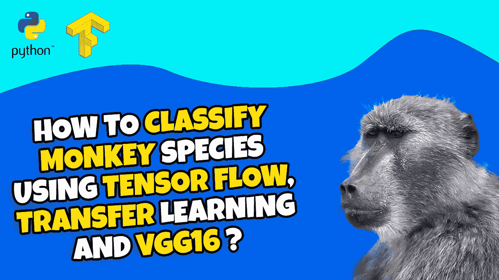

# 如何使用卷积神经网络、Keras tuner hyper parameters、迁移学习对猴子图像进行分类？(第四部分)

> 原文：<https://medium.com/mlearning-ai/how-to-classify-monkeys-images-using-convolutional-neural-network-keras-tuner-hyper-parameters-e6c8abb1f529?source=collection_archive---------8----------------------->

嗨，

这是张量流教程的第 4 部分，使用几种方法对猴子的物种图像进行分类。

在这一部分中，我们将重点使用迁移学习对猴子图像进行分类。
因此，基本上，我们将采用预训练的 VGG16 模型，去掉最后一层，并将其替换和重新训练到我们的图像和所需的类。

我们将使用冻结和使用当前的权重，根据我们的需要定制它，并改进我们的 CNN 模型的结果

我还分享了视频描述中的 Python 代码。

奥雷利拿出这本书。学习深度学习的最佳书籍基于 Tensorflow-Keras。这是链接:[https://amzn.to/3STWZ2N](https://amzn.to/3STWZ2N)

你可以在这里找到视频教程的链接:[https://youtu.be/p9l9AgiVsqI](https://youtu.be/p9l9AgiVsqI)

享受

埃兰

# Python # Cnn # tensor flow # deep learning

 [## Mlearning.ai 提交建议

### 如何成为 Mlearning.ai 上的作家

medium.com](/mlearning-ai/mlearning-ai-submission-suggestions-b51e2b130bfb)