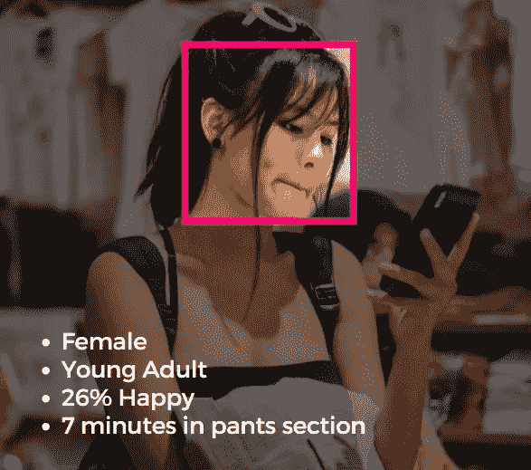
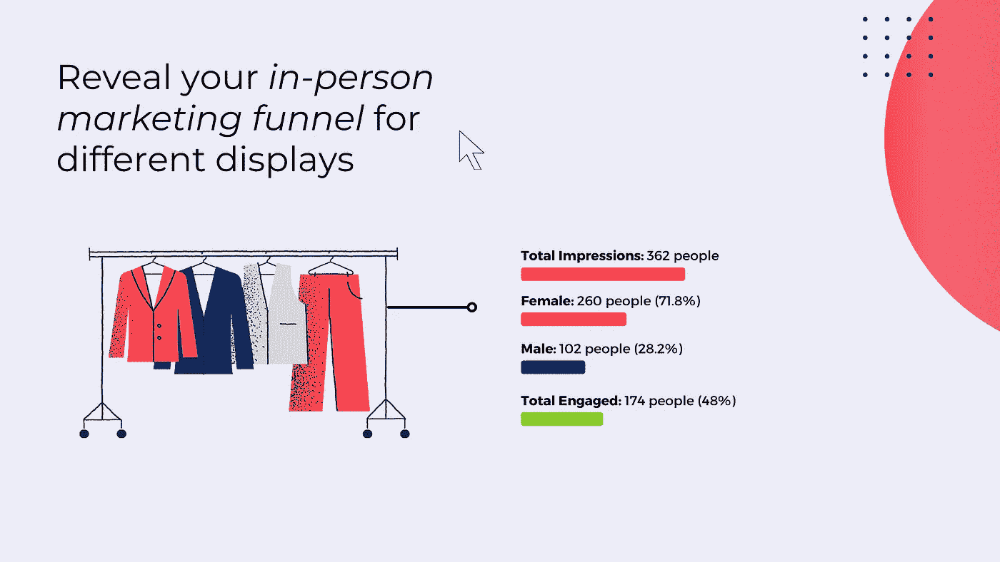

# 如何大规模收集店内零售分析

> 原文：<https://medium.com/mlearning-ai/how-to-collect-in-store-retail-analytics-on-a-massive-scale-8d33a68b8212?source=collection_archive---------2----------------------->

通过情感分析提升您的消费者洞察力

Photo by [Heidi Fin](https://unsplash.com/@heidifin?utm_source=medium&utm_medium=referral) on [Unsplash](https://unsplash.com?utm_source=medium&utm_medium=referral)

“我很好”这句话你听过多少次了？

“我很好”怎么样？

我们都知道，语气和肢体语言在我们与他人交流时起着很大的作用。例如，你的另一半说“我很好”可能意味着他们真的很满足*或*这可能意味着你今晚睡在沙发上。

面部表情对我们的感受起着更大的作用。在美国，微笑是积极情绪(快乐)的典型标志。当您能够捕捉到数百名顾客在一段时间内对零售店的感受时，这将成为一个极其强大的工具。

## 什么是情感分析？

> *情感分析“是指使用自然语言处理、文本分析、计算语言学和生物统计学来系统地识别、提取、量化和研究情感状态和主观信息。”*

换句话说，计算机视觉的进步让我们能够分析一大群人的面孔，从中提取人们的快乐程度。然后，这些数据将用于推动商业决策，例如如何优化店内顾客体验，或者在楼层的哪个位置分配更多员工。有许多工具也可以从文本中分析和处理情感，但让我们专注于生物特征部分(即面部分析)。

Our micro-expressions say a lot about how we feel

## 它是如何工作的？

为了大规模捕捉人们的感觉和行为，你需要一个可以同时检测和分析数百张脸的设备。最简单的方法是使用高分辨率相机拍摄你的空间，然后连接到边缘处理单元来计算分析。边缘处理单元充当超级计算机，其在本地处理视频馈送，然后将集合统计数据(例如，正面情绪)发送到云。

Secure data processing by Zenus

从那里，你可以看到一个实时仪表盘，告诉你 200 个人在下午 4 点的牛仔裤区有 93%的快乐。

作为零售商，您可能希望了解商店不同区域的顾客参与度。商店后面的人比前面的人更不开心吗？当人们经过不同的视觉营销展示时，他们有什么感觉？灯光稍微改变一下呢？

为了获得准确的结果，使用经过行业基准和真实世界数据训练的面部分析系统是很重要的。

## 你能识别哪些情绪？

> 典型的人脸有 43 块不同的肌肉，可以在眼睛、鼻子、嘴巴、下巴、下巴和眉毛周围被激活，做出数千种不同的表情。

共有七种普遍的情绪:愤怒、蔑视、厌恶、恐惧、快乐、悲伤和惊讶。虽然测量购物者的愤怒程度很有趣，但这六种情绪(除了快乐)并不普遍，而且更加主观。它们包含更多的细微差别，情感分析工具很难充满信心地预测这些细微差别。

例如，当我极度愤怒时，我倾向于哭泣(作为癌症的诅咒)。情绪分析工具可能会把这误认为悲伤，即使我有绿巨人之怒。

为了让事情变得简单，同时仍然提取重要的见解，坚持使用一个简单而准确地测量积极情绪的系统。

## 如何使用？

现在你知道什么是情绪分析，让我们来谈谈如何在零售环境中使用它。

Understand how many people displayed positive sentiment over time

以下是一些常见的例子:

*   如果你是一个财富 500 强的大品牌，你可能想在全国范围内推出之前测试促销的有效性。有了情绪分析，你就可以衡量推广在小范围内的成功程度。
*   如果你是一家规模较小的企业，你可能会与知名零售商合作，并可以使用 [Happy Maps](/the-innovation/a-new-tool-all-marketers-should-know-about-f9d598e2a7b6) 将自己与竞争对手区分开来，并追加销售展示/零售空间。
*   根据[评论 42](https://review42.com/resources/retail-statistics/),“…开一家新店会使零售商网站的流量平均增加 37%。”品牌可以为顾客创造更好的店内体验，这将影响电子商务的表现。
*   如果你是一家营销机构，拥有一个零售品牌作为客户，你可以利用情绪分析(在销售数据之上)来证明你的品牌激活、活动和促销所获得的投资回报率。

## 好吧，但是面具呢？

一个训练有素的算法即使带着面具也能检测出情绪！如上所述，“……典型的人脸有 43 块不同的肌肉，可以在眼睛、鼻子、嘴巴、下巴、下巴和眉毛周围被激活。”的确，眼睛是心灵的窗户。

## 最后

情感分析使您能够以前所未有的方式自动收集消费者洞察。零售商可以即时鸟瞰多个地点的购物者参与度。虽然它是一个节省时间和做决定的好工具，但它仅仅是拼图的一部分。一旦你将参与度数据与客流量、停留时间和人口统计数据(年龄/性别)结合起来，你就能看到消费者在实体店体验的全貌。

[了解更多关于道德面部分析的](https://www.zenus.ai/use-cases?utm_source=medium&utm_medium=organic&utm_campaign=zw&utm_content=sentimentblog)或[成为 Zenus 的早期投资者](https://www.startengine.com/zenus?utm_source=medium&utm_medium=organic&utm_campaign=se&utm_content=sentimentblog)。

来源
[https://en.wikipedia.org/wiki/Sentiment_analysis](https://en.wikipedia.org/wiki/Sentiment_analysis)
[https://greater good . Berkeley . edu/article/item/are _ face _ expressions _ the _ same _ around _ the _ world](https://greatergood.berkeley.edu/article/item/are_facial_expressions_the_same_around_the_world)