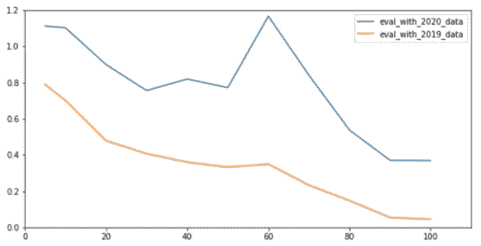

# 如何用 Python 构建投资组合追踪广阔市场

> 原文：<https://medium.com/mlearning-ai/how-to-construct-portfolio-to-track-broad-market-with-python-8900fcb6541a?source=collection_archive---------2----------------------->

## 让我们创建一个指数基金，用整数规划来反映纳斯达克 100 指数

# ***概述***

股票资金管理策略主要分为“主动”或“被动”。最常见的被动策略是“指数化”策略，其目标是选择一个反映广泛市场人口或市场指数变动的投资组合。这样的投资组合被称为指数基金。例如，QQQ 指数基金跟踪纳斯达克 100 指数。

构建一个跟踪特定广泛市场指数的指数基金可以通过简单地购买该指数中的所有 n 只股票来完成，这些股票具有与该指数相同的权重。然而，这种方法不切实际且昂贵。一只拥有 m 只股票的指数基金似乎是可取的，其中 m 远小于目标人群的规模 n。

本博客将向您展示如何通过 Gurobi Python API 使用整数编程来创建一个尽可能跟踪纳斯达克 100 指数的指数基金，同时将基金中的成份股数量保持在最低水平。

请注意，本博客仅用于信息和教育目的，并不构成投资或财务建议。

# 方法

这个任务在数学上将被公式化为一个整数优化问题。为了演示我们的方法，我们将使用 2019 年和 2020 年纳斯达克 100 指数成份股的每日价格，计算 2019 年和 2020 年成份股和指数的回报，以及股票回报的相关矩阵，然后使用 2019 年的价格数据获得最优解，并使用 2020 年的价格数据评估解决方案。

为了使我们的结果完全可复制，所有相关的源代码和数据集都在我们的 [github](https://github.com/ping2022/Integer-Programming-for-Portfolio-Construction) 上公开。

# 相关矩阵

我们计算 2019 年价格文件中股票的回报，使用回报计算股票选择和权重构建的相关矩阵。我们还计算了指数和股票在 2020 年的每日回报，以评估我们的投资组合在 2020 年的表现。

# ***模型构建***

该方法包括两个阶段:选股和计算投资组合权重。它旨在选择最能代表其他股票的股票，选择最接近模拟指数整体表现的股票组成，以及最少数量的股票来代表指数。

> ***第一阶段:选股***

为了选择最能代表指数中其他股票的股票，我们寻求最大化所选股票和其他股票之间的相关性。阶段 1 可以表述如下:

***决策变量* :** 二元变量 xij，yj

● xij:对于指数 i =1，…，100 中的每只股票，二元决策变量 xij 表示指数 j=1，…，100 中的哪只股票 j 是股票 I 的最佳代表，既然我们有 100 只成份股，我们就有 100*100 个 xij 变量。

● yj:二元决策变量 yj 表示基金中存在指数中的哪些股票 j。我们会有 100 个 yj 变量。

***目标函数* :** 最大化 xij 与其对应相关系数的和积。

该模型的目标是最大化基金中 n 只股票及其代表之间的相似性。

***约束:***

1.选择基金中要持有的股票的确切数量

2.每只股票 I 在指数中正好有一只代表性股票 j

3.仅当 j 在基金中时，保证股票 I 最好由股票 j 代表

> ***第二阶段:投资组合权重计算***

在这一阶段，我们通过最小化加权股票回报和指数总体回报之间的差异来为所选股票分配最佳权重。为了将这个整数规划转化为绝对值，我们创建了 y 个变量来方便地求解这个差值最小化问题。我们将线性规划优化公式化如下:

***决策变量*** :二元变量 yi，连续变量 wi

●yi:yi 变量象征指数总体回报和加权股票回报之间的差异。因为我们对每只股票和指数都有 250 个日收益，所以我们有 250 个易变量。

● wi:所选股票的权重。我们会有 100 个 wi 变量。

***目标函数* :** 最小化易之和

最小化指数总回报和加权股票回报乘积的绝对值之和。

***约束* :**

1.yi ≥ | index_return —加权股票收益率|，可以翻译为:

yi ≥ index_return —加权股票收益率

yi ≥加权股票回报—指数回报

2.wi 之和= 1

# **样品内/样品外评估**

在如上建立整数规划模型后，我们将 m(投资组合中的股票数量)设置为 5、10、20、30、40、50、60、70、80、90 和 100，通过选择不同数量的股票进行迭代，并使用 2019 年和 2020 年的数据评估样本内和样本外的表现。

当我们第一次设置 m 为 5 时，我们得到样本内误差为 78.92%，样本外误差为 111.24%。随着我们增加投资组合中包含的股票数量，投资组合的总体回报越来越接近指数总体回报。**样本内误差在 4.49%-78.92%之间。样本外误差在 36.87%-111.24%之间。**

# 结果的解释

我们发现，它与 2019 年和 2020 年的数据显示出不同的模式。当使用 2020 年的数据进行评估时，收益率差在 m 达到 60 之前随着波动而下降，当 m 达到 60 时表现出显著的增加，然后随着 m 增加到 90 而迅速下降到最小值。当使用 2019 年的数据进行评估时，回报率差异随着小幅波动而下降。**总的来说，这种方法对 2019 年的数据比对 2020 年的数据表现更好。**

我们认为这是因为最优解是使用 2019 年的数据获得的。在相同的经济环境和财务周期内，指数和投资组合之间的差异随着投资组合规模的增加而减小。而到了 2020 年，受新冠肺炎和经济变化的影响，股票之间的相关性可能也会发生变化。因此，基于 2019 年相关性选择的投资组合不能很好地跟踪纳斯达克 100 指数的走势。

# **结论**

恭喜你！现在你知道如何应用整数规划技术来建立自己的投资组合。然而，如上所示，尽管所选股票和权重与 2019 年的数据吻合良好，但应用于 2020 年的数据时就不那么稳定了。投资决策是对所有内部和外部条件的综合分析，如经济、政治、政府政策、技术、商业战略、客户和供应商以及公司文化等。

我希望你喜欢阅读这篇博客，并享受创建你的作品集的乐趣！

在[这个 Github repo](https://github.com/ping2022/Integer-Programming-for-Portfolio-Construction) 中，您可以随意使用本文的代码。

我喜欢写关于数据科学概念的文章，喜欢玩不同的算法和数据科学工具。你可以在 LinkedIn 上和我联系。

 [## Mlearning.ai 提交建议

### 如何成为 Mlearning.ai 上的作家

medium.com](/mlearning-ai/mlearning-ai-submission-suggestions-b51e2b130bfb)