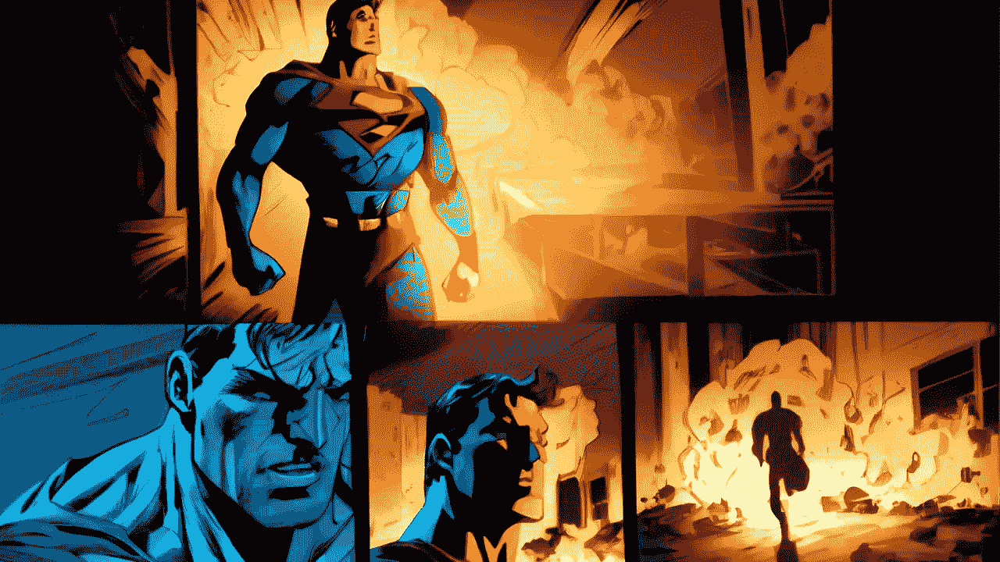

# 如何使用 chatGPT 继续故事板？

> 原文：<https://medium.com/mlearning-ai/how-to-continue-the-storyboard-using-chatgpt-28ff8603f7d5?source=collection_archive---------1----------------------->

## 将您的图像上传到[人工智能助手](https://open.substack.com/pub/mlearning/p/how-to-teach-chatgpt-to-see?r=z7zu8&utm_campaign=post&utm_medium=web)

[Fantastic solution with the Freshest free DEMO](https://open.substack.com/pub/mlearning/p/how-to-teach-chatgpt-to-see?r=z7zu8&utm_campaign=post&utm_medium=web)

已经有训练有素的生成器可以把任何文本变成一个伟大的图像。但是这些模型并不适用于像故事可视化这样需要代理做出正确决策的特定任务。如果 [chatGPT](/mlearning-ai/what-did-i-say-earlier-in-the-conversation-a3322ee33212) 就是这样一个代理人呢？但是如何向 [chatGPT](/mlearning-ai/what-did-i-say-earlier-in-the-conversation-a3322ee33212) 解释一个形象呢？输入只能是文字？