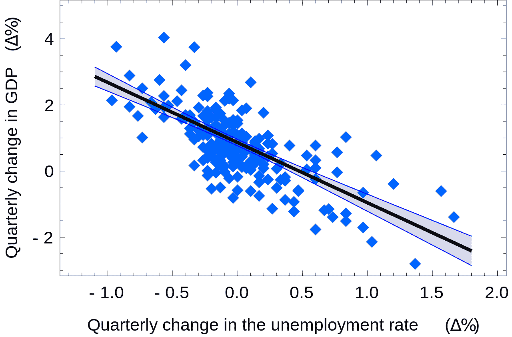

# 如何使用 sklearn 创建线性回归数据集并对其进行预测

> 原文：<https://medium.com/mlearning-ai/how-to-create-a-linear-regression-dataset-with-sklearn-and-make-predictions-on-it-53b7337bbe3a?source=collection_archive---------0----------------------->

在过去的几篇文章中，我一直专注于如何制作分类数据集，如半月形、斑点、圆形和其他类型的分类数据集。我最近关于创建数据集，特别是分类数据集的文章可以在这里找到…