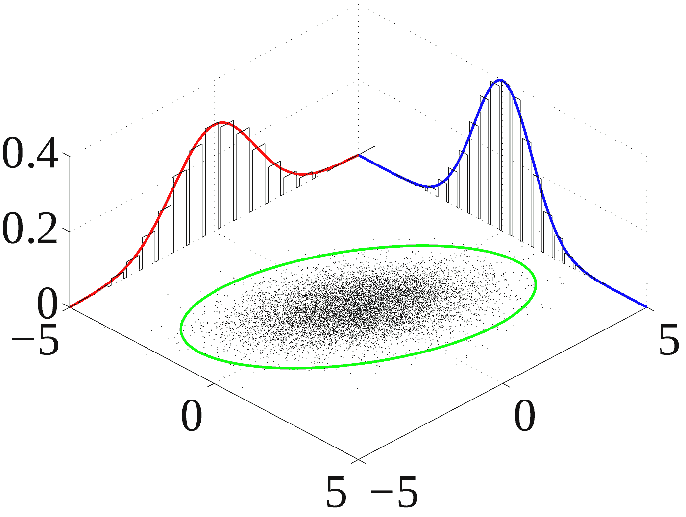

# 如何创建多元回归并对其进行预测

> 原文：<https://medium.com/mlearning-ai/how-to-create-a-multivariate-regression-and-make-predictions-on-it-aa9108019810?source=collection_archive---------3----------------------->

在我的上一篇帖子中，我讨论了如何使用 sklearn 的 make_regression 来生成一个单变量回归变量。我最近关于单变量回归的文章的链接可以在这里找到:-[https://medium . com/mlearning-ai/how-to-create-a-linear-regression-dataset-with-sk learn-and-make-predictions-on-it-53b 7337 bbe3a](/mlearning-ai/how-to-create-a-linear-regression-dataset-with-sklearn-and-make-predictions-on-it-53b7337bbe3a)