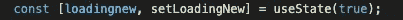
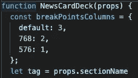
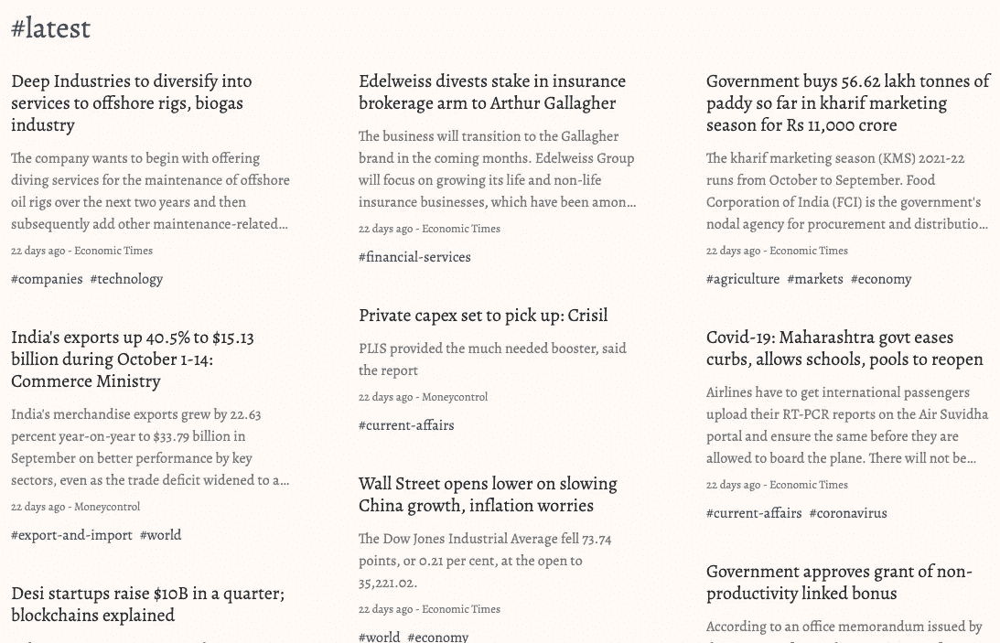
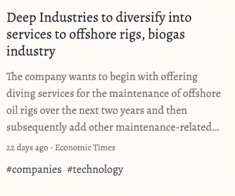
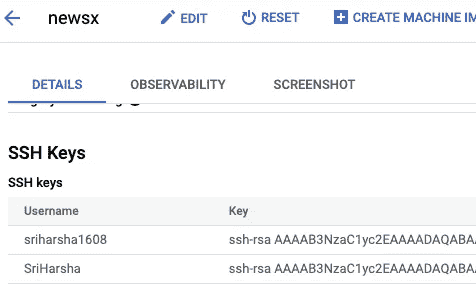
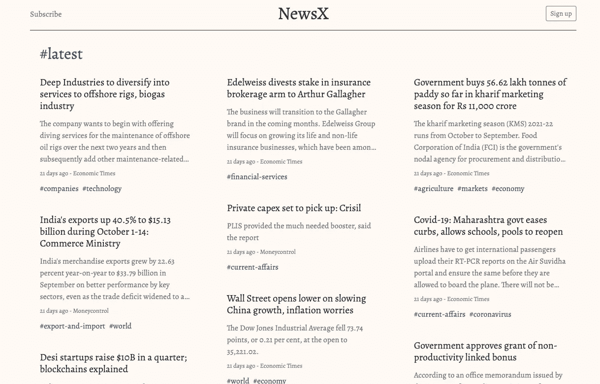

# 如何使用 Reactjs、Mongodb、Flask 和 Fasttext 创建 web 应用程序

> 原文：<https://medium.com/mlearning-ai/how-to-create-a-web-app-with-reactjs-mongodb-flask-and-fasttext-560fa2e1103c?source=collection_archive---------1----------------------->


在我们每天忙碌的生活中，我们需要创造奇迹，创造奇迹。一天，当我在看新闻时，一个想法被卡住了。我们为什么不从所有顶级报纸上收集金融及其相关版块的文章，放在一个平台下，用不同版块的有限版块标记。实时更新新闻。然后应用程序得到了发展。这对新投资者很有帮助，可以节省很多时间。

在本文中，我们将讨论使用 Reactjs、Flask API、MongoDB 和 Fasttext 创建一个 web 应用程序，它将显示来自各种来源的新闻文章的信息。

React 是一个开源的、可重用的、基于组件的前端 JavaScript 库，用于构建交互式 ui。

React 使用声明性的方法，这使得代码更加可预测，也更容易调试。

**JSX** (JavaScript 语法扩展)JSX 是对 JavaScript 的语法扩展。在 React 中，它用来描述 UI 应该是什么样子。在 JSX 的帮助下，我们可以在包含 JavaScript 代码的同一个文件中编写 HTML 代码。

**组件**组件被认为是 React 应用程序的核心构建块。这使得构建 ui 的任务变得更加容易。每个组件都存在于同一个空间中，但是它们彼此独立工作，并合并到一个父组件中，这将是应用程序的最终 UI。

有两种类型的组件:类组件、功能组件

我们主要使用功能组件来构建我们的 web 应用。
功能组件是一种编写只包含一个呈现方法，没有自己状态的组件的方式。它们只是 JavaScript 函数，可能会也可能不会接收数据作为参数。我们可以创建一个函数，将 props(属性)作为输入，返回应该呈现的内容。

**使用状态**
React 组件有一个内置的状态对象。状态对象是我们存储属于组件的属性值的地方。当状态对象改变时，组件重新呈现。
要使用它，我们需要在一个特定的组件中从 react 导入 useState()并编写变量，可调用来改变状态，如下所示。



默认情况下，loadingnew 为 true 来更改它。我们需要调用 setLoadingNew(false)，这样 LoadingNew 中的值就会改变。

**道具** 道具代表**属性**。它是一个存储标签属性值的对象，工作方式类似于 HTML 属性。它提供了一种将数据从一个组件传递到其他组件的方法。它类似于函数参数。

我们可以使用{props.parentsvariable}从父组件获取数据，并在子组件中使用它。下图中的例子



在我们的 web 应用程序中，我们使用了 4 个组件:标题、类别列表、新闻面板、新闻卡片部分。


Header



News card Section



News deck

react 的安装可以从这个[链接](https://github.com/nvm-sh/nvm)开始。
curl-o-[https://raw . githubusercontent . com/nvm-sh/nvm/v 0 . 39 . 0/install . sh](https://raw.githubusercontent.com/nvm-sh/nvm/v0.39.0/install.sh)| bash

现在我们来讨论一下后端。我用 MongoDB 存储数据。最初安装 mongodb 时，我面临各种问题。后来，我通过 docker 部署了一个简单的解决方案。关于如何通过 docker 拉取和使用 mongodb 的更多细节，可以参考这个[文档](https://hub.docker.com/_/mongo)。

我面临的另一个问题是。当我试图将本地系统中现有的数据库连接到 docker 映像时。我不能使用最新版本的图像，后来我用了 4.2 版本。效果非常好。

```
$ docker run --name some-mongo -v /my/own/datadir:/data/db -d mongo
```

现在数据库已经启动并运行了！数据呢？
文章的提取是通过从不同的在线资源中搜集来完成的。对于抓取，我们将在 python 编程中使用 Beautifulsoup 模块。其收集数据并同时实时存储在数据库中。

现在我们来了解一下如何刮文章。可以参考我之前的[帖](/analytics-vidhya/how-to-extract-and-summarize-with-beautifulsoup-and-textrank-c4ecec360776)。因为需要提取部分。提取模式/代码可能因网站而异，这主要取决于设计的结构。我们需要提取标题、描述、总内容、关键字和时间戳。

在类别和最新版块下以美学观点呈现文章。这使得用户在网页上感觉良好。基于枚举的关键词，让我们把它们分成有限的类别。现在让我们在这里使用机器学习，fasttext。我们创建了一个模型，该模型预测的准确度为 0.8 AUC。用近 100Gb 的文章训练它。给出粗略的数据统计。我们将 700 个关键词分为 53 类。使用关于训练和更新标签的快速文本模型。关于 fasttext 的更多信息，请查看本[教程](https://fasttext.cc/docs/en/supervised-tutorial.html)。

**Flask** **API** 服务让你通过简单的 HTTP 请求与数据库进行交互。在我们的应用程序中，它将根据类别过滤器拾取文章并将其反映在前端页面上。

现在我们可以运行我们设计的应用程序了。我们可以看到我们的应用程序，通过设备(电脑，手机)连接到同一个网络通过搜索我们的系统 IP 地址和端口号。因为来自不同网络的设备看不到该应用。这里来了反向隧道的话题。

为了做反向隧道，我决定在 GCP 创建一个免费的实例，并提供免费积分。创建实例后，现在在本地系统上生成 ssh 密钥。复制公钥并将其粘贴到实例的 ssh 密钥部分。

```
ssh-keygen -t rsa -b 4096 -C myfirstprojectuser #in localsystem
```



Remote system

因此您可以从本地登录到远程。接下来，转到弹性 IP，将当前 IP 地址设为固定地址。接下来，按照以下步骤进行更多的[分析](https://blog.rodneyrehm.de/archives/38-You-may-not-need-localtunnel-or-ngrok.html)。

```
*#!/bin/bash**# it’s usually a good idea to exit upon error*
**set** -e*# your connection parameters*
user=rrehm
server=example.org
remotePort=1234
localPort=80*# some stuff autossh needs to know*
AUTOSSH_SERVER_ALIVE_INTERVAL=30
AUTOSSH_SERVER_ALIVE_COUNT=2
**export** AUTOSSH_POLL=30
**export** AUTOSSH_GATETIME=0
**export** AUTOSSH_LOGFILE=”/tmp/autossh.log”*# clean up log file on start*
**touch** “${AUTOSSH_LOGFILE}”
**rm** “${AUTOSSH_LOGFILE}” **||** **true**autossh -f -M 0 \
 -o “ExitOnForwardFailure yes” \
 -o “ServerAliveInterval ${AUTOSSH_SERVER_ALIVE_INTERVAL}” \
 -o “ServerAliveCountMax ${AUTOSSH_SERVER_ALIVE_COUNT}” \
 -A ${user}**@**${server} \
 -R ${remotePort}:localhost:${localPort}
```

使用此代码在本地系统中创建一个文件，并根据您的需要更改参数，然后运行该文件。它将自动重新连接隧道。
在另一个终端窗口登录到远程计算机，用 curl localhost 命令检查本地系统的代码 localhost HTML 代码是否有反射。

接下来，让我们将远程 localhost:3000 映射为 8080 端口。遵循以下步骤:

```
 sudo apt-get install nginx
sudo rm /etc/nginx/sites-enabled/default
sudo nano /etc/nginx/sites-available/node
server {
    listen 80;
    server_name [example.com](http://example.com/); location / {
        proxy_set_header   X-Forwarded-For $remote_addr;
        proxy_set_header   Host $http_host;
        proxy_pass         "[http://127.0.0.1:1337](http://127.0.0.1:1337/)";
    }
}sudo ln -s /etc/nginx/sites-available/node /etc/nginx/sites-enabled/nodesudo service nginx restart
```

现在让我们用 python 通过 certbot 获得我们 IP 地址的证书。让我们跟随[资源](https://www.nginx.com/blog/using-free-ssltls-certificates-from-lets-encrypt-with-nginx/)的步骤。如果我们有一个域名系统，我们可以把它和我们的远程固定 IP 连接起来。确保防火墙没有阻止端口 80 上的请求。因此每个人都可以查看该页面。

在此基础上，我在 CSS、js 和 useState()的帮助下，为我的 web 应用程序添加了更多功能，如黑暗模式。当点击按钮时，它需要改变状态，并带有类主题三元运算符。它需要反映，它的 CSS 属性和显示页面，并与 js 设置值到本地存储。当错误地发生刷新时使用它，它需要根据用户偏好模式(暗或亮)来反映先前的状态。又多了一个功能搜索栏，可以搜索特定标签并直接进入新闻。借助 route 和 params 以及 usehistory()。



our app view

除了使 web 应用程序成为一个进步的 web 应用程序，我们还需要一些额外的润色。比如 manifest.json 和 worker.js 等..，借助谷歌 chrome lighthouse 选项。我们可以看看有什么其他要求是必需的。通过访问[pwa.builder.com](http://pwa.builder.com)并输入我们的网站地址，我们可以获得缺失的和所需的代码，以制作一个完美的进度网络应用程序。最后，添加所有需要的东西，重新启动应用程序，并检查灯塔是否满足 pwa 的所有属性。现在我们可以下载我们的应用程序了。

[](/mlearning-ai/mlearning-ai-submission-suggestions-b51e2b130bfb) [## Mlearning.ai 提交建议

### 如何成为 Mlearning.ai 上的作家

medium.com](/mlearning-ai/mlearning-ai-submission-suggestions-b51e2b130bfb)