# 如何在 Python 中使用 AWS ECR Docker 容器映像创建 AWS Lambda

> 原文：<https://medium.com/mlearning-ai/how-to-create-an-aws-lambda-using-aws-ecr-docker-container-image-in-python-76203a2c11e2?source=collection_archive---------1----------------------->

在这篇博客中，我们将看到如何使用 Python 中的 AWS ECR Docker 映像创建一个 [AWS](https://aws.amazon.com/) Lambda。如果您是第一次使用容器映像创建 Lambda 函数，那么它会非常复杂。我自己在做这件事的时候，我没有找到任何相关的博客或文章来教你这些。

这就是为什么以后再也不会有人掉进这个坑了，我写这篇博客是为了那些和我两三个月前处境相同的人，因为我知道这有多令人沮丧。所以没有任何进一步的原因，让我们做吧。

**点击此处阅读全文—**[https://machine learning projects . net/create-an-AWS-lambda-using-AWS-ECR/](https://machinelearningprojects.net/create-an-aws-lambda-using-aws-ecr/)

# 步骤 1-创建一个新文件夹，并将您的 py 文件添加到其中。

*   只需创建一个文件夹，并将您的代码文件添加到其中。

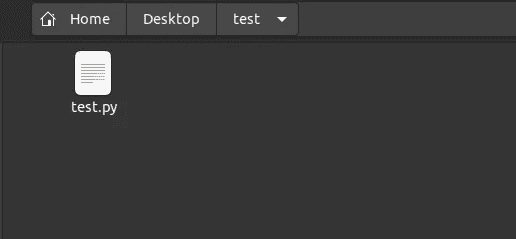

# 步骤 2 —在文件夹中创建 docker 文件并编辑它。

*   创建如下所示的 docker 文件，并根据您的方便编辑它。
*   在第 1 行中，根据您的需求更改 python 版本。请记住，在下一步中，这应该与您的 conda 环境相同。
*   在第 5 行中，将 test.py 更改为您的文件名。
*   在第 6 行中，将测试更改为您的 python 文件名。比如我的文件名是 test.py，它包含函数处理程序，所以对我来说它是 **test.handler** 。

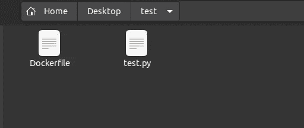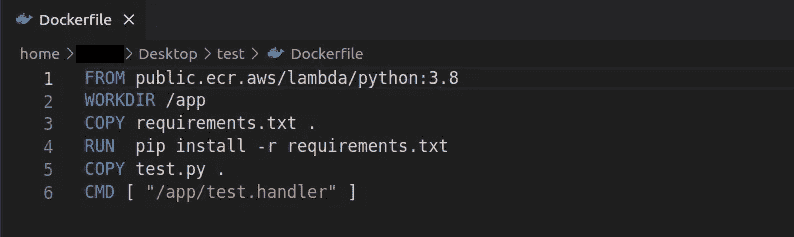

# 第三步——创造康达环境。

*   使用命令**conda create-n<env name>python =<version>**命令。
*   它将安装一些基本的库。出现提示时，点击**‘y’**和**，输入**。

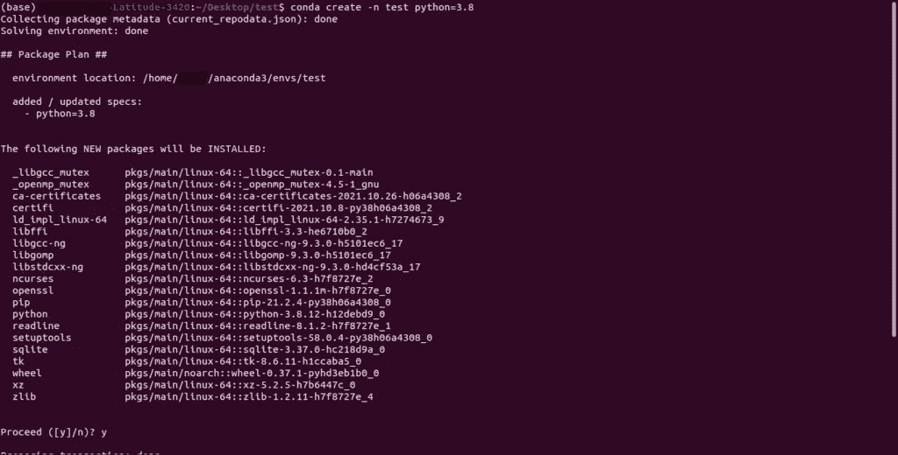

# 步骤 4-激活 Conda 环境。

*   使用**conda activate<env name>**命令激活 conda 环境。

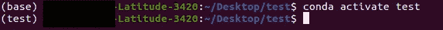

# 步骤 5 —在 conda 环境中安装所需的库。

*   在 conda 环境中安装所需的包/库。
*   使用命令 **pip install <空格分隔软件包名称>在环境中安装软件包。**

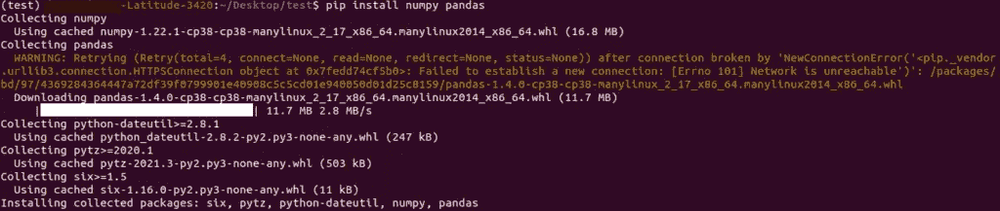

# 步骤 6——生成 requirements.txt 文件。

*   我们需要一个 requirements.txt 文件来创建 docker 容器。
*   我们将使用**pip free>requirements . txt**命令将 conda 环境中的所有包存储在 **requirements.txt** 文件中。

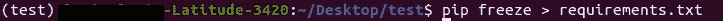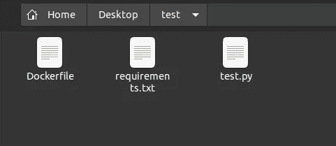

# 步骤 7-在 AWS 上创建一个新的 ECR 对象。

*   在搜索栏中搜索 ECR，然后单击弹性容器注册表。
*   然后点击创建存储库。
*   在下一个屏幕上，只需为您的 ECR 容器命名。我把它命名为 **test-ecr** 。
*   成功创建后，在 ECR 主屏幕上搜索并点击它。

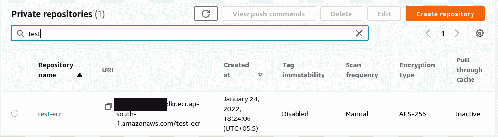

# 步骤 8-打开推送命令。

*   打开后会是这样的。
*   如您所见，目前这里没有图像。
*   单击查看推送命令按钮。

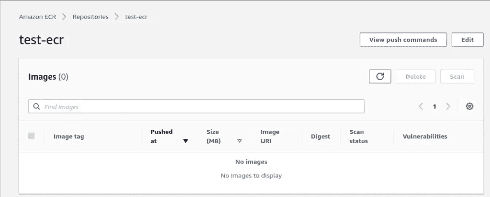

# 步骤 9-执行推送命令。

*   下面是您需要在终端中执行的 4 个 push 命令。
*   确保您的 conda env 已激活。
*   第一个命令帮助您登录 AWS。(确保您的 Windows/Linux 上安装了 aws-cli，并且您的 PC 上设置了凭据)
*   第一次在 PC 上运行登录时，它会要求您提供凭据。您可以在 IAM >用户>安全凭据>创建访问密钥中获取它们。

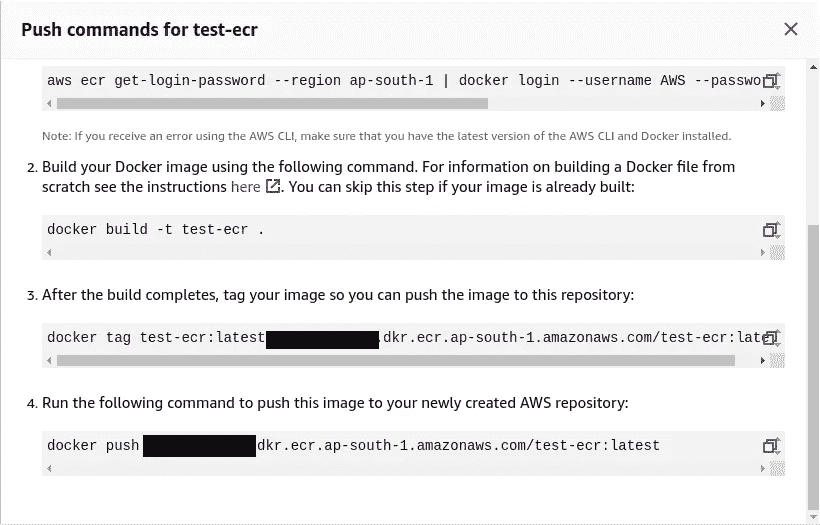

*   第二步有助于建立形象。

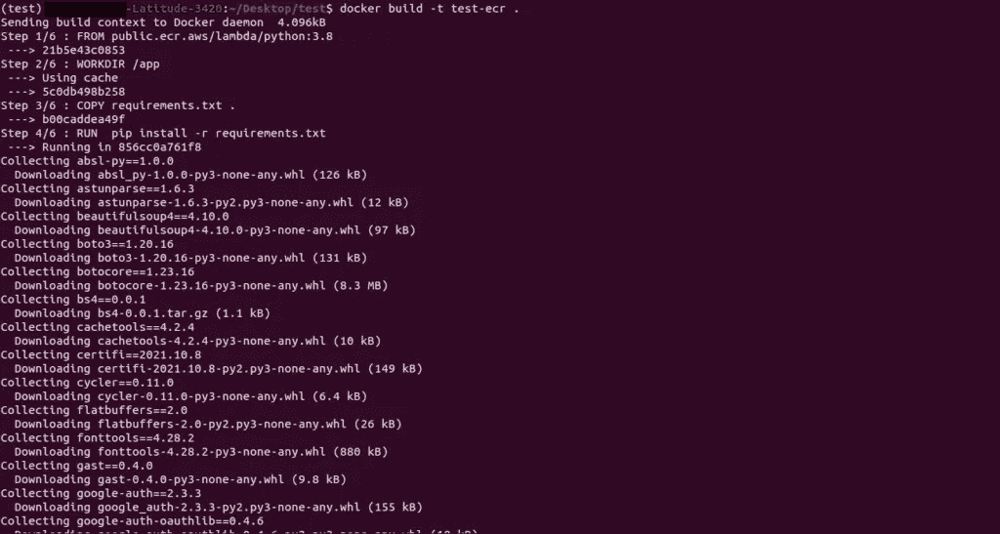

*   第三步标记图像。
*   第四步有助于将映像从本地推送到 ECR。

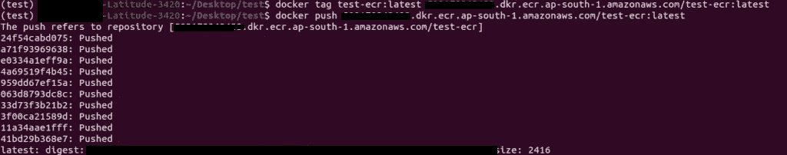

*   如果所有 4 个命令都被正确执行，您的 ECR 将显示一个名为***‘最新’***的条目。

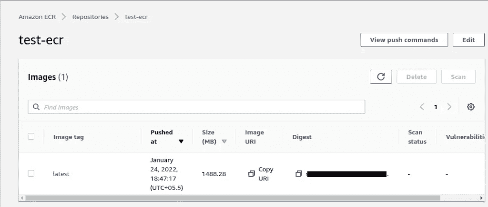

# 步骤 10-创建一个新的 Lambda 函数。

*   在主搜索栏中搜索 Lambda。
*   点击**创建功能**按钮。
*   它将显示一个如下所示的窗口。
*   单击容器图像。
*   给你的 Lambda 函数一个名字，并选择你想使用的容器图像。

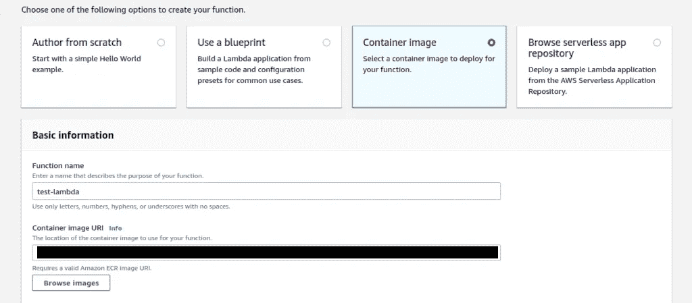

*   这将使用您选择的 ECR 映像成功创建您的 lambda。
*   你的 Lambda 将看起来像下图。

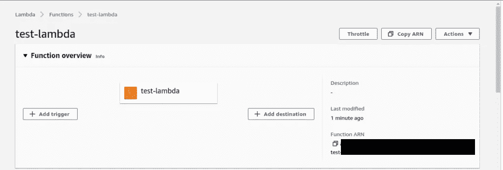

# 第 10 步——测试一切是否正常。

*   我的 lambda 只接受 2 个数字并返回它们的和。
*   所以我提供了两个数字，我的 lambda 只返回它们的和。

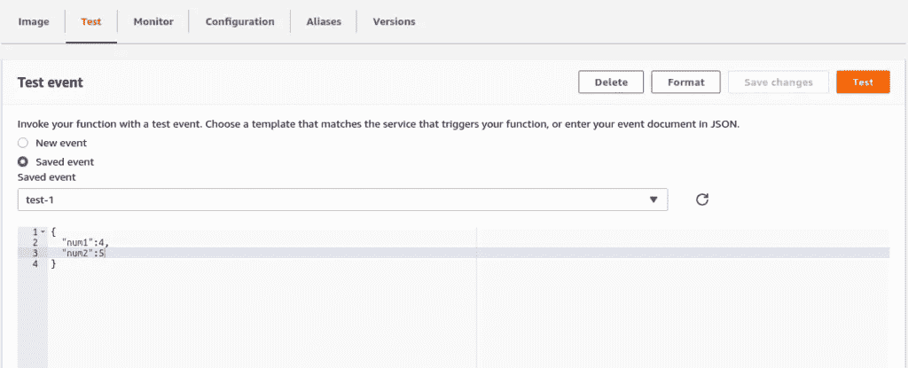

*   如果到目前为止您所做的一切都是正确的，测试结果将显示一个绿色提示，并带有“成功”消息。
*   你可以看到结果是 9。

**注意— Lambda 仅提供 3 秒的超时。这意味着如果你的 Lambda 运行超过 3 秒，它将不会工作。进入配置>通用配置，并根据您的需要进行更改。请记住，您最多可以设置 15 分钟。**

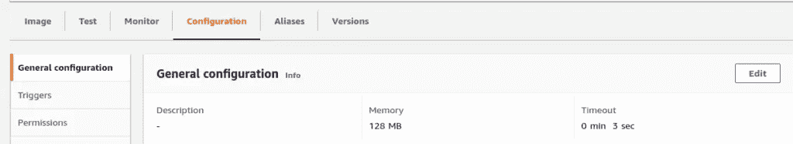

*这就是我写给这个博客的所有内容，感谢你阅读它，我希望你在阅读完这篇文章后和下次阅读前能有所收获👋…*

**有关详细解释，请访问—** [**如何使用 PYTHON 中的 AWS ECR DOCKER 容器映像创建 AWS LAMBDA**](https://machinelearningprojects.net/create-an-aws-lambda-using-aws-ecr/)

**查看我的其他** [**机器学习项目**](https://machinelearningprojects.net/machine-learning-projects/)**[**深度学习项目**](https://machinelearningprojects.net/deep-learning-projects/)**[**计算机视觉项目**](https://machinelearningprojects.net/opencv-projects/)**[**NLP 项目**](https://machinelearningprojects.net/nlp-projects/)**[**烧瓶项目**](https://machinelearningprojects.net/flask-projects/) **at**********

**** [## Mlearning.ai 提交建议

### 如何成为 Mlearning.ai 上的作家

medium.com](/mlearning-ai/mlearning-ai-submission-suggestions-b51e2b130bfb)****